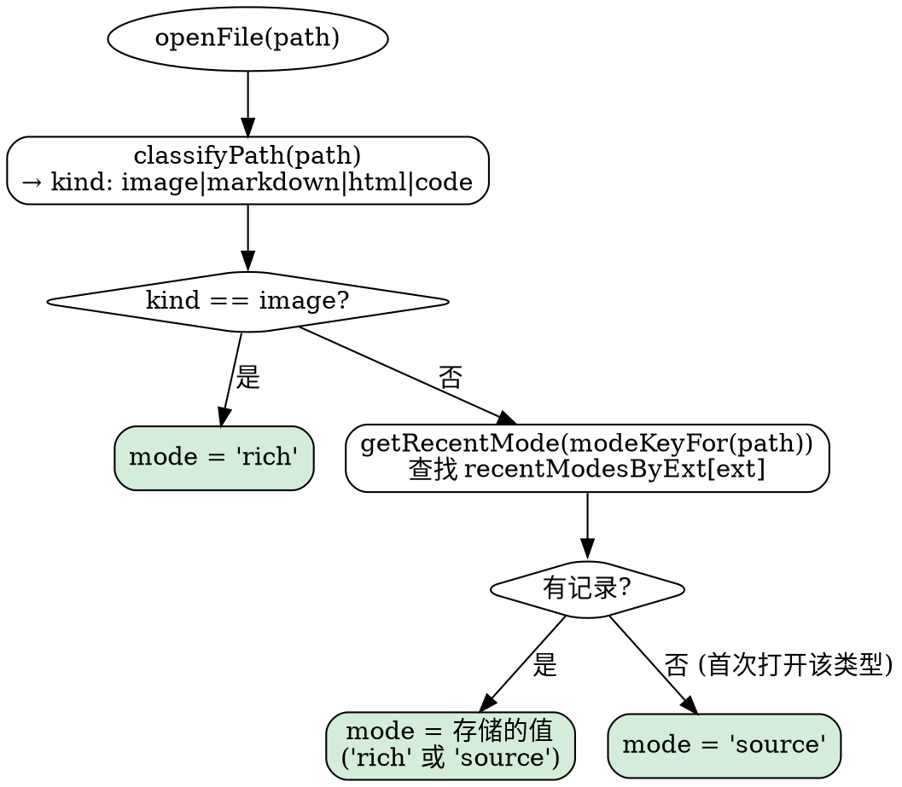

# 文件打开时视图模式选择逻辑

## 流程图

```dot
digraph mode_selection {
  rankdir=TB
  node [shape=box, style=rounded]

  start [label="openFile(path)", shape=ellipse]
  classify [label="classifyPath(path)\n→ kind: image|markdown|html|code"]
  is_image [label="kind == image?", shape=diamond]
  mode_rich [label="mode = 'rich'", style="rounded,filled", fillcolor="#d4edda"]
  lookup [label="getRecentMode(modeKeyFor(path))\n查找 recentModesByExt[ext]"]
  has_record [label="有记录?", shape=diamond]
  use_stored [label="mode = 存储的值\n('rich' 或 'source')", style="rounded,filled", fillcolor="#d4edda"]
  use_source [label="mode = 'source'", style="rounded,filled", fillcolor="#d4edda"]

  start -> classify
  classify -> is_image
  is_image -> mode_rich [label="是"]
  is_image -> lookup [label="否"]
  lookup -> has_record
  has_record -> use_stored [label="是"]
  has_record -> use_source [label="否 (首次打开该类型)"]
}
```

## 模式持久化时机

```dot
digraph mode_persist {
  rankdir=TB
  node [shape=box, style=rounded]

  toggle [label="用户切换模式\nsetMode(id, mode)"]
  save [label="用户保存文件\nsaveActive()"]
  saveas [label="用户另存为\nsaveAs(id, newPath)"]
  persist [label="setRecentMode(ext, mode)\n写入 recentModesByExt[ext]\n持久化到 settings.json", style="rounded,filled", fillcolor="#cce5ff"]

  toggle -> persist
  save -> persist
  saveas -> persist
}
```

## 关键规则

- `modeKeyFor(path)` 返回文件扩展名（如 `md`、`html`、`json`），无扩展名则返回完整文件名小写
- 同一扩展名的所有文件共享一个模式状态
- image 类型始终为 `rich`，不参与持久化逻辑
- 无记录时默认 `source`，无任何 fallback