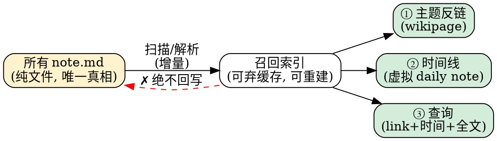

# 笔记召回层 设计方案

> 类型：设计规格（Design Spec，候选定稿）
> 日期：2026-07-13
> 上游：`docs/note-recall-layer-discussion.md`（方案讨论）
> 一句话：在 note.md 层次大纲之上，建一个**只读、可再生、位置无关**的召回层——按 `[[wikilink]]` 归堆成主题反链、按日期节点排成时间线，全部从纯文件派生，不污染文件。

---

## 第一部分 · 哲学检索与取舍

设计前，先检索了欧美效率工具圈的五个支柱性思想，并逐一做"取 / 舍"判断。取舍的准绳是我们自己的 file-over-app 硬原则与"文件是真相、应用可替换"的愿景。

### 1.1 五个支柱

| 支柱 | 代表 | 核心主张 | 我们取什么 | 我们舍什么 |
|---|---|---|---|---|
| **File over app** | Steph Ango（Obsidian） | 文件比应用长寿；要长久，就用你能掌控的、易读易取的文件格式。这也是对工具制造者的道德要求 | 全盘接受，作为最高约束：召回层产出的一切都是派生物，文件是唯一真相 | 无（这是我们的地基） |
| **Local-first** | Ink & Switch（Kleppmann 等） | 本地副本为主副本；所有权、长寿(百年后仍可读)、离线、隐私七理想 | 所有权 + 长寿：索引是本地可弃缓存，删了能从文件重建；离线可用 | CRDT/实时协同不是本期目标；不引入服务端权威 |
| **Outliner 三巨头** | Roam / Logseq / Tana | 万物皆 block、块级双链、daily notes 入口；结构随链接涌现 | 数据模型：层次=block、行=定位、缩进=父子；daily notes 作为时间线入口 | Roam 的**云端专有存储**；"涌现价值全靠人工手动链接"的**纪律成本** |
| **结构化派** | Tana（Supertags） | 自由反链对严肃工作太松散；每个节点应有类型+字段 schema | 借其**类型继承**的直觉——但极轻量地实现为"层次继承归属" | schema 本体。Supertags 前两周像在做数据库设计，正是过度工程化陷阱 |
| **Evergreen / Stream-vs-Garden** | Andy Matuschak | 笔记应跨项目累积演化；但作者本人反思：维护"干净笔记"的成本会随规模上升，也许该直接在 stream 里发展想法 | stream + garden **共存**：日期条目是 stream，顶部"当前结论"是 garden，二者在同一文件里用层次表达 | 强制维护干净 evergreen 笔记的开销——用户可只住在 stream 里，提炼是可选项 |

### 1.2 一条贯穿的警戒线：PKM 过度工程化

效率圈自我批判的共识（Collector's Fallacy / IKEA 效应 / 工具战争）：

- **收藏 ≠ 理解**：捕获过于顺滑，会诱使人囤积从不回看的信息；
- **IKEA 效应**：在模板、schema、工作流上花的功夫越多，越自我说服系统有价值，哪怕它没帮你思考；
- **判据应是产出**：系统好坏看它帮你产出了什么(洞见、写作、决策)，不看它多精巧；"少造基础设施，多思考多写"。

**对本设计的直接约束**：召回层要**极度克制**。不做 schema、不做持久 id、不做强制模板、不做花哨捕获管线。凡是"让系统更精巧"的诱惑，默认拒绝，除非它直接改善"召回并重新思考"这一产出。见 §3.7 非目标。

### 1.3 取舍结论

我们要的是 **Roam 的数据模型 + Obsidian 的文件哲学 + Ink&Switch 的所有权 + Matuschak 的 stream/garden 共存**，同时**主动规避** Roam 的云锁定与纪律成本、Tana 的 schema 重负、以及 PKM 圈的过度工程化。这几条恰好收敛到同一个技术姿态：**把结构写进纯文本层次里，把聪明留在只读派生层里。**

---

## 第二部分 · 设计原则（从哲学落到约束）

1. **文件是唯一真相**：note.md（缩进大纲 + `[[wikilink]]` + 日期节点）承载全部语义。Obsidian/CLI 不装本应用也能完整读懂。
2. **召回层是可弃派生**：索引不承载语义、可从文件 100% 重建、存在 vault 之外(或明确标注为 cache)。删掉不丢信息。
3. **应用绝不擅自改写用户文件**：任何写文件都必须由用户的显式编辑动作触发，绝不由只读的索引过程回写。（约束放写入端）
4. **结构靠缩进，不靠魔法**：归属、时间、层级全部体现为可见的文本结构，不靠目录位置、不靠隐藏元数据、不靠 front-matter。
5. **克制优先**：新增机制必须证明它改善召回产出；否则不加。默认少即是多。
6. **wikilink 按文件名解析**（沿用既有项目规则）。

---

## 第三部分 · 设计方案

### 3.1 数据模型：笔记原子

召回的最小单元是**大纲节点（outline node）**：一行文本 + 其缩进子树。一条有意义的笔记 = 三要素：

```
笔记原子 = 时间(何时) + [[wikilink]](属于谁) + 内容(写什么)
```

- **时间**让它进时间线；**wikilink**让它进主题反链；**内容**物理上躺在任意 note.md 里。
- 三要素都不是强制字段，而是**约定**：缺时间的节点不进时间线，缺归属的节点不进反链，仅此而已（优雅降级，见 §3.6）。

节点在文件中的身份 = `(文件路径, 祖先路径, 内容 hash)`。**不引入持久 id**（理由见 §3.8）。

### 3.2 归属模型：层次继承

节点 N 归属于 `[[X]]`，当且仅当 `[[X]]` 出现在 **N 自身文本** 或 **N 的任一祖先文本** 中。

```
- [[项目X]]              ← mention 一次
  - 2026-07-13
    - 今天发现……          ← 继承归属项目X
    - 又想到……            ← 继承归属项目X
```

- 归属关系**写在缩进里**→ file-over-app 成立，且脱离本应用仍可人肉读懂。
- 一次 mention 覆盖整棵子树 → **直接化解 Roam"纪律成本"失败模式**（"大多数人最终停止手动链接"）。这是我们相对 Roam/Logseq 的核心改进。
- "根据层次的所在行聚合 + 查看子节点树" = 继承的两个方向：**向上找归属，向下取内容**。

### 3.3 时间模型

节点 N 的时间，按优先级取第一个命中：

1. **最近的日期祖先**：祖先链中文本为 ISO 日期（如 `2026-07-13`）的节点。← 首选，daily-note 式结构天然满足。
2. **节点自带可见日期前缀**：如 `2026-07-13 直接写在 wikipage 上的一条`。← 适合不建日期层的散写。
3. **兜底：文件 mtime / git 时间**。← 不纯，仅当上两者都无；召回视图会标注"推断时间"。

日期节点只是文本为日期的普通大纲节点，**无隐藏语义**，Obsidian/CLI 看到的就是普通大纲。

### 3.4 召回层：三视图，全只读派生



| 视图 | 定义 | 呈现 |
|---|---|---|
| **① 主题反链** | 页面 X 的所有归属节点 | 按时间排；每条带**面包屑(祖先链)** + 可展开子树；来源文件可跳转 |
| **② 时间线** | 所有带时间的节点合流，倒序 | = 一个虚拟的、聚合的 daily note；向下滚动重现历史 |
| **③ 查询** | `link ∧ 时间范围 ∧ 全文` 组合 | 如"近 30 天所有 `[[项目X]]`" |

跨文件的多个子树**平铺 + 面包屑**呈现，**不**硬合并成虚拟大纲（合并有歧义）。

### 3.5 索引：可弃、增量、无 id

- **存储**：vault 之外的应用缓存（或 vault 内明确标注 `.cache/` 且 git-ignore）。
- **重建**：任何时候可从 note.md 全量重建，结果确定。
- **增量**：文件变更 → 只重解析该文件大纲 → 按 `(祖先路径 + 内容 hash)` diff 增删。节点移动导致的偶发"删+增"误判，对只读视图无影响（重算结果一致）。
- **无 id**：见 §3.8。

### 3.6 写入端

写入端只做两件**轻**事，绝不强制：

1. **"记一条"入口**（可选）：在合适位置(当前文档伴生笔记 / 今日日期节点)插入一个空的日期子节点，降低"这该写哪"的摩擦。用户不用它，纯手写也完全成立。
2. **归属提示**（可选）：在项目文档里写笔记时，建议/预填一个**可见、可删**的 `[[项目X]]`（普通文本，非隐藏元数据）。归属也可完全靠 §3.2 的层次继承，不依赖此提示。

### 3.7 stream 与 garden 共存

同一个 note.md 内，用层次同时容纳两种笔记形态，回应 Matuschak 的自我反思：

```
- [[项目X]]
  - 当前结论 / TL;DR        ← garden：回看读这里；提炼是可选动作
    - 结论一
    - 结论二
  - 日志                    ← stream：append-only，永不覆盖
    - 2026-07-13
      - ……
    - 2026-06-20
      - ……
```

- 用户可**只住在 stream 里**（零维护成本），garden 区可有可无。
- 冲突处理天然：新日期 append 在上，旧的下沉，靠时间定序，信任最近的。

### 3.8 关于持久 id（明确不做）

- **当前反链 + 时间线不需要 id**：召回是只读派生，靠 `(文件, 祖先路径, 内容 hash)` 定位足够。
- id 是**未来"块引用/深链"能力**的需求，不是本层需求。真做时，遵循 Obsidian `^blockid` 成熟做法：**给被引用的目标、懒生成、在写入/引用动作端补、写进正文行尾**——而非"给含 wikilink 的源行、在索引时批量回写"（那会污染文件、制造 git noise 与多设备冲突）。
- 详见讨论文档 §7。

### 3.9 非目标（Non-Goals）

克制是本设计的特性，不是缺失。以下明确**不做**：

1. ❌ 类型/schema/supertags（避 Tana 的 database-design 前期负担）。
2. ❌ 持久 block id（直到"块引用"功能真正立项）。
3. ❌ 强制模板、强制捕获管线（避 collector's fallacy 放大）。
4. ❌ 把任何派生数据回写进 note.md。
5. ❌ 跨文件子树自动合并。
6. ❌ 服务端权威 / 云端专有存储（守 local-first）。
7. ❌ 做成"囤积型第二大脑"——本层的成败**只用一个判据衡量：它是否帮你更快召回并重新思考**。

---

## 第四部分 · 演进路径（按价值/风险排序）

| 阶段 | 交付 | 特点 | 依赖 |
|---|---|---|---|
| **P1** | 索引 + **主题反链视图** | 纯只读、零文件改动、价值最高、风险最低 | wikilink 解析(已有) |
| **P2** | **时间线视图** + 日期节点约定 + "记一条"入口 | 恢复 daily-note 滚动重现 | 时间模型 §3.3 |
| **P3** | **查询视图**（link+时间+全文） | 定向召回 | P1+P2 索引 |
| **P4**（延后） | 块引用 + 目标懒生成 `^blockid` | 仅当确有跨节点引用需求 | 写入端 id 机制 |

**建议先做 P1**：它独立成立、不碰文件、直接验证"位置无关召回"这一核心假设是否真的改善产出。P1 站住了，P2/P3 才有意义。

### P1 实现状态（2026-07-13）

代码库勘察结论：反链**管道层**（全 vault 扫描 `buildFolderIndex`、文件监听增量重扫、`PageScope` 命名空间、`resolveTarget` 按文件名解析、`.notes.md→.note.md` 迁移）**已存在**于 `src/lib/outline/backlinks.ts` + `backlinks-io.svelte.ts`，可整体复用。缺的是**语义层**（层次继承 + 面包屑/子树），现有 `indexFileContent` 是逐行扁平的（等于 Roam 扁平反链）。

已落地（P1a 落位 + P1b 继承内核）：

| 文件 | 内容 | 验证 |
|---|---|---|
| `src/lib/outline/recall.ts` | `recallNodes(tree,page)` 纯函数：承载节点去重（只留最顶层）+ 面包屑（祖先链）+ 子树折叠；复用 `parseOutline`。IO 聚合器 `recallForPage(idx,page)` 跨文件读取→解析→召回 | TDD 7 测试 ✅ |
| `src/components/outline/BacklinksInline.svelte` | 内联反链区：面包屑 + 承载行 + 可展开子树；`$effect` 随 `outline.version`/页名异步重算（只读 store、只写本地 state，无自失效） | 手动/GUI 待验 |
| `src/components/RichEditor.svelte` | 新增 `.scroll` 滚动外层包住 `.host` + `BacklinksInline`，使反链**随正文内联滚动**（仅 rich 模式；水平内边距移到 `.scroll` 保证对齐）；`backlinkPage` 派生（受 `outlineGate.enabled` 总开关 + 非 code + 有 filePath 三重 gate）；`$effect` 触发 `ensureIndex`（`untrack` 包裹） | 布局改动，**GUI 待验** |

未碰 `backlinks.ts`（既有扁平索引/解析被测试严格锁定，207 大纲测试未破）。

**集成修正**：`ensureIndex`（建反链索引）原先仅由大纲侧栏 `OutlineEditor` 触发，故只在编辑器打开 wiki 页、从未开侧栏时索引为 null → 内联反链空白。已在 RichEditor 补触发（idempotent，同 vault 根仅首扫一次），并用 `untrack` 避免 `$effect` 因 `ensureIndex` 内部 `bump()`/赋值而自失效。

**已知取舍/边界**：① `recallForPage` 为视图时读取候选文件（每页通常寥寥几个），大扇入优化留待后续；② 散文 `.md` 经 `parseOutline` 每行降级为根节点（无面包屑），符合"散文段落各自独立"；③ 无行号跳转（点击命中仅打开文件，与既有 `BacklinksSection` 一致）；④ 时间排序/日期节点属 P2，P1 命中顺序按文件内出现序。

**待做**：dev 实机验证（RichEditor 滚动容器重构属布局改动，须实机确认正文/反链一起滚动、rich 模式无回归、hover overlay 与 reveal 滚动正常），通过后方可提交/发布。

---

## 附：拍板记录与剩余开放项

### 已定（2026-07-13）

1. **反链视图落位** → **嵌入 wikipage 正文底部**（Obsidian 式反链区，随正文一起滚动；只有打开 wikipage 本身时出现，不随任意文档常驻）。§3.4 的"① 主题反链"按此实现。
2. **日期约定** → **日期作为大纲一层**为唯一主推（§3.3 第 1 条）。日期节点即文本为 ISO 日期的普通大纲节点，子树继承该日期。§3.3 的第 2 条（行内日期前缀）**降级为兜底解析、不主推**；散写在 wikipage 上的条目，约定自建/挂到日期节点下。

### 剩余开放项

3. **索引存储位置**：vault 外应用缓存，还是 vault 内 git-ignored `.cache/`？
4. **迁移**：现存无日期结构的伴生笔记，P2 时间线对其如何降级展示。
5. **id 动机澄清**（承接讨论 §7.4）：加 id 的原始动机是"索引慢"还是"已在想块引用"？这决定 P4 是否提前。

---

## 参考（哲学检索来源）

- Steph Ango, *File over app* — https://stephango.com/file-over-app
- Ink & Switch (Kleppmann, van Hardenberg, Wiggins, McGranaghan), *Local-first software: You own your data, in spite of the cloud* — https://www.inkandswitch.com/essay/local-first/
- Andy Matuschak, *Evergreen notes* — https://notes.andymatuschak.org/Evergreen_notes ；*Five years of evergreen notes* 反思
- Maggie Appleton, *Growing the Evergreens*（digital garden / stream vs garden）— https://maggieappleton.com/evergreens
- Roam / Logseq / Tana 哲学与取舍对比（outliner、块引用、daily notes、supertags 纪律成本）
- Christian Tietze, *Collector's Fallacy*；PKM 反模式（IKEA 效应、判据应是产出）
