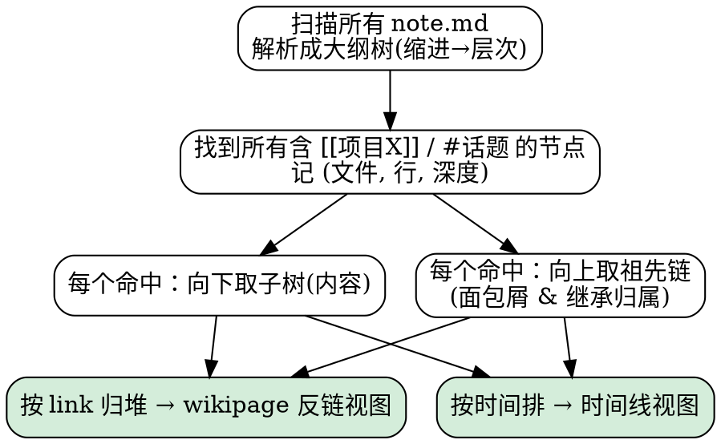

# 笔记召回层 方案讨论

> 类型：方案讨论 / 设计探索（未定稿、未排期）
> 日期：2026-07-13
> 参与：产品作者（用户） × Claude
> 关键词：伴生笔记 · note.md · 层次大纲 · 时间线 · wikilink 反链 · 召回 · file-over-app
> 相关：`docs/FAQ.md`、伴生笔记(sidecar notes / `.notes.md`)、Roam 导入功能、可切换侧栏

---

## 0. 一页速览（TL;DR）

- **要解决的真问题**：*捕获位置要自由，召回必须统一*。笔记会散落在文档的伴生笔记、某日期的 daily note、或关键词 wikipage 上；无论写在哪，都要能按**时间线**滚动重现、按**项目/话题**系统列全。
- **地基已经就位**：所有笔记已统一为 **note.md 层次大纲**。层次结构 = 天然的 block 模型；**所在行 = 定位**，**缩进 = 父子关系**。不需要数据库式 block id。
- **通用笔记原子**：`时间戳 + [[wikilink]] + 内容`。时间让它进时间线，wikilink 让它进 wikipage 反链，内容随便躺在哪个文件里。
- **归属靠层次继承**：父节点的 `[[项目X]]` 沿缩进传播给整个子树 —— 归属写在文件里(缩进)，比目录魔法干净，比逐条 link 省事，且守 file-over-app。
- **召回层是只读派生**：三视图(时间线 / wikipage 反链 / 查询)全部从纯文件扫描重建，不写回文件、不承载语义。这是对 Roam 的严格超越 —— 同样的 outliner 数据模型，但守住 file-over-app。
- **关于持久 id 的结论**：当前的反链 + 时间线需求**不需要 id**。id 是"块引用/深链"这一**未来能力**的需求；真要做，应照 Obsidian `^blockid` 的成熟做法：**给被引用的目标、懒生成、在写入/引用动作端补、写进正文行尾** —— 而不是"给含 wikilink 的行、在索引时批量回写"。

---

## 1. 背景与问题的提出

### 1.1 问题一：伴生笔记丢失了"时间线累积"

过去用 Roam Research 写笔记，完全自控：即使有冲突，也都写在 daily note 里，新日期覆盖/补充旧日期；通过项目关键词的反链，能按时间顺序看到历史笔记；冲突时自己知道更相信近期的版本。

而现在笔记作为 md 文件的**伴生笔记**存在时，缺少了"在日记时间线上持续累积"的方式，导致只有**一个 note 版本**。虽然有 git 能看历史，但"以前那种笔记历史一目了然"的体验丢失了。

### 1.2 问题二：笔记是围绕"项目/话题"持续做的，位置却是多样的

不可能只在单个资源(某个 md、文档摘要、书籍摘要、视频摘要)上持续做笔记；真实情况是围绕**一个项目**或**一个感兴趣的话题**持续做。这些笔记应该：

- 能在 daily note 上**滚动可发现**；
- 能根据项目/兴趣的 **wikipage 全部列出**。

而真正动笔的地方却是多样的、随用户习惯而定：

- 项目下某个文档的**伴生笔记**里；
- 某日期的 **daily note** 里；
- 直接写在关键词的 **wikipage** 上。

**核心诉求**：无论写在哪里，都要能**快速、系统地召回**。

### 1.3 问题三（关键地基）：所有笔记已统一为 note.md 层次大纲

不同地方的笔记，已全部设计为 **note.md** —— 一种**层次型大纲笔记**。因此：

- 计算(聚合)时可以**根据层次的所在行进行聚合**；
- 可以**查看某节点的所有子节点树信息**。

---

## 2. 核心诊断

### 2.1 先拆维度：怀念 Roam ≠ 要回到 Roam

用户怀念的不是 Roam 这个工具，而是 **append 累积**带来的三样东西，以及 Roam 把两个**正交维度**混在一起处理的便利。

| 维度 | Roam Daily Note | 伴生笔记(改造前) |
|---|---|---|
| **主轴** | 时间(每天一页) | 文档(每个 md 一份) |
| **写入语义** | append 累积(只加不覆盖) | canonical 覆盖(永远一份"当前") |
| **聚合方式** | 反链跨页聚合 | 钉死在单个文档上 |
| **历史** | 文件本身即历史(时间倒序可读) | 埋在 git 里 |

append 累积带来的三样东西：

1. **演化可读** —— 不靠工具就能按时间顺序看到想法怎么长出来；
2. **冲突免疫** —— 新日期压旧日期，靠时间戳天然定序，信任最近的；
3. **认知诚实** —— "我曾经这么想、后来改了"的痕迹被保留，对反思极重要。

### 2.2 容器错配：两类笔记被塞进了同一个容器

- **注释型笔记**（关于"这份文档"）：伴生笔记是对的容器，只是缺时间维度。
- **思考型/项目型笔记**（关于"某个主题"，天然跨文档）：**根本不该钉在某个文档的 sidecar 上**。

Roam 的爽感来自把两类都当第二类处理；改造前的伴生笔记把两类都当第一类处理。都是错配。

### 2.3 file-over-app 的价值观检验

产品有 **file-over-app 硬原则**：文件语义必须 Obsidian/CLI 可直接解析，约束放写入端，front-matter 不承载解析语义。

- Roam 的反链魔法**恰恰违反 file-over-app** —— 脱离 Roam 应用，那堆 daily note 就是散乱 md，时间线与聚合全靠数据库特权。所以"回到 Roam"是背叛自己的原则。
- **真正的解**：在 file-over-app 约束下恢复 append 时间线与跨位置召回 —— 不靠应用魔法，靠文件本身的结构(缩进层次 + `[[wikilink]]` + 日期节点)表达。这是对 Roam 的**严格超越**。

### 2.4 问题的本质：捕获与召回必须解耦

> 捕获位置要自由，召回必须统一。

用户不想被"该写在哪"绑架，但要求"写在哪都能系统召回"。这两件事必须解耦。Roam 靠一件事做到解耦：**link 是聚合的唯一真相，位置无关紧要**。你在哪写不重要，只要那段话里带了 `[[项目X]]`，它就归属项目 X。

所以要做的不是"统一存放"，而是**统一召回层**。

---

## 3. 关键洞察：note.md 层次大纲 = file-over-app 版的 Roam outliner

用户"所有笔记已是 note.md 层次大纲"这一事实，把地基彻底夯实：

- **层次结构 = 天然 block 模型**；**所在行 = 定位**；**缩进 = 父子关系**。
- 早前担心的"聚合粒度是段落还是文件、要不要引入隐藏 block id"，被**层次结构从根上解决**：节点边界自解释(缩进)，定位精确(行号)，且全是纯文本，Obsidian outline / CLI 都能解析。**层次本身就是 id。**

这解锁了两件 Roam 做得吃力、而这里能做得**更干净**的事。

### 3.1 归属靠"层次继承"，不用目录魔法，也不用逐条 link

```
- [[项目X]]              ← 这里 mention 一次
  - 2026-07-13
    - 今天发现……         ← 天然归属项目X，不用再写 link
    - 又想到……
  - 2026-06-20
    - 当时以为……
```

父节点的 `[[项目X]]` **沿缩进向下传播给整个子树**。归属关系**写在文件里(就是缩进)** → file-over-app 成立；又不必每条重复打 link。

- 比**目录魔法**干净：归属是可见文本，不是靠"文件在哪个文件夹"的隐性约定。
- 比**逐条显式 link** 省事。
- "根据层次的所在行聚合" + "查看子节点树" 正好是这套继承的两个方向：**向上找归属，向下取内容**。

### 3.2 每条召回都自带"上下文路径 + 展开细节"

- 扁平笔记(普通 md 段落 / Roam 里孤立引用)召回出来是**一个点**，不知道语境。
- 层次大纲召回出来是**树上的一个位置**：
  - **向上的祖先链** = 面包屑(它在哪个文档伴生笔记、哪个日期、哪个父话题下)；
  - **向下的子树** = 完整展开(即"查看所有子节点树信息")。

两头都占 —— 这是普通 md 笔记给不了的。

---

## 4. 通用笔记原子

上一轮为恢复时间线提出的"日期分节"，与这一轮的多位置召回，指向**同一个东西**：

```
一条笔记 = 时间戳(何时) + [[wikilink]](属于谁) + 内容(写什么)
```

| 身份 | 作用 |
|---|---|
| **时间戳** | 让它能在时间线上滚动可发现 |
| **wikilink** | 让它能在项目/话题 wikipage 上被反链列出 |
| **内容** | 物理上随便躺在哪个文件里 |

只要每条笔记(不管写在伴生笔记、daily note 还是 wikipage 里)都长成这个原子，召回层就能把散落各处的条目**按时间线合流、按 link 归堆**。位置彻底不重要。

> 这就是为什么"日期条目"是地基：它给每条笔记发了**时间**和**归属**两个身份证。没有它，daily note 里那条和伴生笔记里那条就无法在同一个视图里排队。

---

## 5. 召回层设计

### 5.1 三种召回，三个视图，全是只读派生

| 召回维度 | 视图 | 本质 |
|---|---|---|
| **时间线**(滚动重现) | 统一时间流 | 把所有容器里的日期条目按时间倒序合流 = **一个虚拟的、聚合的 daily note** |
| **主题**(项目/兴趣列全) | wikipage 反链区 | 所有 mention `[[项目X]]` 的节点，按时间排 |
| **查询**(定向捞) | 搜索 | link + 时间范围 + 全文的组合(如"近一个月所有 `[[项目X]]`") |

**最关键的一条**：三个视图都是**应用从纯文件扫描出来的可再生索引，绝不写回文件、不承载语义**。索引删了能从文件重建 → 应用可替换，文件是真相。这守住 file-over-app，也是对 Roam(数据库特权)的严格超越。

### 5.2 召回引擎算法



全程只读派生，不写回文件；索引可从文件重建。

### 5.3 跨文件子树的呈现

同一个 `[[项目X]]` 的召回，来自 N 个文件的 N 个子树。建议**平铺列出、每条带面包屑**，而**不**硬合并成一棵虚拟大纲（合并会产生歧义）。

---

## 6. 待定的设计决策（Open Questions）

按"已收敛的倾向"整理，尚未定稿：

### 6.1 时间怎么进大纲（时间线视图唯一的硬骨头）

- **方案 A（倾向）**：日期本身是大纲里的一层节点（如 `2026-07-13` 作为中间层）。干净、纯文本、无隐藏语义，继承逻辑天然。
- **方案 B**：任意节点带一个**可见的**时间戳前缀/字段（适合"直接写在 wikipage 深处、又懒得建日期层"的场景）。
- **退化**：祖先链里都没有日期节点时，才退回 git / mtime（不纯，仅兜底）。

> "直接写在 wikipage 上"的条目是三种写法里唯一的时间戳硬骨头 —— 它没有天然时间来源。

### 6.2 "笔记原子"要产品固化到什么程度

给个"记一条"的强入口逼用户就范，还是纯约定、靠自觉？

### 6.3 wikipage 反链视图的落位

实时渲染进页面视图，还是一个独立面板（现有"可切换侧栏"基建可用）？

### 6.4 大 vault 的增量索引

节点移动时如何避免误判？倾向 `内容 hash + 祖先路径` 启发式匹配，**不需要持久 id**（详见第 7 节）。

### 6.5 迁移 / 优雅降级

现存伴生笔记大多没有日期结构，召回层对它们如何优雅降级。

---

## 7. 专题：要不要给节点分配持久 id？

### 7.1 用户提议

为了反链索引方便，**含 wikilink 标记的大纲行**应有全局唯一的持久化 id；id 只为重建索引加速。写 note.md 时不默认生成 id，而是**第一次处理(索引)时更新插入 id**。

### 7.2 分析结论：当前不需要，且提议的规则/时机需调整

**(a) 当前需求根本不碰 id。** 反链召回是只读派生：扫文件 → 找含 `[[X]]` 的行 → 记 (文件, 行, 内容)。这一步不需要 id。id 真正能加速的只有两件事，且都不是当前所需：

- 增量索引在"节点移动"时的准确性 —— 靠 `内容 hash + 祖先路径` 启发式即可，只读视图对偶尔误判(删+增)无感；
- 稳定的块级引用 / transclusion / 深链 —— 这是**未来能力**，现在没有。

→ 对当前的反链 + 时间线需求，id 是 YAGNI。

**(b) id 贴错了对象。** `wikilink` 是**出边**，含它的行是链接**源**；反链只需解析"这条指向了 `[[项目X]]`"，**源不需要 id**。真正需要持久 id 的是**入边的目标**：想深链/引用到某个具体节点时，那个**被指向的节点**才需要稳定身份 —— 而被引用的往往是某条结论、某个观点，**它们通常没有 wikilink**。发放条件应是"**这条被引用了**"，不是"这条含 wikilink"。

**(c) 时机与自身原则打架。** "索引时插入 id" = 让**只读的索引过程去写用户源文件**：

- 每个文件首次索引就产生一次纯 noise 的 git diff；
- 多设备 / git 同步下，两台机器首次索引各自插 id → 冲突；
- 违反"应用别偷改用户写完的东西"。

file-over-app 原则里有"**约束放写入端**"。要补 id，应在**写入/引用动作端**补(用户敲下引用、离开该行时就地补，是可见编辑动作，diff 归属清晰、单设备产生)，而非索引端批量回写。

**(d) 语法别自造。** 真做块引用，用 **Obsidian `^blockid` 标准语法**：

```
- 某条被引用的结论 ^k3f9a2
```

这才是 file-over-app 意义上的"可解析"(Obsidian 原生认识)，代价是可见尾巴 → 更要**少发 id**，只发被引用的目标。

### 7.3 参照：Obsidian `^blockid` 的成熟做法

| 维度 | Obsidian 的做法 | 用户原提议 |
|---|---|---|
| **时机** | 引用发生时才生成(懒) | 索引首次处理时批量插 |
| **对象** | 被引用的**目标** | 含 wikilink 的**源**行 |
| **位置** | 目标块正文行尾 | (同，正文) |
| **触发方** | 写入 / 引用动作端 | 只读索引端回写 |

Obsidian 机制细节：

- **何时**：不是写笔记时自动给每个块生成；而是当你在别处打 `[[某文件#^` 触发块选择器、选中目标块的那一刻，Obsidian 才在目标块末尾追加 `^随机id` 并补全链接。也可手动敲 `^my-id`。
- **哪里**：写在**目标块正文行尾**，同一个 .md 文件里，空格分隔，不进 front-matter、不进 sidecar/数据库。段落加在末行行尾；**列表项/大纲节点加在该行行尾**。
- **格式**：短随机串(通常 6 位字母数字)；可自定义。引用侧写 `[[file#^id]]`(跳转) 或 `![[file#^id]]`(嵌入)。

> 优势：用户做的是**严格层次大纲**，每个缩进节点就是一个明确的块，不会有 Obsidian 那种"这个 id 到底属于单个列表项还是整张列表"的边界歧义。

### 7.4 建议

1. **现在不要加 id。** 反链 + 时间线用"文件 + 行 + 内容 hash"动态派生先上线，保持最纯 file-over-app，零文件污染。
2. **增量索引**担心节点移动失准，用 `hash + 祖先路径` 启发式匹配，不需要持久 id。
3. **把 id 留到真做"块引用 / 深链"那天**，届时改成：给**被引用的目标**懒生成、用 `^blockid` 语法、在**写入端**补。

> 悬而未决的动机澄清：加 id 的动机，是担心重建索引慢，还是心里其实已经在想"块之间互相引用"？两个答案会把设计带到完全不同的地方。

---

## 8. 用户使用建议（不等产品，今天就能做）

1. 在伴生笔记里手动用 `## YYYY-MM-DD`（或日期大纲节点）分节，新想法 append 到顶部，永不覆盖旧的 —— 这就是"日期原子"的纯手工版。
2. 顶部维护一个"当前结论 / TL;DR"区：回看读顶部，考古读下面。
3. **区分容器**：凡"关于某个项目/想法的持续思考"，别塞进某个文档的 sidecar，单独开一个主题笔记走时间线 + wikilink。
4. 冲突时不删旧内容，划线或移进底部"历史"折叠区，保留"我曾经这么想"。

---

## 9. 结论与下一步

- **数据模型已就位**（note.md 层次大纲 = file-over-app 版 Roam outliner）；缺的不是功能，而是**把召回视图这一层长出来**。
- 轮廓已完整到可写 spec：**一个跨 note.md 的、层次驱动的召回层 —— 命中节点连子树带面包屑，按 link 归堆成 wikipage 反链、按大纲里的日期节点排成时间线，全是可再生的只读派生。**
- **剩余要拍的板不多**：时间节点的约定(§6.1)、反链视图的落位(§6.3)、大 vault 增量索引(§6.4)、迁移降级(§6.5)、id 的动机澄清(§7.4)。
- 下一步建议：就上述 Open Questions 正式走一遍设计收敛（brainstorming），产出可实现的 spec，再动代码。
