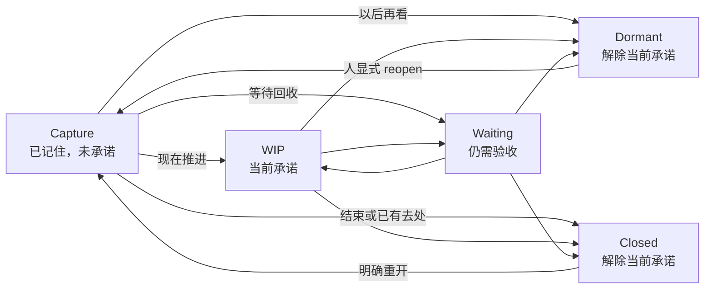

# Next 插件设计

- 日期：2026-08-29
- 更新：2026-09-01（1.5.0 加入 Task 卡片）
- 状态：MVP 已实现，产品效果仍须按 G0–G4 验证
- 插件：`notemd.next`
- 分类：Thinking / 思考
- 输入：用户提供的《Open 念头应先分流承诺再限制 WIP》及其中列出的研究与验证门

> 1.5.0 扩展：Next 现在同时承载 Idea 与 Task；本文的 Idea-only 对象范围由 [Next Task 卡片设计](./2026-09-01-next-task-cards-design.md) 补充和覆盖，承诺状态机与 WIP 原则不变。

## 0. 直接结论

这不是一个想法看板，而是一道**承诺防火墙**：

> 把所有念头安全地留在 Vault，只把最多三个正在推进的承诺留在手上。

Next 主要负责分流和安放，同时提供一个人的显式快速捕捉入口：顶栏「新建 Idea」或 `⌘N / Ctrl+N`。它把正文写入 Idea Spark 当前使用的同一个目录，只生成一条未承诺的 Capture，不自动进入 WIP。Idea Spark 继续提供完整编辑、托盘和 agent 论证能力；两者共用文件契约但不混淆“捕捉”与“承诺”。

核心动作仍是**安放**：把一条念头放到四个去向之一——现在推进、等待回收、以后再看、结束或已有去处。新建只是更快进入 Capture，不产生处置事件。

## 1. 三层边界

| 层 | 负责什么 | 真相源 |
|---|---|---|
| 捕捉层 | 记住原始念头；可由人写，也可由 agent 产出候选 | `*-idea.md`、原对话引用 |
| 承诺层 | 人决定是否承担下一步与验收责任 | Next 处置事件 |
| 执行层 | 已升级项目、委托、购买或自动化后的实际工作 | 对应项目、人员、产品或流程 |

Next 拥有承诺层，并可在人明确点击新建时向捕捉层追加一份新原文。它不改任何既有原文，不替代项目管理，也不把外部系统复制进来。

### 1.1 五条不可破坏的不变量

```text
被捕捉 ≠ 被承诺
被论证 ≠ 被完成
被委托 ≠ 已验收
被休眠 ≠ 被删除
被关闭 ≠ 必须做完
```

### 1.2 与 Idea Spark 的关系

不把功能塞进现有 `notemd.idea-spark`：

- Idea Spark 的首要动作是 Capture，提供完整编辑、托盘和 agent 工作流；Next 的首要动作仍是 Thinking，只补一个窗口内的最小快速记录入口。项目要求插件保持单一分类。
- Idea Spark 还保留永久删除 idea/proof 的能力；Next 中的 close 只解除承诺，永不删除源文件。
- 独立的 Next 以后可以接其他来源，不被 Idea Spark 的编辑器和 agent 任务绑死。

Next 不新增托盘项，也不建立第二个 inbox。窗口内新建与 Idea Spark 读取同一份 `.notemd/idea-spark.json`；配置缺失或非法时共同回退到 `inbox/ideas/`。

## 2. 核心抽象：证据与承诺正交

一条 idea 同时有两种互不替代的信息：

1. **证据进度**：是否已有同名 `.proof.md` 等材料。系统可推导。
2. **承诺状态**：人是否愿意继续承担。只能由人的「安放」动作改变。

`.proof.md` 存在只显示「已有论证」徽标，绝不显示为 closed。现有 Idea Spark 把 proof 存在称为 `done`，交付本插件时应同步把用户可见语义改为 `proofed / 已论证`，但不让两个插件共享生命周期状态。

## 3. 最小状态机



- `Capture` 是隐式状态：存在源 idea 且没有生命周期事件，或最新生命周期事件为 `reopen`。
- 只有 `WIP` 占 WIP 槽位。
- `WIP` 与 `Waiting` 都有当前责任：前者占执行槽，后者占回收容量。`Capture`、`Dormant`、`Closed` 没有当前责任。
- `Dormant` 和 `Closed` 不占当前注意力，默认不显示。
- `Clarify` 不做持久状态；它就是一次「安放」表单。仍无法决定就退出，继续留在 `Capture`。

## 4. 「安放」是唯一核心交互

用户选中一条念头，点「安放」，只看到四个去向：

| 去向 | 必填内容 | 结果 |
|---|---|---|
| 现在推进 | 承诺、下一步、关闭条件 | `WIP` |
| 等待回收 | 等待什么、回收时间 | `Waiting` |
| 以后再看 | 唤醒条件 | `Dormant` |
| 结束或已有去处 | 出口，以及该出口要求的理由/去向 | `Closed` |

允许「先不决定」直接退出，不要求用户为了整理而强行归类。目标是每次安放用 10–30 秒完成。

### 4.1 WIP：三个固定槽位

进入 WIP 只填三项：

- **承诺**：这次具体要验证或交付什么。
- **下一步**：重新打开时可以直接执行的动作。
- **关闭条件**：出现什么结果或证据就可以停止。

`3` 是待验证的预注册起点，不是文献给出的产品真理。首版先显示 `n/3` 的中性提醒；G3 的限制阶段才由领域状态机拒绝第四个 `commit`。只有 G3 通过，硬限制才成为默认。

即使硬限制生效，也不能把 `Waiting` 当成腾槽区：只有真实出现外部依赖和回收责任时才能进入 `Waiting`。若外部编辑或同步已经产生超过 3 个 WIP，插件完整显示、停止新增并请用户安放，绝不隐藏或自动降级现有承诺。

### 4.2 Waiting：保留验收责任

只填：

- **等待什么**：对象与期待输出。
- **回收时间**：何时检查或验收。

默认警戒线为 5，但首版只做中性提醒，不拒绝记录。已经发生的外部等待不能因为超限而失踪。

委托不是 close。只有用户明确承担某个外部交付的验收责任，并在 Next 中选择「等待回收」，才进入 `Waiting`。Idea Spark 的「委托论证」只生成 evidence，不改变 `Capture/WIP/Waiting` 中的任何状态。

收到结果后有三个去向：验收即结束是 `done via delegate`；责任永久移交是 `transferred via delegate`；自己仍有下一步则回到 `WIP`。购买只关闭“是否自建”这个念头；若还要验证产品能否解决问题，应另进入 `Waiting` 并设置回收时间。

### 4.3 Dormant：安放，不是另一份 backlog

只填一个 `wake_trigger`，可以是明确日期，也可以是一句具体情境，例如「再次出现同类客户请求时」。已有明确未来计划时，可再附一个可选 `next_action`，仍不算当前 WIP。

首版没有后台唤醒：日期到达后，只在用户下次打开窗口时重新浮出；文字条件只是人工检索与恢复线索，不声称能被自动识别。浮出也不改持久状态，仍须由人重新安放，不能自动进入 WIP。

### 4.4 Closed：少状态，多出口

关闭原因不与注意力状态混在一起。持久状态只有一个 `Closed`，出口按四组呈现：

| `exit.kind` | `exit.via` | 约束 |
|---|---|---|
| `done` | 省略，或 `delegate` | 可选结果链接；`delegate` 表示交付已验收；完整文章使用兼容扩展 `delivery: article` 并必填成稿路径或公开 URL |
| `stopped` | `drop`、`disproved`、`ignore` | 一句话理由；`ignore` 可无理由 |
| `transferred` | `merge`、`project`、`delegate`、`buy`、`publish` | 必填去向；`delegate` 表示责任永久移交 |
| `compressed` | `principle`、`automate` | 必填规则、模板或自动化链接 |

这样保留正当出口，但不把十几个名词做成十几个平级状态。

领域层的唯一校验规则是：`done` 不要求理由、结果链接可选；`stopped/drop` 与 `stopped/disproved` 必填理由，`stopped/ignore` 不要求理由；`transferred` 必填 `target`；`compressed` 必填规则、模板或自动化的 `target`。其余说明文字均可选。

“整理并发布为完整文章”是完成类交付，不是转移责任：尚在整理、写作或发布时应留在 WIP，等待编辑或平台排期时进入 Waiting；只有文章已完成并发布，才能以 `done + delivery: article` 关闭，并记录文章路径或公开 URL。既有 `transferred/publish` 继续表示“公开素材供他人接力”，历史事件保持可读。`delivery` 是 `done` 内的可选兼容字段，旧版会保留但忽略，因此 ledger 仍为 version 1。

### 4.5 项目 Tag：多重归属，不是第二套项目状态

每次安放都可附多个可选项目 Tag，用于在 WIP、Waiting、Dormant 与 Closed 间保留归属和搜索线索。表单把已选项目显示为可移除胶囊，最多先列出 5 个已有项目快捷项；用户也可输入名称后按 Enter 或点「添加」创建新 Tag。这里的“创建”只创建标签字符串，不创建项目文件。卡片显示前两个项目和 `+N`，项目不会占用额外 WIP，也不会改变安放状态。

事件以 `projects` 保存规范集合：省略表示继承，非空数组表示按用户顺序整体替换，`null` 表示显式清空。新 writer 在变更时同时写入旧字段 `project`，其值为第一个 Tag；清空时双写 `projects: null` 与 `project: null`。旧事件只有 `project` 时，新 reader 归一为单元素集合。这样 ledger 继续使用 version 1，旧版至少仍能看到主项目，也不会因新版清空而复活旧值。

“升级为项目”的 `target` 与分类 Tag 分离：只有一个 Tag 时自动作为目标；有多个 Tag 时必须明确选择升级到哪一个。目标必须来自已选 Tag，避免把多重关联误当成多个责任去向。

项目 Tag 只存在于 Next 事件，不扫描不存在统一契约的 Project 文件，不自动创建项目、不改写原始 idea，也不做项目双向状态同步；真正的执行和验收仍由项目系统负责。

### 4.6 Inbox 的本地项目建议

新出现且尚无处置事件的 Inbox Idea 可以显示至多一个“建议 · 项目”按钮。建议只是可删除、可重算的内存投影：不写 ledger、不自动选中，也不改变 Capture。用户点击建议按钮后，安放表单才把该 Tag 加入草稿；取消表单不留下任何数据，最终仍只有人的安放动作能写入确认结果。

匹配不调用 LLM，分两级执行：

1. 对项目名和 Idea 全文做 Unicode NFKC、大小写折叠与空白归一。完整项目名唯一命中时直接建议；拉丁名少于 3 字符、中文名少于 2 字不触发。
2. 若未命中项目名，使用历史上由人确认过项目 Tag 的 Idea 作为本地训练样本。中文连续文本生成 2–3 字 n-gram，拉丁文本取长度至少 3 的词；每个样本只为一个 term 计一次，防止长文放大权重。按 term 出现在多少项目中计算 IDF，并按其在项目样本中的覆盖率加权，预先构建 `term → project postings` 倒排索引。

查询只遍历新 Idea 命中的 postings，累加候选分数。最高项至少命中 2 个 term、分数达到 2.2，并且相对第二名领先至少 20%且绝对领先 0.35 才显示；并列、弱命中和证据不足都不猜。索引构建复杂度为 `O(历史文本 token 数)`，每条新 Idea 为 `O(查询 token 数 + 命中 postings 数)`；正常打开窗口只构建一次，不产生网络请求。阈值是保守产品起点，后续用点击采纳率与取消率调整，不能宣称为通用最优值。

「计划以后做」不另造出口：仍是当前承诺就留在 `WIP`；只是未来可能性就进入带触发器的 `Dormant`。

## 5. 界面：五条泳道，不是全量 backlog

插件是一个纯前端 singleton 独立窗口，从「插件 → 思考 → Next」打开。当前插件协议不能注册主窗口侧栏，因此不设计常驻看板；窗口内使用横向五泳道，让状态关系和可拖放目标一眼可见。

顶栏提供「新建 Idea」按钮，并显示平台快捷键 `⌘N / Ctrl+N`。弹层只要求无法省略的正文输入，明确显示保存目录，支持 `⌘Enter / Ctrl+Enter` 保存和 Escape 取消；保存失败保留草稿。创建成功后新 Idea 出现在 Capture 泳道，不自动打开、不自动安放。界面不直接暴露内部状态术语；五条泳道采用用户已经熟悉的名称：`收件箱 / 进行中 / 等待 / 稍后 / 已完成`（英文为 `Inbox / In Progress / Waiting / Someday / Done`）。

副标题之后按当前项目候选顺序列出项目胶囊。点击一个项目后，五条泳道与修复区只显示包含该 Tag 的卡片；再次点击同一项目即清除筛选。项目筛选与文字搜索取交集，只改变当前投影，不写事件、不改变 WIP 计数或项目候选顺序。没有项目时不显示空筛选区。

```text
┌ 收件箱 ─────┐ ┌ 进行中 2/3 ─┐ ┌ 等待 2 ─────┐ ┌ 稍后 ───────┐ ┌ 已完成 ─────┐
│ 最近念头 A   │ │ 承诺 A       │ │ 等设计稿     │ │ 到期才浮现   │ │ 默认不常亮   │
│ 最近念头 B   │ │ 承诺 B       │ │ 等外部验证   │ │              │ │              │
└─────────────┘ └─────────────┘ └─────────────┘ └─────────────┘ └─────────────┘
```

五条泳道和卡片等宽；窗口不足时只横向滚动，不压缩卡片。`Capture` 默认最多呈现 10 条近期念头但不暴露总债务；`WIP` 与 `Waiting` 完整显示；`Dormant` 默认只显示已到日期的条目；`Closed` 默认为空。用户主动「显示已安放」或搜索时，才加载全部 Dormant/Closed。孤立与未知记录进入独立修复区，不混入可拖放状态。

卡片只显示恢复行动所需的信息：标题、最多两个已确认项目 Tag 与 `+N`、下一步或等待对象、必要日期，以及独立的「已有论证」徽标。未经确认的 Inbox 项目建议使用虚线按钮而不是已选 Tag；点击才打开带该 Tag 草稿的安放表单。不做优先级、估时、分数、标签云或卡片 `…` popup。鼠标停留或键盘聚焦卡片时，在泳道滚动容器外显示完整 Idea 正文 Tip；正文来自扫描时已读取的源文件，不为 hover 二次读取，孤立卡片不显示旧内容。Tip 渲染后按实际尺寸在卡片左右定位并限制在视口内；鼠标可跨过短间隙进入 Tip 滚动，卡片聚焦时也可用方向键、Page Up/Down、Home/End 浏览长正文。每张卡使用独立的标题与描述关联。Escape、离开、滚动、失焦、打开操作表单或开始拖动时关闭；普通点击没有形成拖动时恢复仍在卡片上的预览。卡片可拖到另一泳道：drop 只预选对应安放 route，仍须在 sheet 确认该状态的必填信息后才写事件；Dormant/Closed 拖回 Capture 使用显式 `reopen`。按钮完整保留，作为键盘操作和精确编辑路径。

Tauri 插件窗口的 OS 级 drag-drop handler 会吞掉 webview 内的 HTML5 `dragstart/drop`，因此泳道拖动必须由 pointer 事件实现：按下后移动超过 5px 才进入拖动态，以泳道的 viewport rect 命中目标，松开才触发转换；Escape、pointer cancel、窗口失焦、同泳道与无效落点均只取消，不写事件。测试必须走 pointerdown → pointermove → pointerup，不能伪造宿主实机收不到的 HTML5 DnD。

安放 sheet 对每个可枚举字段提供 4–5 个快捷答案，点击即可填入，仍可在下方编辑。承诺、下一步、关闭条件、等待对象、回收日期、唤醒条件、停止理由、出口方式和结果均遵循选择优先；项目 Tag 可多选、移除或自由创建；人员、产品、文章链接等无法可靠推断的信息必须输入，不能用泛化类别制造虚假去向。快捷答案只是减少输入，绝不替人自动提交或自动承诺。

## 6. 文件与真相源

### 6.1 只新增，不改既有源文件

- 首版在 Next 文档的 `source_dirs` 中发现严格以 `*-idea.md` 结尾的普通文件；初始目录取 Idea Spark 当前 `ideaDir`，缺失时默认 `inbox/ideas/`。
- 必须兼容既有 `*-idea.md` 命名，不能擅自改成 `*.idea.md`。
- 人可从 Next 新增一条原始 idea；文件名、frontmatter、目录 fallback 与 Idea Spark 保持一致，同分钟创建会同时避让已有 idea 和 proof 槽位。
- 所有已存在的原始 idea 与同名 proof 仍为只读。Next 永不删除、重命名或改写它们；安放动作也绝不触碰源文件。
- 没有处置事件的源文件隐式为 `Capture`，不需要为每条候选生成卡片文件。

### 6.2 单一可读台账

`Next` 是英文产品名；中文显示为“下一步”，日文为“次の一歩”，德文为“Nächster Schritt”。插件市场名称、菜单入口与窗口内标题在每种语言中保持一致；`notemd.next` 等内部兼容标识不变。下文的 `ledger` 只指 append-only 事件存储模型，不是用户可见名称。

人的处置事件保存在一个普通、可搜索的 Vault 文档：

```text
thinking/next.note.md
```

它是随 Vault 同步、可由 note.md、Obsidian、CLI 和任意 agent 读取的 Markdown 文件。UI 是可删除、可重建的投影；**ledger 本身是真相源，不能声称删掉后还能从原始 idea 恢复关闭理由。**

需要在项目的 OKF 类型登记中新增 `Next`。Frontmatter 存结构化事件，正文是确定性的人类可读镜像。

### 6.3 最小事件模型

```yaml
type: Next
version: 1
source_dirs:
  - inbox/ideas
events:
  - at: 2026-08-29T14:10:00Z
    event_id: 01K...A
    idea_id: 01K...B
    action: commit
    source:
      path: inbox/ideas/2026-08-29-1341-idea.md
      created: 2026-08-29T05:41:00Z
    commitment: 本周验证是否需要 Next
    next_action: 回看最近 30 条 idea 并标注去向
    close_condition: 得到继续、放弃、合并与购买替代率
    projects: [Next, 写作]
    project: Next # 兼容 1.3 及更早 reader 的主项目镜像
```

事件只有六种：

| action | 作用 |
|---|---|
| `commit` | 进入/更新 WIP，并携带三个必填字段 |
| `wait` | 进入 Waiting，并携带等待对象与回收时间 |
| `park` | 进入 Dormant，并携带唤醒条件 |
| `settle` | 进入 Closed，并携带 `exit.kind`、条件适用的 `exit.via`、理由与可选去向 |
| `reopen` | 回到 Capture，等待人重新判断 |
| `relink` | 只更新源引用，不改变承诺状态 |

`source_dirs` 是 Capture 扫描范围：窗口首次成功载入时即创建空事件文档并写入当前 `ideaDir`；以后每次载入发现 Idea Spark 改了目录，就在扫描前保留旧值并加入新值。目录历史不能等到第一次安放事件才持久化，否则这之前发生的目录迁移会让旧 Capture 失联。

`event_id` 每次安放唯一，`idea_id` 在第一次处置时生成并在后续事件中保持稳定；`relink` 也按 `idea_id` 更新引用。插件按事件顺序归约出当前状态。重复 `event_id` 只有在 payload 完全相同时才视为幂等；同 ID 不同内容、或同一 source 对应多个 `idea_id`，都停止写入并要求人工解决。

读取必须宽容但不能假装理解：未知字段原样保留；未知 `action` 涉及的 idea 标为 `unsupported`，不参与自动转换；硬 WIP 模式只要存在未知 action，就禁止新增 `commit`。归约器优先解释 `projects` 的非空、去重字符串数组与 `null`，否则回退解释旧 `project` 的非空字符串与 `null`；对 v1 历史中同名但未知的其他形状继续保留并忽略，不能因新版开始使用这些字段就把旧台账变成只读。1.4 writer 严格要求 Tag 已 trim、非空、无重复，并要求兼容 `project` 与第一项一致；同时继续要求文章交付有非空 `result`。固定的 Next 文档已存在但 YAML、`type`、`version` 或 `events` 不符合 v1 时进入只读修复，绝不能降级为空数组后覆盖；`version > 1` 也不能用 v1 writer 回写。

`host.vault.write` 是整文件覆盖，没有 append/CAS。首版只允许这个 singleton 窗口写 ledger，所有写入串行；每次保存前重读并比较已加载内容的摘要。发现变化时先刷新，再重新验证目标 idea 的当前状态、source→`idea_id` 唯一性和 WIP 容量；全部前置条件仍成立，才用同一 `event_id` 重放本次纯状态转换，绝不静默覆盖。它仍不能提供跨设备原子性；未来若需要多写者，再改成一事件一文件或新增原子 Host API。

### 6.4 重命名、删除与失联

路径不是稳定身份。首次处置同时记录 `source.path` 与 idea frontmatter 的 `created`：

- 路径失效时，在当前 idea 目录按 `created` 查找候选并让用户确认 relink；缺失或重复 `created` 时只允许人工选择，不猜。
- 找不到源时保留 orphan 记录；源文件消失不能推断为 closed。
- 用户可以对 orphan 明确 relink 或 settle，插件不能替他决定。
- proof 只是可选 evidence；proof 丢失或改名不改变承诺状态。

### 6.5 既有数据与目录变化

- 首次安装不迁移、不批量写文件：所有既有 `*-idea.md` 都是隐式 `Capture`；已有 proof 只增加「已有论证」徽标，绝不能迁成 `Closed`。
- 首次创建 Next 文档时读取 `.notemd/idea-spark.json` 的 `ideaDir`；文件缺失或未安装 Idea Spark 时回落到 `inbox/ideas/`。
- `ideaDir` 改动会把新目录加入 `source_dirs`，不会自动移除旧目录。Next 中已有的 WIP、Waiting、Dormant、Closed 仍按其 source 引用显示；源路径失效就进入 orphan/relink 流程，不能静默丢卡。
- 外部重命名没有可靠事件通知，只能提出 relink 候选并由人确认；本设计不声称自动同步所有重命名。

## 7. AI 边界

首版不做全自动对话抽取。当前插件协议没有统一的 AI 对话订阅、全局搜索、文件变化推送或后台常驻能力；为此修改 Host 会把验证性 MVP 扩成基础设施项目。

首版只消费两类已落盘来源：

1. 人用 Idea Spark 或 Next 顶栏显式记录，或由选中文本预填的 idea。
2. agent 按公开文件约定写出的 `*-idea.md` 候选。

产品协议规定 AI 只生成候选和 proof，不写 Next、不进入 WIP、不预选关闭结果；本插件也不提供任何 agent 写事件的入口。1.4 的项目建议完全来自本地字符串规则和倒排索引，不调用 LLM；任意外部 agent 仍可能凭 Vault 权限改文件，插件无法把这条产品边界升级成 OS 级强制。**正常工作流中，只有人的「安放」动作产生处置事件。**

若 G4 通过，再增加其他 agent 候选目录；候选仍只进入隐式 `Capture`。每日澄清成本超过 2 分钟，就降级为人的显式捕捉。

## 8. 最小技术形态

- 纯 UI 插件，无 backend、无 Editor Kit、无 agent capability。
- `manifest.v2.json`：`id: notemd.next`，最低 Host `>=6.901.1`，单一 `main` window，菜单 `location: plugins`、`submenu: thinking`；同时向 tray 的 `capture` 分组贡献 `main` 窗口入口，省略 `label` 以复用各语言产品名，并以 `Cmd+Ctrl+N`（macOS 显示为 `⌘⌃N`）作为全局快捷键。Host 以基础产品名稳定排序、以当前语言显示，因此 Next 在各语言中都紧随 Idea Spark；安装或启用后立即同步菜单与全局快捷键，无需重启。点击或按键都走同一窗口激活路径。窗口内 `⌘N / Ctrl+N` 仍只负责新建 Idea，两组按键语义不冲突。
- capabilities 仅 `vault.read`、`vault.write`、`editor.open`、`toast`。
- 复用 Idea Spark 的文件名/proof 映射与标题提取思路；复用 Decision Log 的纯 transition / IO 分层和 `.note.md` frontmatter + 正文镜像模式。
- 窗口打开和重新聚焦时刷新；首版不轮询、不常驻、不发独立通知。
- `Next` 同步登记到主程序 `CONCEPT_TYPE` 与搜索 origin；这是格式登记，不新增 Host API。运行时只依赖 6.829.2 已有的 Vault、编辑器与 toast API，因此无需为插件人为抬高最低 Host。

虽然 `vault.write` capability 也能调用 remove/rename，本插件代码只允许新增 source 与写 Next 事件文档，不得删除、重命名或覆盖既有 source。能力模型暂时无法表达更窄的“新增 Idea + 写 ledger”。

## 9. 明确不做

- 不新增托盘入口、完整 Idea 编辑器或第二个 inbox；Next 只保留一次性快速输入。
- 不做全量常亮的 open 看板或永久 backlog；泳道拖放不能绕过人的确认与必填校验。
- 不显示 capture 总数，不做逾期红点和“清零”奖励。
- 不做 AI 对话监听、自动承诺或自动关闭。
- 不做项目创建或双向同步；项目标记只提供归属与搜索线索，升级项目仍保存目标后关闭本念头。
- 不做自动语义唤醒、后台定时器、日历系统和独立通知。
- 不做优先级、估时、评分、通用标签云、统计仪表盘或团队协作。
- 不修改、移动或删除原始 idea/proof。
- 不把 close 数量或 open 数量下降当成功指标。

## 10. 验证顺序与停止条件

### G0 / G1：写 UI 前

1. 回看最近 30 条真实 idea：至少 10 条确有未处置成本，至少 3 条事后值得继续或应明确结束；否则停止开发。
2. 用 `capture / wip / waiting / dormant / closed` 标注 60 条历史 idea；每条不超过 30 秒。48 小时后重标 20 条，一致率须达到 80%；否则先修改澄清规则。

### G2：验证「安放」而非出口数量

抽 30 条旧 open，在 10 分钟内只用四个动作处理：现在推进、等待回收、以后再看、结束/已有去处。

通过标准：至少 50% 离开当前视野；两周重开率低于 10%；主观压力下降至少 1 分。若失败，不增加更多出口，先判断是否缺价值标准或事实调查。

### G3：验证三个槽位

四周交叉测试 WIP 软提醒与 WIP≤3 硬限制。通过标准：恢复耗时下降至少 30%，焦虑下降至少 1 分，每周关闭数与继续发展率不下降。

若失败，保留捕捉/承诺分层和多出口，默认保持软提醒。

### G4：最后验证 AI 候选

只有前述机制稳定后才测试更多 AI 候选来源。采纳率须至少 20%，每日澄清成本低于 2 分钟；否则只保留人的显式捕捉。

## 11. 首版验收标准

- 未经人的 `commit`，任何 idea 都不能进入 WIP。
- 同名 `.proof.md` 只产生「已有论证」徽标，绝不产生 closed。
- G3 限制阶段由领域层拒绝第四个 WIP，不能只靠禁用按钮；G3 通过后才成为默认。
- 每条 WIP 都有承诺、下一步和关闭条件。
- 明确承担的外部执行在验收前保持 Waiting；Idea Spark 的委托论证不改变承诺状态。
- 四个安放动作在 10–30 秒内可完成。
- 原始 idea 与 proof 在任何生命周期操作后字节不变。
- 视图重启或缓存丢失后，可从 ledger 事件完整归约承诺状态；标题/存在性来自 idea，proof 徽标来自 `.proof.md`。
- 源重命名可经 `created` relink；源删除不会自动关闭。
- 坏 ledger 不被空状态覆盖；未知事件保留并进入安全只读/受限模式，不被误当作已理解。
- 历史 `*-idea.md` 仍可见，默认视图不暴露全量 capture/dormant/closed 数量。

## 12. 依据与结论边界

输入材料支持的稳定方向是：具体计划可降低未完成目标干扰，外部托管可改善前瞻记忆，任务切换支持限制已承诺 WIP，目标脱离支持把放弃设计成正当出口，Kanban 支持限制在制品，Shape Up 支持保留记忆但不维持中央 backlog。

这些依据支持“可信安放机制”，不直接证明 `WIP=3`、四个动作或本插件能降低认知负荷。若验证通过，最多只能声称：对一个 AI 高强度、Markdown Vault 用户，这个分层可能减少半成品沉积、恢复成本和主观压力；不能外推到团队或普通用户。

## 13. MVP 实现位置

- 插件源码：`plugins-src/next/`
- 插件 ID：`notemd.next`，当前版本 `1.3.1`
- 最低 Host：`6.829.2`；本实现同时登记 `Next` OKF 类型，随下一次 Host 发布生效
- 开发安装：`scripts/dev-install-plugin.sh next`
- 专项验证：`pnpm --filter next-plugin test && pnpm --filter next-plugin check && pnpm --filter next-plugin build`

实现完成只证明状态机、存储安全边界和交互可运行，不代表 G0–G4 的行为效果已经成立。首版仍使用 WIP 软提醒；只有后续 G3 通过才启用领域层已经支持的硬限制开关。
