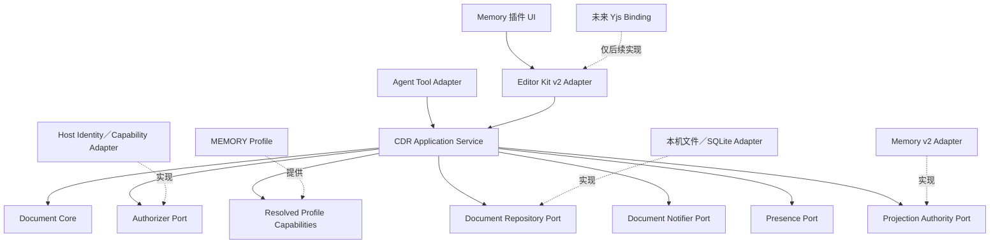

# 人与多 Agent 通用共写文档运行时设计

> 阶段：设计收敛，Stage 0D 的真实 self 文档纵向切片已实现；Stage 1 与 MEMORY MVP 尚未完成。
>
> 决策：采用“通用内核、MEMORY-first 验证”。从第一天使用领域无关的数据结构和窄接口，但第一阶段只交付 MEMORY 的完整纵向闭环。第二个真实场景验证前，不把内部扩展点发布为稳定 SDK，也不建设通用 IAM、事件平台或任意协作后端。
>
> 复核日期：2026-09-04。
>
> 文档关系：本稿是该方向的唯一实施基线，取代 `2026-09-04-co-authored-surface-design.md` 中与正文权威、治理归属、API 和 Yjs 时机有关的设计结论；旧稿中的仓库现状证据已在本稿重新核对。若旧稿继续保留，必须明确标记为 superseded，不能并列作为规范。

> 实施记录（2026-09-04）：已启动首个可运行切片：并存的 Editor Kit v2、领域无关的 Operation 会话，以及现有 `notemd.memory` 窗口内的“共写文档实验”。该切片验证单块 `block.replace`、串行本地确认、局部远程事务、ack 回声隔离、stale-base、幂等、Decoration 与 IME 排队；普通 Agent 只产生提案，直接远端更新明确标为“已授权服务端变更”fixture。块布局已扩展为“一个稳定块覆盖一组连续顶层节点”，远端替换可改变该范围的节点数并原子更新后续映射；本地插入、删除、移动、拆合及多块编辑仍 fail closed。现有 BlockYaml 的 chunk／fingerprint／merge 生产函数已加入 CDR conformance 测试：长中文小改和精确重排可保留 ID，但小于 20 个归一化字符的短块改写会 fresh＋retired，默认 `minChars=400` 也会合并相邻短章节。因此，“外部 Markdown 依赖当前 fingerprint／merge 重建已改写短块的身份”目前是明确 No-Go；携带显式 block ID 的 CDR 编辑与 Operation 寻址不受此结论影响。
>
> Stage 0C 已增加一个 UI-only、按认证插件隔离的宿主 opaque aggregate store，以及插件侧的持久 `DocumentSession` facade。store 以 generation CAS 和同目录临时文件原子替换单份 aggregate；facade 以 copy-on-write 保证 commit 成功后才安装候选状态并向 Editor ack。commit 异常后必须重新 load 来区分“候选已提交、旧版仍在、另一 writer 获胜”；无法读取或验证时进入 outcome-unknown，并锁定本实例和编辑器为只读，不能假装失败后继续写。窗口重开会恢复 committed head、提案、Assessment、AuditEvent 和幂等回执；损坏 schema、写失败和 CAS 冲突均 fail closed。Spike 的 fixture document ID 暂以当前 vault 根路径的 SHA-256 隔离，避免跨 vault 串数据；vault 移动会形成新 namespace，待阶段 1 的 frontmatter document ID 取代。此实现只验证本机单 aggregate 的提交与恢复边界，并不是下文完整 `DocumentRepository`：尚未接入 `.md`／BlockIdentityStore 的同 generation 提交、document-ID frontmatter、不可变 revision/journal、Publication、Annotation、Memory v2 Claim/Profile、其余三类结构操作、外部漂移或 Yjs，因此不构成 MEMORY MVP，也不宣称通过完整 G4。

> Stage 0D 已取代上一段中“尚未接入 `.md`／frontmatter／journal／外部漂移”的历史限制：Memory 插件现在只管理当前 vault 的固定槽位 `${wiki_dir}/Memory Workspace.note.md`，且首次写入必须由用户点击创建。Markdown 以 `cdr.document_id` 携带稳定身份；插件把通用 session、当前 head 的派生 fingerprint 索引、完整 SHA-256 `block_revision`、revision history、回执和审计封装成一个 opaque aggregate；Host v2 Repository 以 generation CAS、representation SHA-256 乐观前置条件、prepared journal、同目录原子替换和确定性恢复，将 vault Markdown 与 app-data aggregate 暴露为一次逻辑提交。保持 identity/profile 可解析且在替换前已检测到的正文漂移或文件删除会进入只读 drift，不自动采用或覆盖磁盘内容；frontmatter 身份或 profile 损坏则直接 fail closed。Host 仓库按 canonical vault root 的无损平台路径字节隔离 locator、aggregate 与 journal。根 `/MEMORY.md`、`/USER.md` 与 `.notemd/memory/**` 继续由路径围栏拒绝。v2 inspect/load 需要 `cdr.repository + vault.read`，commit 还需要 `vault.write`，且仅开放在认证插件 UI 通道。
>
> Stage 0D 仍刻意只支持一份新建的 `self` 文档和 `block.replace`：不纳管任意现有 Markdown，不实现 move/copy 重绑定、外部 diff/导入、projection、Annotation、Publication、insert/move/delete、Memory v2 Claim Adapter 或 Yjs。当前 aggregate 中的 `derivedBlockIndex` 只是从 committed head 重新计算并校验的派生索引，不是下文完整的 `BlockIdentityStore`；lineage、结构操作后的稳定映射与逐块 authority 要等 Stage 1 按完整 schema 实现。由此，Stage 0D 是可运行增强插件切片，不等于 MEMORY MVP，也不宣称完整通过 G1、G3、G5 或 G7。
>
> Stage 0D 的文件前置条件只对同一 Host 进程内、经该 Repository 协作的 writer 提供严格 CAS。任意外部进程若恰在最后一次 hash 检查与 existing-file rename 之间写入，跨平台文件系统 API 无法提供可移植的原子 compare-and-replace；本阶段不宣称解决该竞争窗口。完整 MVP 必须按第 7.3 节保存被置换 preimage／导入候选并通过故障注入 G4，在此之前产品文案只能承诺“检测到的 drift 不覆盖”。

## 0. 结论

产品不是 MEMORY 专用编辑器，也不是第一天就完成的通用协作平台，而是一个最小的 **Governed Collaborative Document Runtime（CDR）**：人和多个 Agent 通过同一组结构化操作维护一份可阅读、可追踪、可治理的文档。

第一阶段包含三个内部组件：

1. **Editor Kit v2**：稳定块身份、局部事务、锚点和装饰层。
2. **CDR Application Service**：统一编排读取、验证、授权、提案、提交、持久化和事件。
3. **MEMORY Profile Adapter**：把通用文档能力接到现有 Memory v2 权威服务。

通用性由以下条件证明，而不是由首版功能数量证明：

- Core、Application Service 和 Editor 接口不出现 MEMORY、Claim 或 Yjs 专有类型。
- MEMORY 的领域判断只存在于 Memory Profile／Adapter。
- 存储、编辑器、宿主和未来实时协作都通过窄端口接入。
- 第二个真实 Profile 接入前，不承诺公开 Profile SDK 的兼容性。

## 1. 目标、范围与非目标

### 1.1 产品目标

CDR 只解决七个通用问题：

1. 文档由带稳定身份的块组成，同时保持连续、自然的阅读体验。
2. 人和 Agent 使用同一种 Operation／ChangeSet 协议提交局部变化。
3. 同块并发通过精确基础版本检测，不以最后写入覆盖前一方。
4. Agent 默认提交提案；只有可信主体在明确授权下才能直接应用。
5. 批注与核验绑定实际检查的文档和块版本。
6. 临时在场与永久操作历史分离，Agent 活动显示在实际作用位置。
7. 当前工作内容、持久化内容和面向特定用途的采用版本可以区分。

### 1.2 MEMORY-first 的含义

MEMORY 是第一个 Conformance Profile：

- 首个端到端 UI 位于现有 Memory 插件窗口。
- 首个领域适配器连接现有 `host.memory.v2.*` 受控服务。
- 首个验证同时覆盖文档自持正文和外部权威投影块。
- MEMORY 的 Claim、consent、有效期、`review_after` 和 context eligibility 不进入通用核心。

MEMORY-first 不意味着：

- Core 可以引用 Claim 或 vault 数据结构；
- 通用 Operation 可以绕过 Memory v2；
- 为了 MEMORY 的特殊规则扩大所有 Profile 的接口；
- MEMORY 验证通过就宣称通用 SDK 已经稳定。

### 1.3 首版非目标

- 不实现跨设备或多人同段输入。
- 不在首版接入 Yjs；Yjs 仍是后续跨设备协作的已选实现，但通用接口只保留不泄漏具体类型的模块边界。
- 不建设多租户 IAM、临时授权 token 或通用策略 DSL。
- 不建设事件溯源平台、内容寻址对象库或任意存储后端框架；本机 aggregate 的 generation CAS 只是并发写保护，不是通用存储平台。
- 不支持实时可写 Markdown source pane。
- 不承诺普通 Markdown 在第三方编辑后的全历史无损往返。
- 不实现 Collection、DocumentRelation、scope 继承／覆盖或跨文档知识图谱。
- 不实现彻底清除；首版只有软删除和恢复。
- 不发布第三方 Profile SDK、动态加载或热更新机制。

## 2. 设计原则

### 2.1 通用设计，具体验证

通用内核从第一天保持领域无关；每项抽象必须由 MEMORY 首个闭环需要，或由第二个真实场景证明。候选未来能力只记录触发条件，不提前实现。

### 2.2 每个关注点只有一个权威

正文、块身份、操作历史、Presence、领域事实和用途发布分别有唯一权威。运行时视图、UI 状态和导出文件不得形成平行写入口。

### 2.3 Application Service 是唯一用例编排者

Core 只执行纯文档规则；Profile 只贡献纯领域能力；Editor 只处理编辑表面；Repository 只实现持久化契约。认证、版本检查、策略、应用和提交顺序由 Application Service 统一编排。

### 2.4 操作优先，不允许整篇覆盖

运行期间的修改都归一化为带目标、基础版本、操作者和幂等键的局部 Operation。全文替换仅允许首次 hydration、显式导入或不可增量恢复的 resync。

### 2.5 安全默认值

- Agent 默认 `propose`，不默认 `apply`。
- Profile 缺失、版本未知或 validator 失败时进入只读。
- Profile 只能收紧宿主授权，不能扩大授权。
- 外部权威投影块不能通过直接改写显示文字改变领域事实。
- UI 只有在 Repository 确认提交后才能显示“已保存”。

## 3. 唯一权威模型

CDR 不设置“一份文件统治所有语义”的总 SSOT，而是按关注点指定唯一权威：

| 关注点 | 唯一权威 | 其他表示 |
| --- | --- | --- |
| 当前已提交的自持正文与顺序 | `DocumentRepository` 的 committed revision | 本机 Adapter 以同一 commit generation 的 `.md` 表示；ProseMirror 是运行时视图 |
| 块身份、当前映射与拆合谱系 | committed revision 中的 `BlockIdentityStore` | 本机 Adapter 复用现有 BlockYaml schema／merge 算法；Editor node attrs 是会话镜像 |
| 已提交操作、操作者、理由和幂等回执 | CDR journal／Repository | Activity UI 是投影 |
| 临时光标、选区和处理中位置 | Presence channel | 不进入 Git 或业务历史 |
| 外部投影块内容 | `authority.provider` 指向的领域服务 | `.md` 中的文字是可读投影 |
| Memory Claim 与领域决定 | 现有 `.notemd/memory/**` 和 `host.memory.v2.*` | CDR 只保存精确引用 |
| 首版下游采用的版本 | 单一 Publication ref | 当前编辑视图不自动等于已采用版本 |

`DocumentRevision` 是唯一 committed head 的逻辑标识和读取视图，不是另一份可独立编辑的正文。首版本机 Repository 将 `.md`、BlockIdentityStore、revision 元数据和 journal 作为带同一 generation／commit marker 的逻辑提交管理；裸文件 hash 漂移不能绕过 ChangeSet 自动成为 committed。具体崩溃恢复方式在技术 Spike 中确定。

### 3.1 每个块只有一种内容权威

```yaml
authority:
  kind: self
```

`self` 块：

- 正文来自 Repository 当前 committed revision；本机 Adapter 将它持久化为 `.md`；
- 修改通过通用 ChangeSet 写回；
- 普通文档默认使用此类型。

```yaml
authority:
  kind: projection
  provider: notemd.memory.v2
  ref:
    object_id: claim-id
    revision_id: claim-revision-id
    payload_sha256: full-sha256
  rendered_sha256: full-sha256
```

`projection` 块：

- 权威内容来自 provider；
- `.md` 保存确定性可读投影，供普通工具、搜索和 Git 阅读；
- 直接修改投影文字只产生 drift／proposal，不构成领域写入；
- provider 返回新版本后，CDR 才刷新文字和精确引用。

`narrative` 可以作为内容标签，但不再与 `claim-backed` 组成第二套权威分类。背景、解释和因果通常是 `self`；Memory Claim 是 `projection`。

### 3.2 唯一 ID 模型

| 标识 | 含义 | 规则 |
| --- | --- | --- |
| `document_id` | 路径变化后仍稳定的文档身份 | Core 视为 opaque string；本机 Adapter 以保留 frontmatter `cdr.document_id` 为唯一权威 |
| `block_id` | 文档内稳定块身份 | Core 视为 opaque string；本机 Adapter 直接复用现有 `b-xxxxxx` |
| `block_ref` | 全局块地址 | `(document_id, block_id)` |
| `revision_id` | 一次成功的正文提交 | Repository 分配；保存提案／决定不生成 revision |
| `block_revision` | OCC 所需精确内容版本 | 完整 hash，不使用模糊 fingerprint |
| `request_id` | 提交幂等键 | 同 ID 异载荷必须报冲突 |
| `event_id` | 持久审计事件身份 | 不与 revision 或未来同步 token 混用 |
| `external_revision_ref` | Profile 领域对象版本 | provider 分配 |

现有 `fingerprint` 只用于外部修改后的模糊重关联；`generation` 只用于 sidecar merge；未来 Yjs state vector 只用于协作同步。它们都不能作为 `block_revision` 或 `revision_id` 的别名。

### 3.3 块身份规则

首版只冻结已经能验证的规则：

- 文本改写：保留 `block_id`，更新 `block_revision`。
- 同文档移动：保留 `block_id`。
- 插入：生成新 `block_id`；唯一例外是带 `restore_from: { revision_id, block_id }` 的恢复操作，它重新引入已删除的原 ID。
- 删除：从当前正文移除，历史 revision 保留；恢复以新提交重新引入原 ID。
- 拆分、合并和粘贴：Editor 归一化为基础操作组合，最终身份由现有 block merge 合同决定。

现有 block 算法默认面向较大的检索块；段落级、标题、短列表和中文改写的身份稳定性必须先实测。若不满足要求，应升级同一个 BlockIdentityStore schema 和算法，不能创建第二套 `DocNode.node_id`。

## 4. 最小通用领域模型

首版只保留七个一等业务对象：

| 对象 | 职责 | 不负责 |
| --- | --- | --- |
| `Document` | 身份、Profile、`scopeRef`、working 与 publication 指针 | scope 继承、Collection、关系图 |
| `DocumentRevision` | 一次不可变提交的文档与块映射 | 独立正文写入口、任意 DAG 合并 |
| `Block` | ID、类型、内容、attrs、权威和精确版本 | Claim 语义、句子永久 ID |
| `ChangeSet` | 一组操作、基础版本、模式、状态和决定结果 | 通用多级审批工作流 |
| `Annotation` | 绑定版本和范围的评论／疑问 | 通用任务系统 |
| `Assessment` | 对精确版本的核验结果与依据 | 自动继承到后续版本 |
| `AuditEvent` | 已提交变化、决定和关键 Agent 生命周期 | 作为文档状态的事件溯源权威 |

以下是值对象，不建立独立仓库：`ActorRef`、`ScopeRef`、`ProfileRef`、`ArtifactRef`、`Anchor`、`PublicationRef`、`PresenceState`、`ProjectionCommandIntent` 和 `ProjectionCommandReceipt`。最后两者的状态内嵌在 ChangeSet 中，不形成第二套任务仓库。

`ScopeRef` 只包含命名空间和值，例如 `{ namespace: 'project', value: 'project-42' }`。Core 只比较和传递它，不解释 vault／project／domain 层级，也不实现继承。

### 4.1 最小关系

```text
Document ──working──> DocumentRevision ──contains──> Block[]
    └──publication──> DocumentRevision

Applied ChangeSet(base revision, operations) ──commit──> new DocumentRevision
Pending/rejected/cancelled ChangeSet ──stores──> proposal state only
Annotation / Assessment ──target──> revision + block revision
AuditEvent ──records──> commit / decision / publication / agent lifecycle
```

### 4.2 概念数据结构

```ts
interface DocumentRevision {
  documentId: string
  revisionId: string
  parentRevisionId: string | null
  profile: { id: string; version: string }
  contentHash: string
  blocks: readonly Block[]
  committedAt: string
}

interface Block {
  blockId: string
  blockRevision: string
  type: 'heading' | 'paragraph' | 'list' | 'code' | string
  content: unknown
  attrs: Readonly<Record<string, unknown>>
  authority: SelfAuthority | ProjectionAuthority
}

interface Anchor {
  documentId: string
  revisionId: string
  blockId: string
  blockRevision: string
  range?: { from: number; to: number }
  exactQuote?: string
  prefix?: string
  suffix?: string
}
```

Anchor 重新定位只能返回 `resolved | ambiguous | orphaned`。无法唯一匹配时必须显式待处理，不能静默附着到另一段文字。

## 5. Operation、ChangeSet 与状态

### 5.1 首版 Operation

正文结构只提供四个基础操作：

```text
block.insert
block.replace
block.move
block.delete
```

内部另有一个不向人或 Agent 公共 API 暴露的系统操作：

```text
projection.refresh
```

它必须携带 `{ block_id, expected_block_revision, authority_ref, rendered_content, command_receipt_id, receipt_hash }`。Application Service 只有在验证 receipt 为 `revision-created`，且 external ref／payload hash 与 provider 返回值一致后，才能构造 `VerifiedProjectionRefresh` 交给 Core；普通 projection 编辑不能构造该证明，也不能触发 refresh。

批注和核验使用独立窄命令：

```text
annotation.add
annotation.resolve
assessment.record
```

不再并存 `DocOp`、`BlockOp` 和 `Operation` 三种同义词。外部 API、Editor Adapter 和 journal 都使用同一份 Operation schema。

```yaml
request_id: req_01J...
document_id: doc_01J...
base_revision_id: rev_17
mode: propose # propose | apply
actor: { kind: agent, id: codex/run-42 }
reason: 按会议纪要修订截止日期
operations:
  - operation_id: op_01J...
    kind: block.replace
    target:
      block_id: b-3f9a21
      expected_block_revision: full-sha256
    payload:
      content: 新正文
```

规则：

- 每个写请求必须带 `request_id` 和 `base_revision_id`。每个已存在的目标块必须带精确 `expected_block_revision`；insert 不伪造目标版本，insert／move 另外携带 expected parent／order anchor。
- `block.insert` 必须携带 `candidate_block_id`，由入站 Adapter 注入的 IdProvider 生成；Core 只验证格式、文档内唯一性和 restore 例外。服务不在提交后重命名 optimistic block。
- 同 `request_id`、同规范载荷的重试返回相同回执；异载荷返回 `idempotency_conflict`。
- 当文档 head 已前进时，Application Service 在最新 head 上重新检查所有被触及块的 `expected_block_revision`，以及 insert／move 使用的结构锚点。它们均未改变时，ChangeSet 可确定性重放到最新 head，并以新 head 重新 CAS；CAS 竞争只做有界重试。任一目标或结构锚点已改变时返回 `stale_base`。
- 因此不同块可以独立提交；同块基础版本不匹配时不自动拼接事实性文字。
- `mode=apply` 仍需通过宿主授权和 Profile 约束。
- `projection` 块的正文 Operation 不直接应用，由对应 authority adapter 生成领域提案。
- 单个 ChangeSet 只能包含一种 `authority.kind`；projection ChangeSet 只能涉及一个 provider。混合修改拆成多个显式 ChangeSet，不承诺跨 provider 原子性。

### 5.2 唯一 ChangeSet 状态机

```text
pending ──self accept──────────────> applied
   │
   ├──projection accept + intent──> accepted
   │                                 ├──external proposal submitted──> forwarded
   │                                 ├──external revision + refresh─> applied
   │                                 └──permanent error──────────────> failed
   ├──reject───────────────────────> rejected
   ├──base stale───────────────────> conflicted
   └──cancel───────────────────────> cancelled

forwarded ──external revision + refresh──> applied
          └──external rejection──────────> failed
```

- `mode=propose` 创建 `pending` ChangeSet。
- 获授权的 `self` ChangeSet 使用 `mode=apply` 时，可在成功正文提交后直接成为 `applied`。
- 首版 projection 的 `mode=apply` 一律降级为 `propose`；它不能绕过外部权威的接受和 outbox 流程。
- `accepted` 表示决定和 command intent 已 durable，但正文尚未改变；此状态不能再次接受或拒绝。
- `forwarded` 表示 provider 只返回了外部 proposal ref，仍未产生可刷新正文的 external revision。
- `ProjectionCommandReceipt` 必须区分 `submitted(external_proposal_ref)` 与 `revision-created(external_revision_ref)`；只有后者可以触发 projection refresh。
- ChangeSet 内嵌 `authority_command: { intent, status: pending | submitted | revision-created | failed, receipt?, last_error? }`；它由 Repository 一起恢复，不建立独立任务状态机。可重试失败保留在 `accepted`，永久失败才使 ChangeSet 进入 `failed`。
- validation、applying 和 persisting 是瞬时 Activity，不是持久领域状态。
- 决定者、时间、理由和依据记录在 ChangeSet 上；首版不建立独立 Decision 对象。
- publication 不是 ChangeSet 状态。

### 5.3 保存与用途采用

非正文对象与正文版本使用不同回执，不能共用“已保存”：

| 层级 | 含义 |
| --- | --- |
| `stored` | proposal、决定、outbox 或 AuditEvent 已可靠持久化，但不代表正文变化 |
| `optimistic` | 仅当前编辑器可见，尚未得到服务确认 |
| `committed` | revision、ChangeSet、幂等回执和 AuditEvent 已形成一致持久化提交 |
| `effective` | 单一 Publication ref 确认该 committed revision 可供首版下游使用 |

首版不区分 durable 与 checkpointed。`storeProposal`／`transitionProposal` 成功后显示“提案已保存”；只有 `commitAppliedChange` 成功后才能显示“文档已保存”。`effective` 由单一 Publication ref 与 Profile 校验共同决定，不能由 working 或 committed 自动推断。首个 Profile 将它用于 `agent-context`；出现第二种具有不同治理语义的用途后，才升级为 purpose map。

### 5.4 Assessment 的版本语义

```ts
interface Assessment {
  assessmentId: string
  kind: string
  target: {
    revisionId: string
    blockId?: string
    blockRevision?: string
  }
  outcome: 'passed' | 'failed' | 'inconclusive'
  evidence: readonly ArtifactRef[]
  actor: ActorRef
  recordedAt: string
}
```

Assessment 不持久化通用 `stale` 状态。界面通过“目标版本是否仍是相关版本”派生 `outdated_target`。这与 `stale_base`、Memory Claim 的 stale 和 Publication 依赖过期是不同概念。

## 6. 总体架构与依赖方向



### 6.1 职责

| 组件 | 唯一职责 |
| --- | --- |
| `DocumentCore` | 纯函数执行结构校验、ID 规则、Operation 和版本冲突 |
| `CdrApplicationService` | 编排用例、求交宿主授权与 Profile policy，并强制执行结果；不解析 Markdown、不操作编辑器、不实现领域规则 |
| `Authorizer` | 从可信宿主身份和 capability 产生不可扩大的 HostAuthorization |
| `ProfileCapabilities` | 提供确定性的 schema、验证、ChangePolicy 和投影 |
| `DocumentRepository` | 满足原子提交、CAS 和幂等回执契约 |
| `DocumentNotifier` | 发送无 cursor 的进程内失效／Activity 通知，不持久化历史 |
| `Editor Adapter` | 在编辑器事务与通用 Operation 之间映射 |
| `Memory v2 Adapter` | 读取版本化领域输入，并幂等执行受控 Memory 领域命令 |

依赖只能指向内层端口。Core 和 Profile 不得依赖 ProseMirror、Yjs、Tauri、文件路径、SQLite 或 Memory RPC。

## 7. Application Service 工作流

一次 `submitChangeSet`／`decide` 的固定顺序：

1. 从可信宿主 envelope 取得 Actor；不接受客户端自报身份。
2. Authorizer 先检查该 Actor 对 document、action 和用途的粗粒度权限；拒绝时不得读取正文或外部领域数据。
3. 通过粗粒度授权后，按 `(document_id, request_id)` 查询幂等回执，并加载当前 `DocumentRevision`／ChangeSet。
4. Core 检查文档基础版本、块版本、结构锚点和结构合法性；head 已前进时按 §5.1 的安全 rebase 规则处理。
5. 对 projection refs，Authorizer 再检查 provider、resource 和 purpose 读取权限，只生成允许读取的 `AuthorizedAuthorityRead`。
6. Application Service 通过 Projection Authority Port 读取授权范围内的版本化数据，再把不可变 `ProfileDataSnapshot` 传给 Profile。
7. 已解析 Profile 执行纯 validator 和 ChangePolicy。
8. Application Service 将 HostAuthorization 与 Profile policy 求交：任一方 deny 即拒绝，Profile 可把 apply 降级为 propose，但不能扩大宿主授权。
9. 对 `self` 块：首次提交若为提案，调用 `storeProposal` 保存 `pending`；若允许直接应用，Core 产生下一 revision 并调用 `commitAppliedChange`。之后 `decide(accept)` 直接调用 `commitAppliedChange`，在同一事务中 CAS pending ChangeSet 与文档目标版本、生成 revision、写入决定并把 ChangeSet 置为 `applied`；reject／cancel 才使用不生成 revision 的 `transitionProposal`。
10. 对 `projection` 块：提交时只保存 `pending`。`decide(accept)` 必须重新经过步骤 1–8，再由 ProjectionCommandPlanner 形成 intent draft。
11. `transitionProposal` 以 ChangeSet version/state、当前 document revision、原目标块版本和结构锚点执行一次原子 CAS；成功时把状态改为 `accepted` 并同时保存带 command ID／payload hash 的 `ProjectionCommandIntent`。并发 accept/reject 只能一个成功。
12. 只有 durable intent 才能交给 Projection Authority Port 幂等执行；不得先产生外部副作用再补记本地意图。
13. provider 返回 `submitted` 时记录 receipt 并进入 `forwarded`；返回 `revision-created` 时记录 receipt，再以精确 external revision 生成受信任的 projection-refresh ChangeSet并重新经过版本检查。provider 失败则保留原投影和可重试状态，永久失败进入 `failed`。
14. Memory v2 决定完成通知、用户显式刷新以及窗口／进程重开扫描，都会调用同一个幂等 `reconcileProjectionChangeSet`。它先重新授权，再用 submitted receipt 查询外部 proposal 的当前结果。
15. resolve 仍为 pending 时不改状态；返回 rejected 时以 ChangeSet-version CAS 进入 `failed`；返回 revision-created 时以 receipt proof 构造 `projection.refresh`，经版本检查和 CAS 后进入 `applied`。
16. Repository 按迁移类型原子提交：proposal／决定只改变 ChangeSet 和 outbox；实际正文应用才同时产生新 revision；每次都保存对应幂等回执和 AuditEvent。
17. 提交成功后发出进程内通知。proposal／决定只显示 `stored`／“提案已保存”；正文 revision 成功后才显示 `committed`／“文档已保存”。

如果 Memory v2 命令成功、投影刷新提交失败，重开后根据 durable intent 和 command receipt 以同一 command ID 重试刷新；如果 Memory v2 尚未成功，CDR 不得假装 Claim 已改变。这是 Repository aggregate 内的最小 outbox，不是独立通用事件平台。

## 8. 窄接口契约

### 8.1 Core

```ts
interface DocumentCore {
  validate(
    snapshot: DocumentRevision,
    changeSet: ChangeSet,
  ): readonly CoreIssue[]

  apply(
    snapshot: DocumentRevision,
    changeSet: ChangeSet,
  ): Result<AppliedChange, CoreConflict>
}
```

Core 是确定性纯函数：不读写存储、不鉴权、不调用 Profile 或 Host。

### 8.2 Profile capabilities

不使用一个全能 `DocumentProfile` 接口，而使用可选小能力：

```ts
interface ProfileDescriptor {
  readonly id: string
  readonly version: string
}

interface SchemaProvider {
  schemaContribution(): ProfileSchemaContribution
}

interface ProfileDataSnapshot {
  readonly provider: string
  readonly version: string
  readonly records: readonly VersionedExternalRecord[]
}

interface DomainValidator {
  validate(input: {
    snapshot: DocumentRevision
    changeSet?: ChangeSet
    profileData?: ProfileDataSnapshot
  }): readonly DomainIssue[]
}

interface ChangePolicy {
  evaluate(input: {
    snapshot: DocumentRevision
    changeSet: ChangeSet
    actor: ActorRef
    profileData?: ProfileDataSnapshot
  }): 'deny' | 'propose' | 'apply'
}

interface ProjectionProvider {
  project(input: {
    snapshot: DocumentRevision
    target: string
    profileData?: ProfileDataSnapshot
  }): Result<ProjectionArtifact, ProjectionError>
}

interface ProjectionCommandPlanner {
  planAcceptedChange(input: {
    snapshot: DocumentRevision
    changeSet: ChangeSet
    profileData: ProfileDataSnapshot
  }): Result<ProjectionCommandDraft, ProjectionPlanError>
}

interface ProfileCapabilities {
  readonly descriptor: ProfileDescriptor
  readonly schema?: SchemaProvider
  readonly validator?: DomainValidator
  readonly policy?: ChangePolicy
  readonly projector?: ProjectionProvider
  readonly projectionCommandPlanner?: ProjectionCommandPlanner
}
```

替换契约：

- 相同版本化输入必须返回确定结果。
- Profile hook 不得写文件、持久化、发布、改编辑器或直接调用 Host。
- ProjectionCommandPlanner 只把已接受 ChangeSet 转成声明式 intent draft；Application Service 负责分配 command ID、持久化 intent 和调用 Adapter。
- 缺少可选能力返回 `not_supported`，不得猜测默认行为；缺少 ChangePolicy 的 Profile 只能只读。
- 含可写 projection 的 Profile 必须提供 ProjectionCommandPlanner；缺失时 projection 只能读取和导出。
- Profile/version 不可用时可以读取和导出，但禁止改写未知结构。
- Profile policy 只能把宿主授权降级为 propose 或 deny；最终强制执行属于 Application Service。

首版这些是内部接口，不是对第三方稳定的 SDK。

### 8.3 身份授权与领域策略

```ts
interface Authorizer {
  authorize(input: AuthRequest): Promise<Result<HostAuthorization, AuthError>>
}
```

可信 Host Adapter 实现 `Authorizer`；Profile 不能构造或扩大 `HostAuthorization`。Application Service 使用固定的 deny／propose／apply 求交规则，不预建 GovernanceEngine、规则语言、多人审批编排或临时授权 token。

### 8.4 Repository

```ts
interface DocumentRepository {
  load(documentId: string): Promise<DocumentAggregate | undefined>

  receipt(
    documentId: string,
    requestId: string,
  ): Promise<ChangeReceipt | undefined>

  storeProposal(
    command: StoreProposal,
  ): Promise<Result<ChangeReceipt, CommitConflict>>

  transitionProposal(
    command: TransitionProposal,
  ): Promise<Result<ChangeReceipt, CommitConflict>>

  commitAppliedChange(
    command: CommitAppliedChange,
  ): Promise<Result<ChangeReceipt, CommitConflict>>

  setPublication(
    command: SetPublication,
  ): Promise<Result<ChangeReceipt, CommitConflict>>

  appendLifecycle(
    documentId: string,
    events: readonly AuditEvent[],
  ): Promise<void>

  readRecentAudit(
    documentId: string,
    limit: number,
  ): Promise<readonly AuditEvent[]>
}

interface ProjectionAuthorityPort {
  read(
    request: AuthorizedAuthorityRead,
  ): Promise<Result<ProfileDataSnapshot, AuthorityReadError>>

  execute(
    request: AuthorizedProjectionCommand,
  ): Promise<Result<ProjectionCommandReceipt, AuthorityCommandError>>

  resolve(
    request: AuthorizedAuthorityResolution,
  ): Promise<Result<
    | { kind: 'pending' }
    | { kind: 'rejected'; reason?: string }
    | { kind: 'revision-created'; externalRevision: ExternalRevisionRef },
    AuthorityReadError
  >>
}
```

ProjectionAuthorityPort 按 `projection.provider` 路由 Adapter。`read` 返回带 provider version／hash 的不可变输入；`execute` 必须以 intent ID 和 payload hash 幂等；`resolve` 按 submitted receipt 查询外部 proposal 的当前终态。三者都只接受 Authorizer 产生的授权请求。provider 缺失或版本不兼容时，相关 projection 只读，不能回退成 `self`。

Repository 写方法必须满足：

- `storeProposal`／`transitionProposal` 只保存 ChangeSet、决定、命令意图／回执、幂等回执和 AuditEvent，不制造内容未变的新 revision；
- `commitAppliedChange` 才创建新 revision，并以 expected revision 执行 CAS；
- 接受 self proposal 时，`commitAppliedChange` 还必须同时 CAS `expectedChangeSetVersion + expectedState=pending`、目标块版本和结构锚点，并原子写入新 revision、`applied` 状态、决定、回执和 AuditEvent；不能先 transition 再提交正文；
- `transitionProposal` 必须原子校验 `expectedChangeSetVersion`／`expectedState`、`expectedDocumentRevisionId`、目标块版本和结构锚点；任一不匹配都不得记录决定或 intent；
- `setPublication` 只允许指向已 committed revision，并以 `request_id + expectedPublicationRef`（首次为 null）执行 CAS；调用前重新执行 Authorizer、`DomainValidator(changeSet omitted)`、所需外部数据读取和 ProjectionProvider。ChangePolicy 只处理 ChangeSet，不能用伪造 ChangeSet 复用于 publication；
- 每个方法涉及的数据要么一起 durable，要么都不能通过 CDR API 读取；这里的原子可见性边界是 Repository／CDR API，不承诺多个裸文件对外部进程在同一瞬间切换；
- 同 request ID 和同规范载荷返回同一回执；异载荷明确冲突；
- 只有 applied change 成功后返回新的 `revision_id`；失败不得留下半个 CDR 可见提交。

本机文件实现必须使用 journal、generation／commit marker 和原子替换，让 CDR 读取只接受完整 generation；启动时恢复或回滚未完成提交。每次 `commitAppliedChange` 还必须比较 head 对应的 `expectedRepresentationHash` 与替换前磁盘 hash，不一致时保存外部 bytes 为导入候选／恢复副本并返回 `external_drift_conflict`，禁止覆盖。外部进程直接读取 `.md` 可能看到旧或新的完整文件，但不能看到部分写入字节。

Repository 是 AuditEvent 的唯一持久入口：revision、决定和 publication 事件由相应写方法同事务产生；Agent started/completed/failed 通过 `appendLifecycle` 按 event ID 幂等追加；`readRecentAudit` 是唯一历史查询入口。DocumentNotifier 只通知客户端重新读取，不保存或重放历史。

文件仓库或 SQLite 能否满足这份契约由 Spike 决定。公共接口不暴露 CAS 对象库、fsync、分段 JSONL 等实现细节。

### 8.5 Consumer-specific API

基础协作 API 分成四组窄接口：

```text
DocumentReader: open / read
ChangeService: submitChangeSet / getChangeSet / decide
DocumentNotifier: subscribe（首版为无 cursor 的进程内通知）
PresenceService: set / watch
```

MVP 另有两个按消费者隔离的用途接口：

```text
PublicationService: readEffective / setEffective
DocumentExporter: exportReadable / exportBundle
```

Application Service 还实现不向普通 UI／Agent 暴露的 `ProjectionReconciler.reconcile(changeSetId, trigger)`。Memory v2 Adapter 在决定完成后通过可信宿主通道调用它；窗口 focus、用户刷新和启动恢复也调用同一入口，因此事件只是加速，不是正确性前提。

批注和 Assessment 通过 `submitChangeSet` 的窄命令进入同一幂等、授权和持久化流程，不再提供第二条写入口。Publication／export 接口不直接暴露给所有 Agent。

Agent 默认工具面：`read / propose / annotate / assess / subscribe / cancel-run`。`apply` 和用途发布只有能力明确授权时才出现。

## 9. Editor Kit v2

现有 Editor Kit v1 保持冻结，继续服务只需要整篇 Markdown 的插件。CDR 使用并存的 v2 入口，不改变现有消费者。

### 9.1 最小接口

```ts
type SurfaceUpdate =
  | {
      kind: 'ack-local'
      requestId: string
      authoritative: DocumentRevision
      includedChangeIds: readonly string[]
    }
  | { kind: 'apply-remote'; change: AppliedChange }
  | {
      kind: 'proposal-stored'
      requestId: string
      changeSetId: string
      authoritative: DocumentRevision
      includedChangeIds: readonly string[]
    }
  | {
      kind: 'reject-local'
      requestId: string
      reason: ChangeError
      authoritative: DocumentRevision
      includedChangeIds: readonly string[]
    }
  | {
      kind: 'resync'
      snapshot: DocumentRevision
      includedChangeIds: readonly string[]
    }

interface AppliedChange {
  changeId: string
  baseRevisionId: string
  revisionId: string
  operations: readonly Operation[]
  blockRevisions: Readonly<Record<string, string>>
}

interface EditorSurface {
  reconcile(update: SurfaceUpdate): Promise<void>
  observeLocalOperations(
    listener: (draft: LocalOperationBatch) => void,
  ): () => void
  setReadOnly(value: boolean): void
  destroy(): Promise<void>
}

interface AnchorMapper {
  create(selection?: EditorSelection): Anchor
  resolve(anchor: Anchor): ResolvedAnchor
}

interface DecorationHost {
  setLayer(id: string, items: readonly DecorationItem[]): void
  removeLayer(id: string): void
}
```

`AppliedChange.baseRevisionId` 是该提交在 Repository 中实际 CAS 的父 revision，不是客户端最初请求的旧 base。Editor 只局部应用当前 head 的直接后继；缺少父 revision 或通知乱序时进入只读并请求完整 `resync`，不得靠比较不透明 revision 字符串或只检查异块版本来猜测顺序。

`includedChangeIds` 是一次 snapshot-bearing 回执附带的、**有界且临时**的覆盖证明：只列出通知生产者确认已经包含在该 authoritative snapshot 中、且可能仍在当前进程队列里的 change ID。它不是 revision ancestry，不写入 DocumentRevision／Repository，不跨重开增长，也不提供 gap replay；Editor 只按精确 ID 丢弃已覆盖通知，其余通知仍按 `baseRevisionId` 重新校验。生产者无法证明覆盖时传空数组，随后发现 base 缺口就走 `resync`。

Presence、订阅状态、保存状态、授权、Profile 和 publication 不进入 EditorSurface，由窗口级 `DocumentSessionViewModel` 组合。

### 9.2 编辑规则

- 顶层 addressable ProseMirror node 绑定现有 `block_id`。
- 本地 transaction 转换为 Operation；外部 committed change 以局部 transaction 应用。
- `ack-local.authoritative` 是该请求提交完成时读取的 committed head。本地块与乐观结果相同时不产生第二次正文事务；其中已包含的其他远端块可以局部对齐。较早到达 UI、后被该 head 覆盖的 change 只记为已消费，不再回放，避免先处理新 ack、再处理旧通知时把 head 回退。
- 任何 snapshot-bearing 回执只能通过 `includedChangeIds` 精确声明其覆盖的进程内通知；直接远端更新必须满足 `change.baseRevisionId === current.revisionId`，否则锁定编辑并请求 `resync`。
- 未提交的本地请求或 IME composition 存在时，不应用也不缓存收到的 `resync` payload，只记录“需要重新同步”；本地请求结束后重新读取最新 authoritative snapshot。IME 的最终输入 transaction 到达前不得因该标记切换只读。
- optimistic 编辑被降级并保存为 proposal 时使用 `proposal-stored`：恢复 authoritative 正文，同时把建议 diff 保留为 Decoration；不得让未接受文字继续留在正文中。
- 本地请求被拒绝或冲突时使用 `reject-local` 恢复／比较 authoritative revision；无法安全增量恢复时才使用 `resync`。
- 初始 snapshot 在 mount 时传入；之后只有显式 `resync` 可以整份重新对齐。
- 普通远端更新禁止调用整篇 `setContent()`／`setMarkdown()`。
- transaction origin 和 operation ID 用于避免回声，但不能证明远端身份。
- Decoration 不进入正文、undo 或业务历史。
- source 模式首版只读；显式导入产生 ChangeSet。

### 9.3 IME 与 Undo

- Composition 期间，同块外部变更排队；异块变更可以局部应用。
- Composition 结束后重新检查基础版本；冲突进入比较界面，不拼接输入。
- 本机首版使用 ProseMirror history；已 committed 的外部变化通过新的 revert ChangeSet 撤销。
- 程序化 Decoration 和 Presence 不进入 undo 栈。

## 10. Presence、Activity 与持久事件

只保留两个真实来源：

1. **Presence**：在线、光标、选区、关注块、短期处理中状态；TTL 到期消失，不持久化。
2. **AuditEvent**：提交、提案决定、Assessment、发布切换以及 Agent started/completed/failed；进入 Repository 历史。

Activity 是 Presence 与 AuditEvent 的 UI view model，不是第三份持久记录。Agent 内部推理不进入 Activity；只显示任务目的、当前动作、目标块、证据引用和结果。

首版本机重开可以读取当前 aggregate、pending ChangeSet 和 recent audit。只有网络客户端确实需要增量恢复且全量读取成本不可接受时，才把 cursor/gap replay 扩为稳定分布式协议。

## 11. 本机持久化与外部文件修改

### 11.1 本机适配

首版采用：

- 原位置 `.md`：保存可移植正文；CDR 纳管文件以保留的 frontmatter `cdr.document_id` 携带唯一文档身份，路径变化不改变身份；
- `BlockIdentityStore`：以该 `document_id` 为存储 key，保存稳定 ID、fingerprint、lineage 和权威引用；payload 不再保存第二份可编辑 document ID；
- CDR 受控存储：不可变历史 revision body／delta、revision 元数据、ChangeSet、Annotation、Assessment、Publication ref、幂等回执和 AuditEvent。历史内容只能作为旧 revision 读取或恢复来源，不能成为当前正文的第二写入口。

CDR 存储可以是 SQLite 或受控文件仓库，由原子提交 Spike 决定。不要为了抽象同时实现两种。

当前 `src/lib/mdblock/path.ts` 把 BlockYaml 存在 `<appLocalDataDir>/blocks/<absolute-path-hash>.yaml`，移动或重命名会使缓存失联。CDR 不把这一物理路径当作新契约：首次纳管时导入现有记录，此后由 Repository 按 `document_id` 定位唯一 BlockIdentityStore。非 CDR 文档继续使用旧缓存路径，不受本设计影响。

本机 Adapter 维护派生的 `document_id → current source locator` 唯一绑定，但 document ID 本身仍只以 frontmatter 为权威。若两个同时存在的路径声明同一 ID，二者都进入 `duplicate-document-id` 只读冲突；用户必须显式选择“确认是 move 并重新绑定 locator”，或“确认为 copy，给副本分配新 ID 并创建新 aggregate”。系统禁止自动任选路径或让两个文件共用 aggregate。

CDR MVP 所需的逻辑 BlockIdentity schema 至少包含：

```yaml
meta:
  schema_version: 3
  generation: 12

active:
  - id: b-3f9a21
    block_revision: full-sha256
    fingerprint: { ... }
    parents: []
    authority: { kind: self }
```

MVP 必须提供能以 `document_id` 定位、并保存完整 `block_revision` 和 `authority` 的新 schema 或 CDR 专用兼容版本。若旧缓存或索引中的 document ID 与 frontmatter 不一致，必须进入 `identity-conflict` 只读状态，不能任选一方覆盖。Spike 决定旧缓存迁移方式、物理位置、ID 长度和模糊匹配阈值，但不能取消这些必需字段。

### 11.2 Profile 选择

通用 Core 只接收解析后的 `{id, version}`。note.md 宿主以 OKF frontmatter `type` 作为唯一 Profile 选择输入；resolved Profile 记录进 revision/audit，但不能反向覆盖 `type`。未知 Profile 只读打开。

### 11.3 外部 `.md` 修改

外部编辑后，现有 block merge 负责身份重关联：

- 唯一匹配：形成 `actor=external/unknown` 的检测结果和受控 ChangeSet，再按 Profile 规则处理；
- 匹配歧义：要求人工确认；
- `projection` 文字漂移：不改变 provider 权威，只生成 drift 提示或领域提案；
- 无法定位的 Annotation/Assessment Anchor：标记 ambiguous/orphaned。

裸 `.md` hash 与 committed revision 不一致时，CDR 继续以最后一个 committed revision 提供受控读取，同时显示磁盘 diff，不得把外部字节静默当成已提交内容。文档进入 `external-change-pending` 只读会话状态并禁止用途发布；用户接受导入 ChangeSet 后才切换 committed head。外部工具直接读取文件时看到的是磁盘版本，CDR UI 必须明确标示两者差异。

首版不承诺第三方 Markdown 编辑的批注、历史和投影权威无损往返。

### 11.4 最小导出契约

首版只提供两种导出：

- **阅读导出**：普通 `.md`，保留可读正文和必要引用，不承诺治理历史无损。
- **业务 bundle**：`document.md + manifest.yaml + blocks.yaml + history/`，携带 schema version、document/block ID、不可变 revision body／delta、ChangeSet、Annotation、Assessment、Publication ref 和允许迁移的 external refs。

bundle 中的 YAML 是结构化迁移表示，不是运行时第二写入口。未知的 namespaced extension 必须原样往返或进入显式 `loss_report`；没有权限导出的外部权威内容只保留引用和缺失说明。首版 bundle 不包含 Yjs 会话状态。

## 12. MEMORY Profile：第一次完整验证

### 12.1 映射边界

| 通用概念 | MEMORY 映射 |
| --- | --- |
| `Document` | 某个 project/domain/vault scope 的 MEMORY 文档 |
| `self` block | 背景、解释、因果、约定等自持叙事 |
| `projection` block | 引用精确 Claim revision 的可读投影 |
| `Assessment` | 对目标 revision 的核验记录；领域结论由 Memory 解释 |
| `ProjectionCommandIntent` | Memory v2 proposal／decision／revoke 等受控命令意图 |
| `effective` | 首个 Profile 将单一采用版本用于 Agent context，并与 Memory v2 context 规则共同决定输出 |

### 12.2 不可跨越的权威边界

1. Claim 创建、替换、批准、拒绝、撤销、删除、scope、consent、有效期和 `review_after` 只通过现有 `host.memory.v2.*` 完成。
2. CDR 不复制 Claim 判断字段，只保存 `claim_id + revision_id + payload_sha256`。
3. Memory Profile 可以进一步收紧权限，不能把 Memory v2 拒绝的操作变成允许。
4. Claim 是否进入 Agent context 继续以 Memory v2 context 服务结果为准。
5. 根 `/USER.md` 和 `/MEMORY.md` 继续是现有只读投影，不注册为普通可写 CDR 文档。
6. `review_after` 首版完全沿用 Memory v2 当前 stale／do-not-rely 语义；通用 Core 不认识该字段。
7. `Document.scopeRef` 只表示文档组织归属；Memory Claim 的 context spaces／registry scope 表示事实适用范围。两者只能由 Memory Profile 显式映射，不能复制或默认等同。

### 12.3 MEMORY-first 端到端闭环

1. 用户打开包含 `self` 和 `projection` 块的小型 MEMORY。
2. 用户修改一个 `self` 块，Editor 生成局部 Operation，提交后保留 block ID。
3. Agent 对另一个块提出修改，原位置显示 Activity 和 diff；正文在接受前不改变。
4. 核验 Agent 对精确 revision 生成 Assessment；目标改变后 UI 显示 outdated target。
5. 用户编辑 Claim 投影文字时，Memory Profile 将其路由为 Memory v2 proposal，而不是直接修改 Claim。
6. Memory v2 只返回 proposal ref 时，ChangeSet 进入 `forwarded` 并等待领域决定；形成新 Claim revision 后，CDR 才更新 projection ref 和可读文字并进入 `applied`。
7. Agent context 只使用 `effective` revision，并继续经过 Memory v2 context 规则；working 改动不自动进入上下文。
8. 关闭窗口、重复请求或进程中断后，重开能恢复 working、pending／accepted／forwarded、批注、核验和用途采用状态。

## 13. Yjs 与跨设备：已选实现，触发式接入

Yjs 是跨设备协作阶段已经选定的首个 Collaboration Binding 实现，不再与其他 CRDT 框架并行选型。CDR Core 仍只依赖通用 Binding 边界；首版不定义 Yjs 类型、epoch 文件布局、state vector API、GC、outbox 或 schema migration。

启动 Yjs 实现必须同时满足：

- 已出现明确的跨设备、离线合并或多人同段输入需求；
- 本机局部编辑、ID、IME、幂等和恢复闭环已经通过；
- 团队接受 Yjs 二进制状态的持久化、升级和故障恢复成本；
- 已通过单独 ADR 定义协作状态与 `.md`／Repository 提交的关系。

Yjs Adapter 必须遵守：

- Agent 默认不成为 authoritative 协作 Peer，仍经 CDR API 提交提案。
- 实时同步不能替代身份、授权、Assessment、Publication 或 Memory v2 历史。
- Core、Profile、Anchor 和 Repository 公共契约不暴露 `Y.Doc`、`Y.RelativePosition` 或 state vector。
- Awareness／类似能力只承载 Presence。
- 受信实时事务最终仍需形成通用 Operation 和 committed revision。

## 14. 实施阶段与闸门

### 阶段 0：MEMORY 窗口内技术 Spike

使用虚构 MEMORY 文档，但所有 Core 数据结构保持领域无关：

- 验证现有 BlockYaml schema／merge 算法在段落、标题、列表、短块和中文改写下的身份稳定性，并验证从路径 hash 缓存迁移到 document-ID store。
- 验证 Markdown → ProseMirror → 局部 Operation → Markdown 往返。
- 模拟人和两个 Agent 对不同块／同一块并发操作。
- 验证 proposal Decoration、stale-base、Anchor 重新定位和 Assessment 版本绑定。
- 验证中文／日文 IME、undo、重复 request 和窗口重开。
- Stage 0C 已用按插件隔离的单 aggregate generation-CAS store 验证失败不安装候选状态与窗口重开。
- Stage 0D 已把固定槽位 `.md`、派生 current-block fingerprint 索引、revision history、回执和 audit 纳入同一逻辑 generation，并以 representation hash 乐观前置条件与 prepared journal 验证 cooperative-writer 下的 prepared-state 恢复；existing-file 最终替换竞争、真实进程 kill 与故障注入仍属于阶段 2。当前只覆盖 `self + replace`，不是完整 MVP Repository。

Go/No-Go：任一普通局部更新需要全文 `setContent()`、块 ID 往返不稳定、IME 丢字、同块 stale 覆盖或重复请求产生二次应用，均不得进入 MVP。

### 阶段 1：最小通用内核＋MEMORY-first 功能闭环

同一个纵向切片交付：

- DocumentCore、Application Service、Authorizer、ChangePolicy 和窄 Profile capabilities。
- 七个核心对象、四类正文 Operation 和唯一 ChangeSet 状态机。
- Editor Kit v2、Anchor、Decoration 和本机 Presence。
- 满足 CAS／幂等／原子提交的单一本机 Repository。
- Memory Profile 与 Memory v2 Adapter。
- `self + projection` MEMORY 文档、Agent 提案、Assessment、用途采用和重开恢复。
- Markdown 阅读导出与当前业务 bundle；不包含 Yjs 会话连续性。

### 阶段 2：MEMORY MVP 可靠性与验收闸门

- 进程崩溃、失败恢复、损坏引用和外部文件漂移。
- 真实中文／日文 IME 与复杂选区。
- 从真实 MEMORY 样本建立性能基线，不预设 5,000 块等产品数字。
- scope、权限、来源与 Activity 泄漏测试。
- 明确 sidecar schema 升级和回滚路径。

阶段 2 完成后才能称为 MEMORY MVP。

### 阶段 3：第二 Profile 的通用性验证

先用无 UI conformance fixture，后用真实“产品规格”或“研究报告”场景验证：

- 自定义 attrs、validator、ChangePolicy 和 projector 无需修改 Core。
- Repository、状态机和 Operation 不出现 MEMORY 分支。
- Profile 不需要的能力可以不实现。

只有第二个真实产品接入且接口稳定后，才讨论公开 Profile SDK。测试 fixture 只能证明技术可替换，不能代替真实产品验证。

### 阶段 4：按需求扩展

Yjs、跨设备、远端身份、复杂发布、完整协作迁移分别立项，不作为 MEMORY MVP 的默认尾项。

## 15. 延后项与触发条件

| 延后项 | 当前处理 | 触发条件 |
| --- | --- | --- |
| Yjs epoch／state vector／GC／migration | 只保留模块边界和安全不变量 | 跨设备、离线或同段多人需求成立 |
| CapabilityGrant／token／resource selector | 复用宿主身份与 capability gate | 出现远端、多租户或临时委派 |
| 分布式 cursor／gap replay | 重开读取 aggregate、pending 和 recent audit | 网络增量恢复成为实际瓶颈 |
| CAS 对象库／事件溯源平台 | 单一本机 Repository | 数据量、合规或多进程基准证明需要 |
| 多用途复杂发布 | 首版只验证 `agent-context` | 同文档出现第二个不同治理语义的用途 |
| DocumentRelation／scope 继承 | 使用不透明 `ScopeRef` 和显式引用 | 两个真实 Profile 需要相同行为 |
| 第三方 Markdown 无损回灌 | 检测后形成 proposal 或人工处理 | 外部编辑成为核心工作流 |
| 协作连续性 bundle | 只迁移业务 revision 和引用 | Yjs 上线且必须延续原会话 |
| purge | 软删除＋历史恢复 | 删除范围、备份、Git 与协作副本政策明确 |
| 公开 Profile SDK | 内部窄接口 | 第二个真实 Profile 验证完成 |

## 16. 验收矩阵

### G0 通用纯度

- Core、Application、Editor 和 Repository 类型不出现 MEMORY、Claim、vault 或 Yjs 术语。
- MEMORY 特例只存在于 Memory Profile、Adapter 或产品 UI。
- 用 fake Profile 替换 Memory Profile 时，无需修改 Core 即可完成读、改、提案和导出。

### G1 编辑与身份

- 单块外部更新不触发全文 `setContent()`，其他块 ID、选区、滚动位置和 undo 不变。
- replace／move 保留 ID，insert 生成新 ID，delete 可由历史 revision 恢复。
- 段落、标题、列表、短块和中文改写达到 Spike 冻结的身份稳定门槛。
- 复制已纳管 `.md` 不会共享 aggregate：重复 ID 必须 fail closed，并可显式选择 move rebind 或 copy-as-new。

### G2 并发与幂等

- 不同块变化可以独立提交。
- 同块 expected revision 过期必定 conflicted，不 last-write-wins。
- 同 request ID 同载荷只产生一个逻辑结果：proposal 不重复创建，apply 不重复生成 revision；异载荷明确报错。
- Agent proposal 在接受前不进入 working 文档。
- projection ChangeSet 接受后先进入 `accepted`；provider 只接收提案时进入 `forwarded`，只有精确 external revision 刷新成功后才进入 `applied`。

### G3 治理与版本绑定

- 未授权 Agent 不能 apply；生成者和决定者分别留痕。
- Assessment 绑定精确 revision／block revision，目标改变后不迁移结论。
- 单一 `effective` ref 只能引用 committed revision；MEMORY 将它用于 Agent context，working 改变不自动发布。

### G4 持久化和恢复

- 只有 `commitAppliedChange` 回执可以声明文档 committed；proposal／决定回执只能声明 stored。
- API 返回 committed 时，revision、ChangeSet、回执和 AuditEvent 已形成一个逻辑提交。
- 任一写入失败不显示“已保存”，且重开时不会暴露半个提交。
- 窗口／进程重开恢复 working、publication、pending／accepted／forwarded、outbox、Annotation 和 Assessment。
- 外部 `.md` 改写与 CDR commit 竞争时返回 `external_drift_conflict` 并保留两侧内容，任一版本都不得被静默覆盖。

### G5 MEMORY-first 集成

- `self` 叙事修改不会制造 Claim。
- `projection` 修改只通过 Memory v2 改变权威，并可安全幂等重试。
- Memory v2 只返回 proposal ref 时不得刷新正文；只有取得精确 Claim revision／hash 后才能提交 projection refresh。
- submitted proposal 后续批准必须收口为 `applied`，拒绝必须收口为 `failed`；进程在 `forwarded` 时退出，重开扫描仍能通过同一 reconcile 入口完成收口。
- CDR 不复制 Claim 的 truth、consent、批准或 `review_after` 权威状态。
- 根 `/USER.md`、`/MEMORY.md` 和现有 Memory v2 context 规则保持不变。

### G6 输入、活动与权限

- 真实 IME composition 期间，同块变化排队且不丢字，异块可以局部应用。
- Presence 超时消失且不进入历史；Agent 关键生命周期进入 AuditEvent。
- 文档 Activity、批注和证据按正文读取权限过滤。

### G7 迁移最低承诺

- Markdown 阅读导出可在普通工具打开。
- 当前业务 bundle 往返保留 document/block ID、Annotation、Assessment 和 Publication ref。
- 产品不宣称已支持 Yjs 会话迁移、完整事件重放或第三方 Markdown 无损协作。

## 17. 需要产品负责人确认的决策

1. 是否接受 committed `DocumentRevision` 为 CDR 读取权威，而本机 Adapter 用 `.md + BlockIdentityStore + commit marker` 表示它；裸文件变化必须先受控导入才能切换 head？
2. 是否接受首个版本只交付 MEMORY Profile，不同时交付 generic／review 等示例 Profile？
3. 是否接受第二个真实 Profile 完成前，Profile capabilities 只作为内部、不稳定接口？
4. 是否接受保持 Yjs 技术选择不变，但在 MEMORY-first 本机闭环通过且跨设备需求成立后再启动接入？
5. 是否接受首版只实现单一 `agent-context` 用途采用，而不实现通用多级发布系统？
6. 是否接受先以真实样本冻结性能和块身份指标，不使用没有数据依据的固定规模门槛？

## 18. 仓库现状依据

- `src/lib/blockio/yaml-schema.ts`：现有 BlockYaml 数据是当前 block 子系统的 ID 权威，包含 fingerprint、active/history、parents 和 generation。
- `src/lib/blockchunk/merge.ts`：已有 keep/edit/split/merge/fresh 五阶段匹配与 lineage 合同。
- `src/lib/mdblock/commands.ts`：已有 ID 继承、新 ID 分配和退休关系落盘。
- `src/lib/mdblock/path.ts`：现有 YAML 实际位于按绝对路径 hash 命名的本机缓存，移动会失联；CDR 需要 document-ID 定位和显式迁移。
- `src/editor-kit/main.ts`：Editor Kit v1 冻结；破坏性协作接口应走 v2。
- 现有 Memory v2 Repository／UI RPC：继续承担 Claim revision、决定、scope、consent、有效期和 context 权威。
- 宿主已有窗口 push 原语，但尚未形成 document subscription、cursor、重连和事件源接线。

本规格不授权修改现有根 MEMORY 投影、Memory v2 数据或安装 Yjs；实施必须从阶段 0 Spike 开始。
