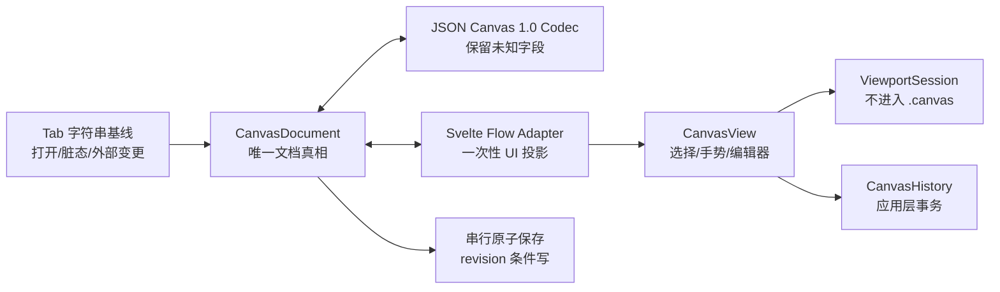

# 无限画布（内置 `.canvas` 文档类型）技术规格

- 日期：2026-09-04
- 状态：首版已实现；自动化质量门通过，Obsidian 与桌面/iOS 实机矩阵待人工验收
- 持久化格式：[JSON Canvas 1.0](https://jsoncanvas.org/spec/1.0/) 的 `.canvas` 文件
- 交互引擎：Svelte Flow（已固定 `@xyflow/svelte` 1.6.6；上游仍标注 alpha/API 可能变化）
- 交付形态：主应用内置文档类型；不依赖桌面插件运行时

## 0. 结论与评审摘要

本功能把 `.canvas` 作为与 `.md`、`.base` 并列的一等文件类型。新建文件名默认为 **`untitled.canvas`**；打开、保存、另存、系统文件关联和 iOS Vault 列表都识别 `.canvas`。落盘内容只能由 JSON Canvas 适配层产生，不允许把 Svelte Flow 的 nodes、edges、viewport 或 `toObject()` 直接保存。

总体分为四层：



关键取舍：

1. `CanvasDocument` 是持久化真相；Svelte Flow 只是交互投影。
2. JSON Canvas 1.0 没有 group 成员字段。首版不使用 Svelte Flow `parentId`，以几何包含关系实现组移动，避免绝对/相对坐标互相污染。
3. viewport、selection、hover、活动编辑器等视图状态绝不写入 `.canvas`，也不触发 dirty。
4. 文本节点默认显示安全的静态 Markdown；整张画布最多挂载一个完整编辑器。当前 Moraya 的资源基目录是模块级共享状态，实施前必须改为编辑器实例级依赖。
5. 现有直接文本写入不能满足高频画布事务。画布上线前必须具备按文档串行、快照化、带预期 revision 的原子保存。
6. 桌面和 iOS 使用同一 codec、领域模型和 CanvasView；iOS 首版分开应用内 Create/Save As、外部 Import 与 Export Copy，不声称支持跨启动原位编辑或本地路径拖放。

## 1. 事实、决定、假设和待确认的标记

本文使用以下标记，避免把规划写成已有能力：

| 标记 | 含义 |
|---|---|
| **已核实事实** | 已从当前仓库、锁文件或上游正式规范/API 核实 |
| **设计决定** | 本规格要求后续实现遵守的契约 |
| **合理假设** | 为形成可实现方案采用，必须在阶段 0 spike 或真机测试验证 |
| **待确认** | 会影响产品语义或范围，需要评审人决定 |

除明确写作“已核实事实”的内容外，本文中的“应/必须/首版”均表示设计要求，不表示当前项目已支持。

## 2. 实现前已核实的项目基线

### 2.1 技术栈与交付边界

- **已核实事实**：项目声明 Svelte 5，锁定 Svelte 5.55.5，并已使用 `$state/$derived/$effect/$props`；Tauri Rust 锁定 2.11.1。证据见 [`package.json`](../../../package.json)、[`pnpm-lock.yaml`](../../../pnpm-lock.yaml)、[`src-tauri/Cargo.toml`](../../../src-tauri/Cargo.toml)。
- **已核实事实**：仓库当前没有 `@xyflow/svelte`。截至本规格日期，上游 latest 非预发布版为 1.6.6，peer dependency 为 Svelte `^5.25.0`，与项目版本范围相容；上游仍称 alpha/API 可能变化，且 2.0 仍是 next。相容不等于已在本项目验证。[npm 1.6.6 元数据](https://www.npmjs.com/package/@xyflow/svelte/v/1.6.6)
- **设计决定**：实现阶段锁定经 spike 验证的 1.6.x 精确版本，不采用 2.0 next；Svelte Flow API 只能存在于 UI/适配层，便于以后隔离升级。
- **已核实事实**：iOS 前端明确不给插件运行时加载 manifest，Rust 端插件协议、市场和运行时命令也只在非 iOS 编译。见 [`src/App.svelte`](../../../src/App.svelte) 和 [`src-tauri/src/lib.rs`](../../../src-tauri/src/lib.rs)。
- **设计决定**：无限画布是内置 `FileKind` 与 `EditorPane` 分支；桌面插件不得声明并覆盖 `.canvas` 的内置处理器。

### 2.2 标签页、文件路由与命令

- **已核实事实**：[`src/lib/tabs.svelte.ts`](../../../src/lib/tabs.svelte.ts) 中 `Tab` 只保存 `initialContent/currentContent` 字符串，dirty 是两字符串不相等；`mode` 只有 `source | rich`。当前没有结构化文档、revision、事务历史或 viewport 容器。
- **已核实事实**：主窗口只挂载活动 tab 的一个 [`EditorPane.svelte`](../../../src/components/EditorPane.svelte)。文件类型分支已包含 image、spreadsheet、base、custom、source、outline、HTML、MDX 和 RichEditor；这是内置 `CanvasView` 的直接接入点。
- **已核实事实**：自定义编辑器目前先于内置分类判定，理论上可抢占扩展名；`.canvas` 尚未出现在 `FileKind`、打开/保存 filter、macOS/iOS 文件关联、iOS Vault 白名单或 Vault 图标映射中。
- **已核实事实**：mode toggle 目前只排除 image；分享会把所有非 image 文件送进 Markdown/HTML 发布链；打印使用白名单。见 [`src/lib/commands.ts`](../../../src/lib/commands.ts)、[`src/components/MobileToolbar.svelte`](../../../src/components/MobileToolbar.svelte)、[`src/lib/share/index.ts`](../../../src/lib/share/index.ts)、[`src/lib/print.ts`](../../../src/lib/print.ts)。
- **设计决定**：canvas 没有 source/rich 双模式。为控制首版改动面，`Tab.mode` 仍保持必填二元类型，Canvas Tab 暂存 `mode:'rich'` 作为**不参与行为判断**的兼容值；不写 recent mode。所有命令/reload 由 `FileKind + DocumentSurfaceCapabilities` 判断。现有模式切换、Markdown 分享、批注、mdblock 等不适用命令必须显式禁用或隐藏，不能靠该兼容值或 fallback 偶然失败。

### 2.3 保存、自动保存和外部变更

- **已核实事实**：[`src/lib/fs.ts`](../../../src/lib/fs.ts) 的保存是 `writeTextFile` 直接覆盖，没有临时文件、`fsync`、原子替换或 compare-and-save。
- **已核实事实**：[`src/lib/autosave.svelte.ts`](../../../src/lib/autosave.svelte.ts) 使用 800 ms 防抖；外部冲突时暂停；写入后仅在字符串仍等于捕获快照时标 clean；失败只写日志。全局自动保存设置默认关闭，见 [`src/lib/settings.svelte.ts`](../../../src/lib/settings.svelte.ts)。
- **已核实事实**：手动保存会 `await` 写盘后读取当时最新的 `currentContent` 更新 baseline。在写入期间继续编辑时，存在“磁盘是旧内容，tab 却被标 clean”的竞态。
- **已核实事实**：外部变更已有 `fresh/changed/deleted`、mtime、hash 和 pending snapshot；dirty 或普通 rich tab 显示冲突横幅，干净 source tab可自动重载。该决定目前按 editor mode 而非文档能力做出。见 [`src/lib/external-state.ts`](../../../src/lib/external-state.ts) 和 [`src/lib/file-watcher.svelte.ts`](../../../src/lib/file-watcher.svelte.ts)。
- **已核实事实**：桌面按 tab 使用 `watchImmediate`，失败时降级到窗口 focus 复核；iOS 不使用 push watcher，只依赖 focus 路径。mtime 相同会直接跳过 hash 检查。
- **设计决定**：复用现有 tab、dirty、关闭确认和外部冲突横幅的产品语义，但画布必须增加结构化 session、保存 revision 和显式 reload hook；兼容 `mode` 值不得被用于推断 Canvas 行为。

### 2.4 Markdown、主题与安全现状

- **已核实事实**：[`src/components/RichEditor.svelte`](../../../src/components/RichEditor.svelte) 直接依赖真实 `Tab`、`activeTab()`、应用拖放、批注、洞察和多种全局事件，不是可直接嵌入卡片的轻量组件。
- **已核实事实**：[`src/lib/plugins/host-render-html.ts`](../../../src/lib/plugins/host-render-html.ts) 提供统一 Marked/GFM/高亮/KaTeX 静态渲染，但输出路径没有通用 sanitizer。
- **已核实事实**：[`src/lib/note-anno/answer-card.ts`](../../../src/lib/note-anno/answer-card.ts) 已记录主窗口无 CSP 且可访问 Tauri IPC 时，未清洗 `innerHTML` 会成为文件系统级 XSS；其中的局部 sanitizer 是安全先例，不是已审核的通用方案。
- **已核实事实**：[`src-tauri/tauri.conf.json`](../../../src-tauri/tauri.conf.json) 当前 `csp: null`，asset protocol scope 为 `**`；[`src-tauri/capabilities/default.json`](../../../src-tauri/capabilities/default.json) 声明主窗口广泛文件、opener 和 HTTP 权限。该 capability 使用 desktop schema，iOS 最终授权表现仍须真机构建验证。
- **已核实事实**：Moraya core 的 `documentBaseDir` 位于模块级变量，所有相对图片解析共享；见 [`../moraya-core/src/schema.ts`](../../../../moraya-core/src/schema.ts)。`editor-bridge` 每次挂载/路径变化都会改这个全局值。
- **已核实事实**：现有主题编译为 `[data-theme="<id>"] .moraya-editor` 作用域；画布静态 Markdown 若要复用排版，必须同时提供 `data-theme` 与 `.moraya-editor`，而画布控制层不能被编辑器排版 CSS 污染。
- **设计决定**：复用 Markdown 解析/编辑核心和主题 token，不直接嵌入 `RichEditor.svelte`；新增受控的静态预览与 `EmbeddedMarkdownEditor`，并先解决实例级资源路径。

### 2.5 移动端、文件访问与拖放

- **已核实事实**：平台模型是 `macos | ios | unknown`，只有 iOS 再按 768 px 区分 phone/tablet；iOS 隐藏桌面侧栏，使用移动工具栏、抽屉、安全区和至少 44 px 的触控目标。见 [`src/lib/platform.svelte.ts`](../../../src/lib/platform.svelte.ts)、[`src/styles/responsive.css`](../../../src/styles/responsive.css)。
- **已核实事实**：iOS 最低版本当前为 18.0；所有文本读取有 4 MB 上限。
- **已核实事实**：锁定的 Tauri dialog iOS picker `open` 默认采用 copy access，Save 使用 export 流程；但系统 `RunEvent::Opened` 当前把 URL 转为普通 path 后延迟发前端，并未统一导入。项目也没有持久化 security-scoped bookmark。因此当前没有一条覆盖 picker/Open In/cold start 的可靠原位编辑或统一导入链。
- **已核实事实**：桌面主 webview 的 Tauri 原生 drag-drop 已启用；App 目前会把 drop 的每个路径直接打开为 tab，RichEditor 又有自己的原生监听。项目经验记录也确认原生 OS drag-drop 会吞掉 WebView HTML5 drop。
- **已核实事实**：锁定 Wry 的本地路径 drop 实现是 macOS 条件路径；没有证据表明 iOS 能返回同样的本地路径与坐标。
- **设计决定**：画布内部拖动只走 Svelte Flow/pointer 事件；桌面外部文件 drop 经一个中央 router 分发；iOS 首版通过工具栏和 picker 导入，不把原生路径 drop 列入验收。

## 3. 协议和引擎事实

### 3.1 JSON Canvas 1.0

以下来自 [JSON Canvas 1.0 正式规范](https://jsoncanvas.org/spec/1.0/)、[官方仓库](https://github.com/obsidianmd/jsoncanvas) 和 [Obsidian 官方 Canvas API 类型](https://github.com/obsidianmd/obsidian-api/blob/master/canvas.d.ts)：

- **已核实事实**：文件扩展名是 `.canvas`；根对象的 `nodes`、`edges` 数组均可选，没有 `version`、viewport、selection、parent 或 children 字段。
- **已核实事实**：节点类型只有 `text/file/link/group`。公共必填字段是 `id,type,x,y,width,height`，几何单位为整数像素，可选 `color`。
- **已核实事实**：nodes 数组从前到后表示由底到顶的 z-order。edges 数组没有规范化的层叠语义。
- **已核实事实**：group 是视觉容器，没有成员列表或相对坐标。Obsidian UI 会在拖组时移动组内卡片，但这属于几何交互，不是文件字段。
- **已核实事实**：edge 必填 `id,fromNode,toNode`；side 可选且为 `top/right/bottom/left`；`fromEnd` 缺省为 `none`，`toEnd` 缺省为 `arrow`；label/color 可选。即使没有箭头，from/to 仍是有序语义。
- **已核实事实**：颜色字段是 string；规范描述十六进制格式并给出 `#FF0000` 示例，或预设字符串 `"1"` 到 `"6"`。规范没有穷举 hex 长度/alpha/case，预设精确显示色也故意不规定。
- **已核实事实**：1.0 正文没有规定未知字段保留；Obsidian 官方类型用 `[key: string]: any` 支持 forward compatibility。
- **设计决定**：本应用保留根、节点、边三层未知字段；这是本项目兼容策略，不宣称 Obsidian 的所有编辑路径也必然保留它们。

### 3.2 Svelte Flow

- **已核实事实**：Svelte Flow node 具有 position、width/height、parentId、zIndex、selected 等字段；`parentId` 会把坐标改为相对父节点，并要求父节点先于子节点。[Node API](https://svelteflow.dev/api-reference/types/node)；[Sub Flows](https://svelteflow.dev/learn/layouting/sub-flows)
- **已核实事实**：edge 具有 source/target、sourceHandle/targetHandle、markerStart/markerEnd、label 等字段；NodeResizer 提供 start/move/end 生命周期。[Edge API](https://svelteflow.dev/api-reference/types/edge)
- **已核实事实**：引擎提供选择、框选、节点/边删除事件、拖动、缩放、平移、pinch、viewport 和坐标转换等能力；`onlyRenderVisibleElements` 可优化大图，但官方说明其本身也有开销。[SvelteFlow API](https://svelteflow.dev/api-reference/svelte-flow)
- **已核实事实**：公开 API 没有应用所需的文档级 undo/redo 或 JSON Canvas clipboard；`toObject()` 输出的是 Svelte Flow nodes/edges/viewport，不是 JSON Canvas。
- **设计决定**：选择和几何事件由引擎产生，复制粘贴、撤销重做、序列化、分组、保存与冲突全部由应用层负责。

## 4. 目标、非目标和首版交付

### 4.1 目标

1. 新建、打开、保存、自动保存和另存 Obsidian 可识别的 `.canvas` 文件。
2. 支持 text、file/image、link、group 四种 JSON Canvas 节点。
3. 支持节点增删、移动、resize、显式层级调整，edge 新建/删除/重连、端点方向和 label。
4. 支持鼠标、触控板和触屏的平移缩放、单选、多选及框选；支持复制粘贴和应用层 undo/redo。
5. 与现有 tab、主题、文件 watcher、冲突横幅、自动保存开关和移动端壳集成。
6. 未知扩展字段不因本应用打开或编辑其他字段而丢失。
7. 用双向 fixture 和 Obsidian 实机回归证明语义往返兼容。

### 4.2 非目标

- 链接卡不嵌入远程网页，不加载 iframe；首版只显示安全的 URL/标题并由用户点击打开。
- 不做实时协作、CRDT、多人光标或网络同步协议。
- 不做 AI 生成、总结或布局。
- 不做自由手绘、墨迹、白板笔迹或自定义形状。
- 不把 Svelte Flow 私有状态、viewport 或 app 私有 metadata 写进 `.canvas`。
- 不承诺像素级复刻 Obsidian；兼容目标是文件和交互语义。
- 首版不扫描并静默改写整个 Vault 中所有 `.canvas` 引用。
- 首版不在文件节点内直接编辑其指向的 `.md`；双击/明确“打开”进入现有 Markdown tab。见 §10.4 的待确认项。
- 首版不提供独立 draft journal 或“iOS 被系统终止后恢复尚未落盘编辑”；自动保存开启时仍按 800 ms 稳定快照尽快落盘。
- 首版不接入现有 SOT Vault Markdown 镜像/附件打包链；位于应用 Vault 的普通文件同步仍按 Vault 本身能力处理，SOT Canvas 同步另行设计。

### 4.3 桌面与 iOS 范围

| 能力 | macOS/桌面首版 | iPad 首版 | iPhone 首版 |
|---|---|---|---|
| 新建/打开/保存 `.canvas` | 完整；系统文件关联 | 应用 Vault/Documents 内完整；Files 导入/导出副本 | 同 iPad |
| 四类节点、边、resize | 完整 | 完整；扩大命中区 | 完整；工具栏优先 |
| 多选 | Cmd/Ctrl、Shift、框选 | 长按/显式多选模式、点选 | 显式多选模式、点选 |
| 复制粘贴/undo/redo | 快捷键 + 菜单/工具栏 | 工具栏 + 可用键盘快捷键 | 工具栏 |
| Markdown text 编辑 | 卡片内单实例编辑器 | 卡片内单实例编辑器 | 全屏/底部 sheet 单实例编辑器，画布手势暂停 |
| 本地文件 drop | 中央 Tauri drop router | 不承诺；picker 导入 | 不承诺；picker 导入 |
| 外部变更 | watcher + focus 校验 | 前台恢复/Vault sync 后校验 | 同 iPad |
| 插件运行时 | 不使用 | 不存在 | 不存在 |

**合理假设**：iPhone 用全屏或底部 sheet 编辑 text 节点更能避免软键盘、选择手柄与画布手势竞争；阶段 0 真机验证后确定具体形态。

## 5. 关键交互

### 5.1 新建、导入、打开和保存

- 桌面“新建画布”先选择保存位置和名称，默认 `untitled.canvas`；取消时不创建 tab。以 `expected:missing` 写入 `{ "nodes": [], "edges": [] }` 后按正常文件打开。该流程参考当前 Base 的“先落路径再打开”，避免无路径 tab 被 autosave 写到空路径。
- iOS“新建画布”不调用 Files export panel，只用应用内命名/目录 UI 在 app Documents 或 Vault 内创建并打开；默认名同为 `untitled.canvas`。
- iOS picker、Share/Open In、冷启动 `RunEvent::Opened` 统一走“导入画布”：Rust 在原 URL/临时授权仍有效时，把源文件复制到用户选定的应用内目录；未选目录时进入 `Documents/Imported Canvases/`。重名追加 `-2/-3…`，成功后打开副本，绝不把 tab 绑定到一次性外部 URL。
- 单文件 import 只复制 `.canvas` 本身，不猜测或越权遍历原 Vault；其 file/background 引用若不在新 root 中，显示 broken + Relink。便携打包导入不在首版。
- iOS“导出副本”调用 Files exporter，但不改变当前 tab identity、watcher、autosave target、resourceRoot 或 viewport key；它不是 Save As。
- 文件名省略扩展名时自动追加 `.canvas`；选择其他扩展名时要求修正，不能把 Canvas session 另存为 `.json` 或 `.md` 后继续假装 canvas。
- 桌面 Open dialog、最近文件、Folder/Vault 列表、Finder 和 Tauri `open-file` 统一进入 `openFile`；iOS 外部 Open In 先导入再进入 `openFile`。最终都分类为保留的内置 `kind: 'canvas'`。
- `⌘S/Ctrl+S` 保存当前 document revision；`⇧⌘S/Ctrl+Shift+S` 进入 canvas 专用另存流程。保存完成不改变 viewport。
- 全局自动保存设置打开时，画布遵循同一设置与 800 ms idle 语义；首版不另设画布默认开关。

### 5.2 节点创建与编辑

- 空白处双击/工具栏“文本”创建 text 节点，默认尺寸由 UI 常量决定；创建后进入编辑。
- “文件/图片”通过 picker 或桌面 drop 创建 `file` 节点；图片只是 file 节点的渲染分支，不产生非标准 node type。
- “链接”只接受允许协议，显示 URL；可在 view 层从 URL 安全派生 host 文本，但不新增非标准 `title` 字段。不抓取远程页面、不注入远程 HTML。
- “分组”围绕当前选区创建 group；无选区时创建空组。有选区时紧邻最底层被围节点之前插入，空组插入数组首位，使新建结果对 Obsidian 友好且不改变其他节点相对次序；读取外部文件时绝不自行重排。
- 单击选择；双击 text 进入编辑；双击 `.md` file node 打开现有 Markdown tab；Esc 结束当前编辑/连接/多选子模式。
- 节点 resize 只改自身 `x/y/width/height`。group resize 不缩放或搬移内部节点。

### 5.3 选择、移动和层级

- 桌面遵循平台约定：Cmd/Ctrl 增减选区，Shift 范围/框选；拖动一个已选节点移动整个选区。
- 选择本身不改 z-order、不触发 dirty。上下文菜单提供“置于顶层/底层/上移一层/下移一层”，每次是一个持久化事务。
- 所有 popup menu 使用全局 `.menu-panel/.menu-row`；组件不得自定义普通 hover 背景。
- group 拖动开始时冻结“边界完全包含”的节点集合；本次拖动对 group 与集合应用同一 delta。重叠组、多组选组取集合并集，每个节点只移动一次。partial overlap 不属于该组。
- 移动/resize 期间只更新交互投影；end 时统一取整、写回 canonical model 并产生一个 undo 项。

### 5.4 连线

- 每个节点提供 top/right/bottom/left 四个稳定 handle；使用 Svelte Flow `ConnectionMode.Loose`，使同一 `side:left` handle 可同时承接 from/to 语义。桌面可拖线，触屏支持“点起点、点终点”的连接模式；若 pinned 1.6.x 实测 Loose 无法稳定投影两端，则改为每边重叠的 `from:left/to:left` 双 handle，并先修订 adapter contract。
- 新 edge 默认 `fromEnd: none`、`toEnd: arrow`。工具栏/edge 菜单可切换两端 `none/arrow`、编辑 label/color、重连或删除。
- edge label 按纯文本显示并转义，不按 Markdown 或 HTML 渲染。
- 缺失 side 的外部 edge 使用临时 floating/最近边投影，不因单纯打开或重绘而补写 side；只有用户重连后才写入明确 side。

### 5.5 平移、缩放和手势

- 桌面鼠标：空白主键拖动框选，Space+拖动或中键拖动画布，滚轮平移，Cmd/Ctrl+滚轮缩放；触控板 pinch 缩放。
- iOS：单指空白平移、双指 pinch 缩放；进入多选/连接/resize 等显式工具模式后，手势解释以模式为准。
- Svelte Flow props 契约：桌面默认 `panOnDrag=[1,2]`、`selectionOnDrag=true`，Space 临时允许主键 pan；iOS 浏览模式 `panOnDrag=true, selectionOnDrag=false`，显式选择模式再切换选择行为。Phase 0 必须验证 touch 不受 mouse-button array 意外限制，并冻结各模式值。
- 活动编辑器及其滚动区使用 Svelte Flow 的 `nodrag/nopan/nowheel` 隔离类；非活动卡片以画布手势优先。
- edge 命中宽度、连接/resize handle 的触控命中区至少 44 CSS px（iOS 视觉目标按 44 pt 真机验证），视觉控件可更小。
- **合理假设**：Svelte Flow 的 `panOnScroll=true, zoomOnScroll=false, zoomOnPinch=true` 能满足 macOS 触控板和 iOS；必须在 macOS、Windows Precision Touchpad、iOS WKWebView 分别验证后冻结参数。

## 6. 总体架构和模块边界

### 6.1 组件与职责

| 模块（建议路径） | 单一职责 | 不负责 |
|---|---|---|
| `src/lib/canvas/json-canvas.ts` | JSON 值、1.0 codec、诊断、unknown extras/presence 保留 | UI、文件 I/O |
| `src/lib/canvas/model.ts` | canonical `CanvasDocument`、节点/边领域操作、不变量 | Svelte Flow 类型 |
| `src/lib/canvas/flow-adapter.ts` | canonical ↔ Svelte Flow projection；handle/marker/z 映射 | 落盘、dirty |
| `src/lib/canvas/session.svelte.ts` | Tab 级 headless session、文档 revision、事务、history；UI detach 后仍存活 | Svelte Flow/DOM |
| `src/lib/canvas/viewport.svelte.ts` | viewport/session store、fit、独立持久化 | `.canvas` 序列化 |
| `src/lib/canvas/save-coordinator.ts` | debounce、每文档串行队列、flush、revision 条件保存 | 图交互 |
| `src/lib/canvas/external-change.ts` | watcher 唤醒后的 probe、save barrier、self-write echo、reload/conflict 分发 | 底层文件监听 |
| `src/lib/canvas/resource-resolver.ts` | root/path 解析、权限校验、mtime/LRU Blob | Markdown 解析 |
| `src/lib/canvas/resource-root.ts` | 桌面/iOS/standalone 的平台无关 root provider | 直接读取 `sotvaultStore` |
| `src/lib/canvas/drop-router.svelte.ts` | 活动表面的桌面 drop 注册、命中与消费 | 节点内部拖动 |
| `src/lib/document-surface.ts` | 按 FileKind 声明 mode toggle、share、clean reload、flush 等能力 | 具体编辑器实现 |
| `src/lib/markdown/safe-preview.ts` | 复用 Marked pipeline、清洗、受控链接/媒体 | 完整编辑历史 |
| `src/components/canvas/CanvasView.svelte` | 组合 Svelte Flow、节点/边类型、工具栏/菜单、手势 | 文件格式 |
| `src/components/canvas/EmbeddedMarkdownEditor.svelte` | 单实例 Moraya adapter、IME、flush、baseDir | 真实 Tab 副作用 |
| Rust `canvas_document_*` 命令 | 一致读取、应用内串行、乐观并发检查、原子替换、canonical path/revision | JSON Canvas 业务变换 |
| Rust `canvas_resource_*` 命令 | 受信 root session、canonical containment、stat/read/import | Markdown 解析或 Flow state |

命名是实施建议，评审通过后可以按现有目录风格小幅调整；层级边界和依赖方向不可逆转。

### 6.2 依赖方向

```text
CanvasView -> CanvasSession -> CanvasDocument
CanvasView -> FlowAdapter -> CanvasDocument
CanvasSession -> JsonCanvasCodec
CanvasSaveCoordinator -> atomic document I/O
SafeMarkdownPreview / EmbeddedMarkdownEditor -> scoped ResourceResolver

禁止：CanvasDocument -> Svelte Flow
禁止：JsonCanvasCodec -> Svelte component
禁止：save(toObject())
禁止：卡片编辑器直接 setContent(tab.id, cardMarkdown)
```

### 6.3 现有文件接入点与必要改动

| 现有位置 | 必要改动 |
|---|---|
| `src/lib/fs.ts` | `FileKind` 增加 `canvas`，扩展表保留 `.canvas` 给内置处理器 |
| `src/lib/tabs.svelte.ts` | `newCanvas/openFile` 路由、异步 surface 生命周期路由、保存快照/revision；Canvas 不能被 custom editor 抢占，`mode:'rich'` 仅兼容且不写 recent mode |
| `src/components/EditorPane.svelte` | 在 source/rich fallback 前渲染 `CanvasView`；只复用 `ExternalChangeBanner`，隐藏未适配 Canvas 的 SOT Vault/镜像横幅 |
| `src/lib/dialogs.ts` | open filter 加 `.canvas`；新增 canvas 专用 save filter/default，不把 generic default 留为 `untitled.md` |
| `src/lib/commands.ts`、App/native menu、MobileToolbar | 新建画布、undo/redo、节点创建；canvas 禁用 mode toggle/share/不适用命令 |
| 新增 `src/lib/document-surface.ts` | 用 capability 取代散落的 `kind !== 'image'` / `mode === 'rich'` 特判；canvas 声明 `modeToggle:false, share:false, find:false, sotVault:false, pluginContent:false, cleanAutoReload:true, structuredFlush:true, canvasEditCommands:true` |
| `src-tauri/tauri.conf.json`、Apple 文档类型生成源 | `.canvas` 桌面/iOS文件关联；先确认生成配置权威源，避免手改生成物被覆盖 |
| `src-tauri/src/vault_ios/list_dir.rs` | iOS Vault 文件白名单加入 `canvas` |
| `src/lib/vault-list.ts` / FolderView | 图标、打开、重命名通知 |
| `src/lib/plugins/types.ts` | 插件命令上下文的 `TabKind` 同步为 canvas，但不允许 custom editor claim `.canvas` |
| custom-editor manifest/registry 校验 | 注册阶段拒绝插件 claim 保留扩展名 `.canvas` 并给出可诊断错误；运行时路由再做防御 |
| `src/lib/external-state.ts` | 从 `mode` 特判扩展为文档 surface capability：能否在 clean+idle 时安全 reload |
| `src/lib/autosave.svelte.ts` | canvas 交给专用 coordinator；通用保存也应修复快照竞态，避免双写 |
| `src/lib/file-watcher.svelte.ts` | canvas 校验走新的 document read/revision API，并在 reload 时通知 session；不能只替换字符串或绕过大小/解析保护 |
| `src/components/ExternalChangeBanner.svelte` | 通过 DocumentSurface callbacks 调用 Canvas Reload/Overwrite/Save As/Recreate；支持 invalid external JSON 诊断，force 只来自明确 Overwrite |
| `src/App.svelte` / RichEditor | 原生 drop 改为单一 router，先给命中 surface，未消费才沿用 openFile/theme import |
| `../moraya-core` + `editor-bridge.ts` | 资源基目录/解析器按 editor instance 注入；保留旧 API 只用于迁移兼容 |
| `src/lib/share/index.ts` / print | 对 canvas 显式 unsupported，不进入 Markdown fallback |
| SOT Vault open/sync 路径 | `maybeCheckVaultUpdate`、SyncOrigin/MirrorSiblings/SyncToVault 和相关 menu 对 canvas 明确跳过；JSON/附件感知同步另行设计 |
| `src/lib/i18n/{en,zh,ja,de}.ts` | 新建画布、工具模式、诊断、保存/冲突/移动端文案四语同步 |
| `src-tauri/src/lib.rs` native menu | 新建画布、Canvas 编辑命令、四语 label 与语言切换重建；保留普通编辑器的原生 Edit 语义 |
| `src-tauri/src/canvas_document.rs`（新增） | 文档 open/probe/save/create、revision 和平台替换实现；耗时 hash/I/O 不阻塞 Tauri 事件线程 |
| `src-tauri/src/canvas_resource.rs`（新增） | root token、受控资源 stat/read/import、exclusive create 和流式复制 |
| `src-tauri/src/lib.rs` | desktop 与 iOS invoke handler 都注册上述命令；现有通用 `write_file_binary/rename_file` 不作为 Canvas 安全存储 API |

### 6.4 生命周期

1. `openFile` 通过 document open 命令读取同一快照的 `{content, revision, requestedPath, canonicalPath}`；以 canonical path 去重后创建 Tab，并在 `CanvasSessionRegistry` 建立**属于 Tab 层**的 headless session。
2. 首次建立 session 解析一次；外部 reload、诊断修复或显式恢复时重新解析。diagnostics 与 canonical model 一起留在 session，不依赖 CanvasView 生命周期。
3. 活动 `CanvasView` 只 attach session 并产生 Svelte Flow projection；selection/viewport 属于 view。切到后台 tab 时 CanvasView detach，但 session、history、disk revision 和在途保存队列继续存在。
4. 文档事务提交后，codec 序列化 canonical model，更新 `tab.currentContent` 和 document revision，触发 dirty/autosave。
5. 按 tab id 注册的 `DocumentSurfaceRegistry` 是所有入口的生命周期路由。`activate/openFile/newFile/closeTab` 在改变 `activeId` 或移除 Tab **之前**先 `beforeDeactivate/finalize`；`closeTab` 在 dirty 判断之前完成。menu save、Save As、Reload、Overwrite、Recreate 和 banner actions 也必须走同一路由。
6. `flushStable()` 只同步可安全提交的文本快照；结构事务、切卡、切 tab、undo、reload、close 前使用 `finalize()`，先结束当前 TextEditSession 并按真实顺序写 history。composition 尚未真实结束时，相关动作延迟或取消并提示用户完成输入，禁止伪造 `compositionend`。`finalize()` 返回 proceed/cancel，调用链必须向上传播；`activate/openFile/newFile/closeTab` 和 App 关窗循环收到 cancel/false 后立即停止，不能重复切换或关闭。
7. 外部 reload 由 session `replaceFromDisk()` 重新解析并更新唯一 disk revision；不能只替换 Tab 字符串后让旧图状态在下一事件写回。
8. CanvasView detach 时 destroy editor、注销 drop target、释放 Flow/view 资源；Tab 真正关闭时等待保存/取消流程后才由 registry 销毁 session、history 和 Blob cache。`onDestroy` 只作兜底清理，不是提交屏障。

## 7. Canonical 数据模型

以下为契约形状，不是要求逐字采用的 TypeScript 实现：

```ts
interface LosslessNumber { kind: 'lossless-number'; raw: string }
type JsonValue = null | boolean | number | LosslessNumber | string | JsonValue[] | Map<string, JsonValue>

interface CanvasDocument {
  nodes: CanvasNode[]
  edges: CanvasEdgeEntry[]
  extras: Map<string, JsonValue>
  presence: { nodes: boolean; edges: boolean }
}

type CanvasNode = TextNode | FileNode | LinkNode | GroupNode | OpaqueNode

interface CommonNode {
  id: string
  x: number
  y: number
  width: number
  height: number
  color?: string
  extras: Map<string, JsonValue>
  preservedInvalid: Map<string, JsonValue>
  optionalPresence: Set<string>
}

interface TextNode extends CommonNode { type: 'text'; text: string }
interface FileNode extends CommonNode { type: 'file'; file: string; subpath?: string }
interface LinkNode extends CommonNode { type: 'link'; url: string }
interface GroupNode extends CommonNode {
  type: 'group'
  label?: string
  background?: string
  backgroundStyle?: 'cover' | 'ratio' | 'repeat'
}
interface OpaqueNode { raw: JsonValue; diagnostic: Diagnostic }

type CanvasEdgeEntry = CanvasEdge | OpaqueEdge

interface CanvasEdge {
  id: string
  fromNode: string
  fromSide?: 'top' | 'right' | 'bottom' | 'left'
  fromEnd?: 'none' | 'arrow'
  toNode: string
  toSide?: 'top' | 'right' | 'bottom' | 'left'
  toEnd?: 'none' | 'arrow'
  color?: string
  label?: string
  extras: Map<string, JsonValue>
  preservedInvalid: Map<string, JsonValue>
  optionalPresence: Set<string>
}
interface OpaqueEdge { raw: JsonValue; diagnostic: Diagnostic }
```

这里的 `LosslessNumber` 与 `Map` 是 codec 内部表示，不会序列化成对象。标准、安全范围内的已知数字转为 JS number；unknown/invalid 区域的任意 JSON number 保留原始 number token。对象容器用 Map 或无 prototype record，避免 `__proto__/constructor/prototype` 造成 prototype pollution。

### 7.1 模型不变量

- 读取要求 nodes 内 ID 唯一、edges 内 ID 唯一；规范没有要求 node 与 edge 两个 namespace 互斥。本应用新建时使用 `crypto.randomUUID()` 并额外避免跨集合碰撞；格式不参与兼容语义。
- 可编辑的已知节点必须有有限、安全范围的整数 x/y/width/height，width/height 大于 0；负 x/y 合法。
- 读取时不擅自 clamp 外部尺寸到 UI 最小值。交互 resize 使用 UI 最小值；非法外部对象作为 opaque/diagnostic 保留。
- canonical nodes 顺序就是唯一持久化 z-order。selection elevation 只能是临时描边/overlay，不能改变数组。
- canonical edges 保留输入数组顺序，但不为其虚构 JSON Canvas 未定义的 z-order。
- `extras` 只含未被本规格识别的键。序列化基底依次为 extras、未被用户修复的 `preservedInvalid`，最后由有效 known fields 覆盖，避免扩展字段伪造标准字段。
- `preservedInvalid` 保存“键名已知但可选值非法”的原值，例如未知 `backgroundStyle` 或非法 side。未编辑时原样回写并用安全 fallback；用户主动修改该字段后由合法 known value 取代。必填身份/几何字段非法时整个对象进入 opaque。
- 可选字段的“缺失”和“显式值”需要保留。未编辑的缺省 `fromEnd/toEnd` 不得被无意义物化。
- serializer 允许规范化空白和 key order；兼容目标是语义与字段 presence，不承诺字节相等。
- codec 不能只依赖普通 `JSON.parse/stringify`：对超出 IEEE-754 安全范围、高精度小数或指数形式的 unknown number，必须保留原 token 并回写；known geometry 若不能无损变为安全整数则进入 opaque。
- JSON 对象含重复 property name 时，文件级进入不可编辑诊断并保留原始字符串，禁止 autosave。不能用 last-wins 解析后静默删掉前一个键。
- nodes/edges entries 数组本身就是顺序真相；opaque 没有第二套 `slot` 排序。显式 reorder 后 serializer 按当前 entries 顺序输出。

### 7.2 宽容读取与安全写回

| 输入 | 行为 |
|---|---|
| JSON 语法错误、根不是 object、nodes/edges 不是数组 | 不建立可编辑 session；显示错误、路径、可复制诊断；保留原始字符串且绝不 autosave 覆盖 |
| 任意 object 含重复 key | 文件级不可编辑诊断；保留原字符串，不采用 last-wins |
| 已知类型且标准字段有效 | 正常可编辑，未知字段进入 extras |
| 未知 node type | 作为 opaque 节点；几何可读时显示“未知节点”占位，不可编辑其内部字段，可整体移动/删除需明确确认 |
| 任意必填标准字段非法（含 text/file/url payload、edge endpoints） | 整个 entry 进入 OpaqueNode/OpaqueEdge 并原位保留；与其有关的交互禁用 |
| 可选已知字段非法 | 进入 `preservedInvalid`，显示安全 fallback；用户显式修复前原 token/value 回写 |
| duplicate node/edge ID | 保留全部；冲突对象不进入普通 Flow graph，以永不回写的唯一 `viewId` 诊断 overlay 显示；所有指向歧义 node ID 的 edge 不投影 |
| dangling edge | 保留但不投影连线；诊断缺失端点；端点恢复后重新出现 |
| unknown root/node/edge fields | 打开、编辑其他字段、保存后仍在原所属对象 |

**设计决定**：容错不能等同于静默修复。任何会改变外部文件语义的修复都必须由用户显式触发并进入一个 undo 事务。

## 8. JSON Canvas ↔ Svelte Flow 映射

### 8.1 节点与视图字段

| JSON Canvas | Svelte Flow projection | 回写规则 |
|---|---|---|
| `id` | `id` | 原样；paste/new 才生成新 ID |
| `type` | custom node type | 只映射四种已知类型；opaque 用诊断 node |
| `x,y` | `position:{x,y}`，`nodeOrigin=[0,0]` | drag end 统一四舍五入为整数并回灌 UI |
| `width,height` | 公共 node width/height；NodeResizer | 不写 `measured`；resize end 取整 |
| nodes 数组索引 | `zIndex=index` | `zIndexMode='manual'`, `elevateNodesOnSelect=false`；pinned 版本若暴露 edge elevation 也关闭/隔离。显式层级命令才改数组 |
| `color` | `data.colorToken/rawColor` | 预设和 hex 原样保存；只在 UI 中映射主题色 |
| `text/file/url/group fields` | 只读、不可变的 view DTO（含 canonical id） | 禁止传 canonical live reference；事件必须经领域命令改 canonical |
| 无对应字段 | `selected,dragging,resizing,measured` | 永不持久化 |
| 无对应字段 | `parentId,extent` | 首版不使用 |

Svelte Flow projection 可随 selection/viewport 重建；canonical 对象不得持有 Svelte component、DOM、Blob URL、function 或 library-specific state。

### 8.2 分组映射

- group 作为普通 custom node 投影，坐标保持 JSON 的绝对坐标。
- 不使用 `parentId`：它会引入相对坐标、父先子后数组约束和父移动语义，与 JSON Canvas 绝对坐标及任意 z-order 冲突。
- `contained(group,node)` 定义为 node 的完整外接矩形被 group 边界包含，边界相等视为包含；group 自身排除。
- 拖动 group 时在 start 冻结集合，避免移动过程中因边界变化导致成员跳入/跳出。嵌套 group 递归取并集，但每个对象只应用一次 delta。
- 自动组移动只包含 ID/geometry 无冲突的可移动 known nodes。opaque、duplicate 或 invalid entry 默认排除并在 group 上显示提示；只有用户直接选中某个可安全读取通用 geometry 的 opaque 占位并确认时，才允许修改其 raw x/y。
- 普通节点被拖入/拖出 group 不写成员字段；下一次组拖动时按当时几何重新计算。
- `background/backgroundStyle` 只影响 group 背景。文件路径解析规则与 file node 一致；未知 style 进入 `preservedInvalid`，原样保留但使用安全 fallback。
- 读取时严格尊重 nodes 原顺序。创建有选区的新 group 时插在**最底层被围节点的数组索引之前**；空 group 插入数组首位。两种情况都不改变其他节点的相对次序，也不强制把读取到的所有 group 移到底部。

### 8.3 Edge 映射

| JSON Canvas | Svelte Flow | 说明 |
|---|---|---|
| `fromNode` | `source` | 保持有序语义 |
| `toNode` | `target` | 保持有序语义 |
| `fromSide` | `sourceHandle` | 稳定 ID 如 `side:left` |
| `toSide` | `targetHandle` | 同上 |
| `fromEnd` | `markerStart` | `arrow` 才画 marker；缺失按 none 展示但不回写 |
| `toEnd` | `markerEnd` | 缺失按 arrow 展示但不回写 |
| `label` | edge label component | 纯文本、安全转义 |
| `color` | edge style token | 原值保存，主题层解析 |

- 首选 projection 明确设置 `connectionMode=Loose`，一边一个 stable handle。Phase 0/adapter tests 必须覆盖普通 edge、edge 连 group、self-edge、click-connect 和同一 side 同时作为 source/target；不能依赖默认 strict mode。
- side 缺失时 renderer 根据节点几何计算临时最近边/浮动锚点，不能把计算结果写回。
- Svelte Flow marker 的具体箭头外形不是 JSON Canvas 语义的一部分；验收检查方向与端点，不要求与 Obsidian 像素一致。
- self-edge、两端均 none 的 edge 若标准字段有效应正常保留和显示；规范没有授权应用删除它们。
- 重连是一个事务，保留 edge id、label、color、extras，只改用户实际选择的端点/side。

### 8.4 颜色

- `"1"…"6"` 作为语义 token 保留，按当前 light/dark 主题映射红、橙、黄、绿、青、紫；不得转存为某个主题的 hex。
- 只有通过本应用“安全可渲染 hex 子集”校验的字符串才用于 CSS，并原样保存；UI 可计算对比色但不写回规范化结果。Phase 0 用 Obsidian 实测 `#RGB/#RRGGBB/#RGBA/#RRGGBBAA` 后冻结该子集。
- 其他颜色字符串不直接称为协议非法：作为 unknown-compatible 值保留，显示中性 fallback 和诊断；用户主动选色后才替换。
- Svelte Flow 的 light/dark `colorMode` 从当前主题 metadata 的 `appearance` 派生，而不是只读系统偏好；metadata 缺失时才回退系统模式。
- Canvas chrome 使用 app CSS 变量；Markdown 内容置于 `[data-theme] .moraya-editor`；节点边框/handle/menu 不进入 `.moraya-editor` 排版作用域。

## 9. 文件路径、资源和重命名

### 9.1 持久化路径与解析根

JSON Canvas 1.0 只把 `file/background` 描述为系统内路径；Obsidian API 的语义是 Vault 内路径。为了既保留原文件又提供 Obsidian 兼容性，路径分为 raw value 与 resolved target：

```text
rawPath       = `.canvas` 中原始字符串；未编辑时原样写回
resourceRoot  = 用于当前 session 解析的受信目录
resolvedPath  = canonicalize(resourceRoot + rawPath)，仅运行时存在
```

- `ResourceRootProvider` 是唯一入口：桌面从已配置的 `sotvaultStore.vaultRoot` 得到 Vault root；iOS 由 Rust 返回 app `Documents/Vault`；两者都先 canonicalize。Canvas 模块不得直接假定 iOS 有 `sotvaultStore` 或 `sotvault_vault_root`。
- 当 `.canvas` 位于 provider 给出的 Vault 内时，`resourceRoot` 必须是该 Vault 根；新建 file/background 值保存为相对 Vault 根的 POSIX `/` 路径。这是 Obsidian 兼容主路径。
- 当 `.canvas` 不在配置 Vault 内时，首版暂以画布所在目录作为 standalone root；这是**合理假设**，不是 JSON Canvas 或 Obsidian 规定。UI 要标记“独立画布”，并在资源无法解析时允许用户选择 Vault/root 后重试。
- 解析时可以兼容输入的 `\`，但只有用户实际修改/重连该路径时才转为 `/`；单纯打开保存不做全局路径格式化。
- absolute path、`..` 逃逸 root、symlink 逃逸、NUL、设备路径和非文件 URL 不自动读取。已有值继续保留，显示“非便携/未授权”占位；用户显式重新选择资源后改成受控相对路径。
- `subpath` 原样保存，标准值必须以 `#` 开头；首版可显示 heading/block 锚点，但不要求对所有文件类型实现精确子文档裁剪。
- 上述 root 规则只适用于 JSON Canvas 的 `file/background`。**合理假设**：text node 中标准 Markdown `./relative.png` 以 `.canvas` 所在目录为 baseDir，再要求最终 target 仍位于 resourceRoot；`.md` file node 内容中的相对资源以该 `.md` 所在目录为 baseDir。JSON Canvas 没有规定 text Markdown 的 base URI，Phase 0 必须与 Obsidian 一起验证普通链接、`../`、wikilink 与 embed 后再冻结。

**待确认 Q1**：独立画布是否接受“画布所在目录就是临时 root”的规则？若用户要求对任意 Obsidian Vault 外导出的嵌套 `.canvas` 自动找到原 Vault 根，则需要额外的 root 选择/记忆功能。

### 9.2 添加文件或图片

- 已在 resourceRoot 内的文件直接写为 root-relative path。
- root 外文件不写绝对路径。桌面和 iOS 都先复制到与画布相邻的 `<canvas-stem>_files/`，使用安全去重文件名，再写 portable path；复制失败不创建节点。
- 若画布在 Vault 内，持久化值包含相对 Vault 根的完整路径，例如 `boards/plan_files/image.png`；独立画布可写 `plan_files/image.png`。
- picker 返回的显示名、MIME 和扩展名都不可信。资源服务检查大小、实际类型和目标冲突；创建文件使用 exclusive/no-overwrite 语义。
- document open/create 时后端为 canonical canvas + 已批准 root 建立不可猜测 session token；`canvas_resource_stat/read/import` 只接收 token + raw/导入源，不接受前端任意传一个 root 就获得信任。token 在 Tab session 关闭时撤销。
- import 使用流式复制与 `create_new`，失败时删除本应用刚创建的半文件，返回最终 portable raw path；iOS 仅清理本应用持有的 picker/cache 临时源，不删除用户原文件。
- 图片节点复用 JSON Canvas `type:'file'`。其他文件显示安全 icon/name/metadata；首版只对受支持图片和 Markdown 做内容预览。

### 9.3 画布 Save As / 移动

- 本节的 Save As 只指桌面，或 iOS 应用内 Documents/Vault 的另存/移动；iOS Files exporter 是“导出副本”，不进入本节的 tab identity 变更。
- 同一 resourceRoot 内 Save As 不改 file/background raw path；Vault-relative 目标仍相同。
- 跨 resourceRoot 或独立画布跨目录 Save As 时，首版不静默复制整个附件树，也不自动猜测新路径。确认框明确列出引用数量，提供“保留引用并保存副本”或取消；前者可能产生断链并在新 tab 中立即诊断。
- “导出便携副本并复制依赖”是后续能力，不作为普通 Save As 的隐式副作用。
- Save As 成功后重绑 watcher、更新 tab/path/title，把旧 viewport 值**复制**到新 key并保留旧 key，再按新 root 重新解析资源；不重建 document IDs。只有真正 rename/move 原文件才迁移并删除旧 viewport key。

### 9.4 重命名策略

| 事件 | 首版行为 |
|---|---|
| 应用内重命名 `.canvas`，resourceRoot 不变 | 更新 tab、watcher、recent、viewport key；内容不变 |
| 应用内重命名被引用文件 | 中央 `PathMutation` 通知所有**已打开** CanvasSession；按 resolved absolute path 精确匹配，更新 raw path，一个画布各形成一条标为“更新文件引用”的事务 |
| 外部重命名被引用文件 | 不猜测新旧关系；显示 broken reference，提供 Relink |
| 关闭状态的其他 `.canvas` | 首版不扫描、不改写 |
| 文件仅大小写变化 | 以平台 canonical path/case 规则识别；必须在 macOS/Windows 实测 |
| group background 文件重命名 | 与 file node 同一规则 |

当前 [`updateTabPath`](../../../src/lib/tabs.svelte.ts) 只更新被重命名文件自身的一个打开 tab，Folder View 也没有跨文档事件。`PathMutation` 是必要新增，不是现有能力。

**待确认 Q2**：首版是否接受“只更新已打开画布，关闭画布不扫描”？推荐接受，避免一次 Finder 式 rename 隐式改写大量文档；关闭画布下次打开时以断链 + Relink 处理。

## 10. Markdown 卡片、链接卡与主题

### 10.1 静态预览

- 所有 text node 默认渲染静态 Markdown，不挂载 ProseMirror。
- 从 `host-render-html.ts` **抽取/复用 Marked 配置与安全适用的 GFM/KaTeX/highlight 扩展**，但不调用会读文件、生成 data URL 或执行重型 diagram staging 的整页/Tab renderer；产物必须经过新的通用 allowlist sanitizer 后才能进入 DOM。
- 预览根为 `<div data-theme="…"><article class="moraya-editor canvas-markdown-preview">…</article></div>`；这样复用当前主题排版，同时用 `canvas-markdown-preview` 限制 margin、overflow 和节点尺寸。
- 静态 preview 的缓存 key 至少包含 `textHash + parserProfileVersion + sanitizerVersion`；主题只通过外层 `data-theme`/CSS 生效，不因切主题重新 parse/sanitize。只有未来确有主题相关渲染产物时才把 theme 纳入对应子缓存。
- 原始 HTML 在首版只允许经过安全白名单的无脚本结构；script/style/iframe/object/embed/form/base/meta、事件属性、危险 URL、SVG inline、未知 namespace 均移除或显示为文本。

### 10.2 单活动编辑器

画布内必须满足以下硬不变量：

```text
mounted full editors per CanvasView <= 1
mounted full editors in main EditorPane <= 1
switch active card = flush old -> destroy old -> mount new
```

- `EmbeddedMarkdownEditor` 复用 `@moraya/core`、主题、合法的 renderer/media/link adapter 和既有 IME guard，但不直接复用 `RichEditor.svelte`。
- 它只接收 `{markdown, baseDir/resourceResolver, onChange, onFlush}`，不得读取 `activeTab()`，不得直接调用 `setContent(tabId, markdown)`，不得注册应用级 native drop、批注、洞察、Power Mode 或当前文件 tab 插件。
- text node 的 baseDir 是 `.canvas` 所在目录，并由 resourceRoot 做 containment；file node 静态预览中的相对 Markdown 资源以被引用 `.md` 文件目录为 baseDir。
- 进入编辑时保留 node 的进入前文本；编辑过程更新该 node 的 draft/canonical 值，退出时合并为一个 Canvas history transaction。详细时序见 §12。
- selection 导致活动节点离开视口或虚拟化即将卸载时，必须先 flush 并 deactivate；禁止由 `onlyRenderVisibleElements` 直接卸载 composing editor。

### 10.3 共享资源基目录的必要修复

当前 `@moraya/core` 的 `documentBaseDir` 是模块级单例，后挂载/切换的编辑器会改变先前 editor 后续解析相对资源所用目录。仅靠“每次 mount 前调用 setter”不能证明异步资源加载和多实例隔离正确。

实施前必须完成：

1. 为 core editor/schema 增加实例级 `documentBaseDir` 或 `resolveDocumentResource(src)` 依赖，创建 schema/NodeView 时闭包捕获。
2. `editor-bridge` 明确传入当前文档路径，不再让 Canvas editor 通过 `activeTab()` 获取路径。
3. 旧 `setDocumentBaseDir` 暂保留给现有调用迁移，Canvas 路径禁止调用；随后逐步迁移普通 RichEditor。
4. 用两个不同 baseDir 的 editor 并发/交错异步加载测试证明互不串扰，即使产品 UI 正常只挂载一个。

这是画布 Markdown 编辑上线的前置门，不是性能优化项。

### 10.4 file node 指向 Markdown

- 首版静态显示标题、subpath 和经过安全处理的 Markdown 摘要。
- 双击或“打开文件”进入现有 Markdown tab；编辑、保存、外部冲突由该真实 tab 管理。
- 首版不在画布卡片内直接写被引用 `.md`，以免一个 CanvasSession 同时拥有两份不同文件的 dirty/baseline/save/conflict/history。

**待确认 Q3**：用户所说“Markdown 卡片”是否要求 `.md` file node 也能原地完整编辑？本规格默认只原地编辑 text node。若答案为是，必须单列多文档事务、双 watcher、双保存失败和 undo 归属设计，不能简单复用 text node。

### 10.5 链接卡

- 新建和首版点击打开只接受 `http:`/`https:`。
- 外部文件中的其他 scheme（包括 `mailto:`/`tel:`）原样保留但不可点击，用户可复制 URL；`javascript:`,`vbscript:`,`data:`,`file:`,`tauri:` 和自定义 IPC scheme 永不交给 DOM/navigation。
- 不自动 fetch title/favicon/OpenGraph，不嵌入 iframe；显示标题只来自用户输入或 URL 的安全文本形式。
- 打开必须是明确用户动作，经受控 opener，并使用 noopener/noreferrer 等价语义。

## 11. 文档状态与视口状态分离

### 11.1 状态归属

| 状态 | 所属 | 是否写 `.canvas` | 是否 dirty | 是否 undo |
|---|---|---:|---:|---:|
| 节点/边标准字段与 extras | CanvasDocument | 是 | 是 | 是 |
| nodes/edges 数组顺序 | CanvasDocument | 是 | 是 | 是 |
| 未知/opaque 原对象 | CanvasDocument | 是 | 仅显式改动 | 仅显式改动 |
| x/y/zoom | ViewportSession | 否 | 否 | 否 |
| selection/hover/focus/menu | CanvasView | 否 | 否 | 否 |
| active text editor 与 composing | TextEditSession | 否；其文本 flush 后进入 node | 文本变更后是 | 见 §12 |
| Svelte `selected/dragging/measured` | Flow projection | 否 | 否 | 否 |
| diagnostics | Parse/session | 否 | 否 | 否 |

### 11.2 Viewport 持久化

- viewport 存入现有 Tauri Store 的私有 `canvas-view-state-v1`，key 是 canonical file path；值只有 `{x,y,zoom,updatedAt}`。
- 写 viewport 使用约 300 ms debounce，失败不影响文档保存、不显示 dirty。
- 首次打开或无有效记录时 `fitView`；外部 reload 保持 viewport；Save As 复制 key、rename/move 迁移 key；删除/无法解析记录时回退 fit。
- selection、active node、编辑光标不跨 session 保存，避免重开时意外进入编辑或暴露历史上下文。
- surface dirty 判断为 `tab.currentContent !== initialContent || hasUncommittedComposition`；`tabs.isDirty/closeTab` 对 canvas 通过 DocumentSurfaceRegistry 查询该结果。后者保证可见但未稳定序列化的 IME 输入不会被误报为 clean。
- `.canvas` 中已有第三方 viewport 扩展字段只作为 unknown extras 保留，不解释也不覆盖本地 viewport。

## 12. 修改事务、撤销重做与剪贴板

### 12.1 Canvas 事务

Svelte Flow 只提供事件边界，`CanvasHistory` 保存应用领域事务。最小事务单位：

| 操作 | history 单位 |
|---|---|
| 节点 drag / resize | start 到 end 为 1 条，多选整体也是 1 条 |
| 创建/删除节点及关联边 | 每次用户动作 1 条 |
| create/reconnect/delete edge、改 label/end/color | 每次确认 1 条 |
| paste/cut | 整批 1 条 |
| group 移动 | group + 冻结成员的所有几何变化 1 条 |
| layer 命令 | 一次数组重排 1 条 |
| text 编辑 session | 从进入到退出合并 1 条；内部历史见下文 |
| viewport/selection | 不进入 history |

- history 记录 domain patch 或 before/after，不保存 Flow object/DOM。
- 连续 pointermove 只更新临时投影；end 时取整并提交。如果 start/end 后值相同，不产生事务和 dirty。
- 首版默认最多保留 100 个事务或约 20 MB patch 数据，先达到者淘汰最旧；这是**合理假设**，阶段 5 用真实大卡片测试调整。
- save 不清空 undo；外部 Reload 清空 undo/redo 并建立新基线，防止把旧磁盘版本重新写回。

### 12.2 文本编辑历史协调

1. 进入 text node 时，TextEditSession 保存 `beforeText`，挂载 core editor。
2. 组合输入期间只由 editor 本地状态处理；compositionend/安全 debounce 后把最新 text 同步到 canonical 和 `tab.currentContent`，使 autosave 能保存，但不为每个字符追加 CanvasHistory。
3. 焦点在 ProseMirror 内时，Cmd/Ctrl+Z、Redo 由 ProseMirror history 消费；每次结果仍同步到 node。
4. 离开编辑、切卡、切 tab、Undo/Redo、Reload/Close 或任何结构操作前调用 `finalize()`；若 `afterText != beforeText`，先把整个 text session 写成一条 CanvasHistory，再执行后续结构事务，保证 undo 顺序与用户动作一致。只有 Save 可以 `flushStable()` 后保持 text session 活跃。
5. 焦点不在 editor 时，undo/redo 由 CanvasHistory 消费；撤销这条 text session 会回到进入编辑前文本。
6. 如果保存发生在编辑中，保存当前 flush 快照但不强制销毁 editor；之后继续输入产生更高 document revision，仍保持 dirty。

### 12.3 中文输入法与快捷键路由

- 所有 canvas keydown 首先检查 `event.isComposing`、composition state 和 IME guard；组合期间不得删除节点、开始连接、提交 label、切工具或触发全局快捷键。
- Enter/Shift+Enter 在 Markdown editor 内交给 editor；不能因画布节点快捷键吞掉候选确认或换行。
- shortcut ownership 顺序：活动 modal/IME → EmbeddedMarkdownEditor → CanvasView → App 全局命令。
- App 当前全局 key handler 只按 `metaKey` 处理多项命令；接入时必须按 event target/Canvas command context 退出，避免 `⌘N/⌘/` 等在编辑器内产生错误动作。
- composing 时 Save 只保存最后一个已稳定提交的 snapshot，session 继续标记 dirty/composing；不得把屏幕上尚未形成稳定 Markdown 的候选文本标 clean。切卡、切 tab、Close、Reload 和结构命令等待真实 `compositionend`；用户取消输入或系统不产生结束事件时取消该动作并保留编辑器。
- iOS 软键盘弹出/收起不得重置 viewport 或结束未完成 composition；app 退后台时 best-effort 保存最后稳定 snapshot，但不能假设系统给予无限异步时间。

#### 编辑命令所有权

当前 native Edit 的 undo/redo/cut/copy/paste 是 Tauri `PredefinedMenuItem`，不会发送现有 `menu-event`；只有键盘监听不能满足 Canvas 菜单操作。首版采用 focus-aware `EditCommandRouter`：

| 当前焦点 | Undo/Redo | Cut/Copy/Paste | Select All | `+/-/0` |
|---|---|---|---|---|
| Embedded Markdown editor | ProseMirror history | editor/text clipboard | editor document | 保持编辑器/应用字体语义 |
| 普通 input/textarea/contenteditable | WebView 原生 | WebView 原生 | 原生文本全选 | 保持现状 |
| Canvas surface（非文本） | CanvasHistory | Canvas clipboard | 全选可交互 nodes/edges | Flow zoom in/out/fit/reset |
| 现有 Source/Rich/其他 editor | 保持当前原生/既有路由 | 保持当前 | 保持当前 | 保持当前根字体语义 |

- Canvas surface 获取焦点时，native Edit menu 动态切为可发事件的 Canvas 项；进入 Embedded editor 或离开 Canvas 时恢复 Predefined 项。Phase 0 必须验证 Tauri menu rebuild 不丢快捷键、语言和其他 editor responder；若不可行，先修订本契约，不能悄悄让菜单无效。
- 键盘、native menu、iOS toolbar 三个入口都进入同一 router。Find/Find Replace 在 Canvas 首版禁用；Sync to Vault、mode toggle、share、annotations、mdblock、plugin content/renderer commands 由 capabilities 禁用。
- `Select All` 在 Canvas surface 只选择可交互、无 ID 冲突的节点与边；编辑器聚焦时绝不越权全选画布。
- 回归矩阵必须覆盖主窗口与 Editor Kit、rich/source/Canvas、键盘与菜单，确保动态 Edit menu 不破坏现有原生编辑语义。

### 12.4 复制粘贴

- 画布选区 copy 包含按 z-order 排列的 nodes，以及两端都在选区内的 edges；保留标准字段和 extras。
- app 内结构化 clipboard 以进程内、带版本的私有 envelope 为可靠路径，并同时写 `text/plain` fallback；平台 Clipboard API 确认支持自定义 MIME 时可写 `application/x-notemd-json-canvas+json`，不得把该能力假定为 iOS/所有 WebView 已支持。不宣称兼容 Obsidian 未公开的 clipboard 格式。
- paste 为所有节点/边生成新 ID并重映射内部 edge，按 viewport center/上次 paste 偏移放置，保持相对位置、z-order 和 extras。私有 envelope 额外携带仅供解析的 source canonical canvas/root 身份：同 root 的 file/background raw path 原样保留；不同 root 时先在源 root 解析，再对目标 root 重编码，目标 root 外资源要求用户选择“复制并改写 / 保留为 broken / 取消”。unknown extras 中疑似 ID/path 的字符串不猜测、不递归改写。
- 文本 editor 聚焦时 copy/paste 保持普通文本/富文本语义；CanvasView 不截获。
- plain text paste 在画布上创建 text node；单个安全 http/https URL 可提示/创建 link node；系统文件/图片 paste 走受控资源导入。
- cut = copy 成功后的一次批量删除事务；clipboard 写失败时不删除。
- 撤销 paste/drop 只移除 Canvas entries，不自动删除已经导入到 `<canvas-stem>_files/` 的真实文件；资源清理必须是另一个显式、可审计动作，避免误删被其他文档引用的数据。

## 13. 保存、自动保存和外部冲突

### 13.1 Document revision

打开画布必须返回：

```ts
interface DiskRevision {
  mtimeNs: string
  size: number
  sha256: string
}

type ExpectedDiskState =
  | { kind: 'missing' }
  | { kind: 'present'; revision: DiskRevision }

interface OpenCanvasResult {
  text: string
  revision: DiskRevision
  requestedPath: string
  canonicalPath: string
}
```

- mtime/size 用于快速排除，sha256 是内容身份；revision 不写入 `.canvas`。
- open/read 命令必须对实际返回的同一份 bytes 计算 sha256，并用 `stat-read-stat` 或同等文件句柄一致性检查；不能把不同磁盘时刻的 mtime/size/text/hash 拼成一个 revision。
- `CanvasSession.diskState` 是 canvas 的唯一 revision 真相；旧 `Tab.lastKnownMtime/lastKnownHash/pendingExternal` 不用于 canvas，`recordOurWrite` 也不为 canvas 重新 stat。ExternalChangeBanner 从 Canvas coordinator 获得包含同一 revision 的 snapshot；保存/reload 成功一次性更新 session diskState 与 banner 状态。
- `requestedPath` 只用于解释用户入口；`canonicalPath` 用于 tab 去重、session/save queue、watcher、resource token 和 viewport key。Canvas Tab 的 `filePath` 设置为 canonical path；同一文件由别名再次打开时激活已有 tab。
- 已有 symlink 只有在解析后的 canvas 与 resource root 均处于授权范围时才跟随，并以实际 canonical target 保存；越界或无法稳定解析的 symlink 只读/拒绝。不存在目标只 canonicalize 父目录并验证最终文件名。
- 每次 canonical 事务递增内存 `documentRevision`。序列化快照带 `{documentRevision,text,expectedDiskState}`。
- `Tab.currentContent/initialContent` 继续作为现有 tab dirty/关闭 UI 的字符串接口，但 CanvasSession 是结构化真相；codec 必须稳定序列化，避免无语义 dirty。

### 13.2 应用内串行、乐观并发检查与原子替换

新增通用 Rust 文档保存命令，要求：

1. 已有目标 `lstat` 后 canonicalize/校验文件与授权范围；missing 目标只 canonicalize 父目录并验证最终文件名。
2. 新建、Recreate、Save As 到新目标传 `expected:{kind:'missing'}`，目标已出现即返回 Conflict。覆盖已有 Save As 在用户确认后读取 `present` revision，再条件写；确认覆盖不等于 `force`。
3. 对已有目标在替换前尽可能晚重新获取 sha256/revision；与 `expected:{kind:'present'}` 不同则返回结构化 `Conflict`，除非明确 Overwrite 使用 `force=true`。Recreate 点击后若文件已经恢复也必须 Conflict。
4. 在目标同目录创建命名可识别的唯一临时文件，exclusive create，写完整字节并 `sync_all`。
5. 使用平台安全的替换：macOS/Unix 原子 rename 语义、Windows `ReplaceFileW` 或等价的“不先删除旧文件”策略、iOS app container 经真机证明的本地替换；支持时同步父目录。进程仍存活的失败路径清理 temp，启动时只清理匹配本应用命名前缀且超过安全时限的陈旧 temp。
6. 返回新 DiskRevision；不能只返回 `void`。

项目 Memory projector 有局部原子替换先例，但不是可直接复用的通用文档 API。同一进程以 canonical document key 的锁/队列保证不会旧写覆盖新写；revision 是对不协作外部进程的**乐观**检查，最后一次检查与替换间仍存在不可彻底消除的 TOCTOU，不能宣称数学意义 CAS。Files provider/export 不在此原子保证内。桌面本地卷和 iOS Documents/Vault app container 分平台通过故障注入后，才可承诺“替换失败时旧目标保持完整”。

### 13.3 每文档串行队列

```text
transaction N -> serialize snapshot N -> enqueue
in-flight write -> complete/Conflict -> only acknowledge exact snapshot
newer revision present -> remain dirty -> coalesce and enqueue newest
```

- 一个 CanvasSession 只能有一个 in-flight write；manual save、autosave、close flush 进入同一队列，禁止双写。
- autosave 遵循全局开关，document 变更后 800 ms idle 入队；viewport、selection 和 pointermove 不触发。
- 写成功后仅当保存快照仍等于当前 serialized text 时把 tab baseline 更新为该快照；如果已出现新版，磁盘 revision 更新但 UI 继续 dirty，并在 autosave 开启时追写最新版。
- 手动 save 先 flush 活动 text/结束可安全结束的事务，再等待/合并队列；不能在 IME composition 中伪造 compositionend。
- 写失败保持 dirty，显示可操作 toast/banner；autosave 采用有上限退避，下一次用户修改或手动保存可重试。
- 未命名 canvas 不存在，因为新建先选路径；若未来支持 untitled session，autosave 必须显式跳过空 path。

### 13.4 外部变更状态机

| 本地状态 | 磁盘事件 | 行为 |
|---|---|---|
| clean + idle + 外部 JSON 有效 | modified | 自动 `replaceFromDisk`；保留 viewport，按仍存在 ID 恢复 selection，否则清空 |
| clean 但 drag/resize/connect/composing 中 | modified | 暂存 external snapshot；事务结束后若仍 clean 再 reload |
| dirty 或有未确认 save | modified | 暂停 autosave，显示 Reload / Overwrite / Save As |
| 任意 | deleted | 显示 Recreate / Save As / Close；不自动创建 |
| 任意 | 外部 JSON 非法 | 保留当前可用 session，不回写；显示解析错误与 Reload disabled 状态 |

- Reload：丢弃本地 canonical/draft，销毁活动 editor，载入磁盘 snapshot，清空 undo/redo；操作前二次确认 dirty。
- Overwrite：用当前 snapshot 调用 `force=true` 原子写；这是唯一跳过 expected revision 的路径。
- Save As：走 canvas 专用路径/扩展名/root 规则，原文件不变。
- Dismiss：只隐藏当前横幅，不恢复 autosave；新事件重新显示。
- 首版不做字段级三方 merge。未知字段也不能在冲突时自动猜测合并。
- watcher 事件只负责唤醒 `CanvasExternalChangeCoordinator`；它通过后端 `probe/open` 得到完整 DiskRevision + text，旧 watcher 不得直接替换 Canvas Tab 字符串。focus、iOS foreground、Vault sync 后的关键检查必须校验 hash，不能沿用“毫秒 mtime 相同即跳过”的 fast path。
- 保存 in-flight 时 watcher 事件进入 barrier：与保存返回 hash 相同的是 self-write echo；其他事件在保存完成后重新 probe，再决定 reload/conflict。
- expected revision 是主要的乐观保护：它能拒绝后端最终 revision 检查前已经发生的外部修改；桌面 watcher 失败仍由 focus 检查兜底。最终检查与替换之间仍有不可消除的 TOCTOU，不协作外部进程在该窗口内的写入可能被覆盖，且无法由后续 probe 可靠识别。首版明确接受并记录此残余风险；更强保证需要平台文件协调或版本化存储，超出首版范围。self-write echo 只抑制与已确认保存结果相同的普通回声，不用于声称识别该竞争窗口。
- iOS Vault sync 前暂停 Canvas autosave并协调当前保存队列；sync 完成后 probe 所有打开 canvas，再恢复 autosave。foreground/visibility 恢复也走同一路径；不能只调用旧 `verifyAllOpen()`。
- Vault 产生 conflict copy 时不自动选边或覆盖，显示来源和两个文件；加入 `.canvas` 专用冲突副本测试。

**待确认 Q4**：画布自动保存是否确认沿用全局开关（当前默认关闭）？本规格推荐沿用，以保持所有 tab 一致；如果要求画布默认开启，需要独立设置、迁移和首次提示。

## 14. Tauri 拖放、触控和平台适配

### 14.1 单一桌面 drop router

当前 App 和 RichEditor 各自订阅 Tauri native drop。画布接入后必须改成一个窗口级 listener：

1. App 接收 native event，统一把 payload position 换算为 CSS client coordinate。
2. `drop-router` 按 z-order 查询已注册且可见的 surface DOMRect。
3. drop 命中活动 CanvasView 时，Canvas 消费全部路径，按网格创建 file nodes；root 外资源先复制。即使是 `.zip`，命中画布也作为 file node，不触发主题导入。
4. 未被 surface 消费时才执行现有行为：`.zip` 主题导入，其余 `openFile`。
5. RichEditor 和 CanvasView 不再自行注册 Tauri window listener，只注册 surface handler。

- `drop` 的屏幕/窗口坐标必须先核对 Tauri 2/Wry 在 Retina、Windows 缩放和窗口缩放下返回的是 physical 还是 logical pixel，再调用 Svelte Flow `screenToFlowPosition`。
- 多文件 drop 在一个 Canvas transaction 中创建；复制任何一个失败时保留已成功项并汇总错误，或全部回滚，阶段 0 选择并写测试。推荐“逐项成功 + 一条可撤销事务 + 错误清单”，避免大批文件因单个失败全部丢失。
- Canvas 内部节点移动、resize、连线不得使用 HTML5 `draggable/dragstart/drop`；统一使用 Svelte Flow pointer lifecycle。

### 14.2 iOS 输入模型

- iOS 首版节点创建通过移动工具栏、系统 picker、剪贴板；画布文件自身则以“应用内 Create / 外部 Import / Export Copy”三个命令分开。不依赖 hover、右键、Shift/Meta 或 native path drop。
- iPad/iPhone 都要有显式工具状态：浏览、选择、连接；模式有清晰选中态，Esc/取消按钮能恢复浏览。
- 单指在空白区域平移；节点拖动需要从非交互卡片区域开始；活动 Markdown editor 内单指用于光标/选择/滚动。
- iPhone 编辑 text node 时暂停画布 delete/connect 快捷动作，保证软键盘、中文候选和系统返回手势优先。
- 触控菜单、resize/connection handles 满足现有 44 px 触控目标和 safe-area。
- iOS background 前同步 `flushStable()` 并尽早入队保存。若进程只是挂起后恢复，保留的 session 仍按 disk revision + dirty 判定；若系统终止进程，尚未写盘的内存 dirty/history 可能丢失。首版不提供 draft journal，不得宣称跨进程终止恢复。

**待确认 Q5**：iPad 从 Files/照片直接拖入是否必须进入首版？推荐不纳入；若必须，需要单独实现 DOM `DataTransfer/File` 导入并真机验证，不能复用桌面 Tauri path-drop。

### 14.3 平台交付语义

- 桌面：应用具有实际文件路径、watcher、系统文件关联和 native menu；支持原位编辑获权路径。
- iOS：应用 Vault/Documents 中的 `.canvas` 可完整编辑；Files picker、Share/Open In 和 cold open 都先导入应用副本；“Export Copy”导出后不把当前 tab 偷换成无持久权限的外部 URL。应用内 Save As/Move 与外部 export 是不同命令。
- iOS 没有已验证的 security-scoped bookmark 生命周期，所以“Open In Place across launches”不在首版承诺内；plist 中的声明不等于实现。
- iOS Vault 白名单、文档类型和 cold-start pending open-file 都要加入 `.canvas` 并真机验证；生成 Apple 工程不是配置真相源，先找出生成入口再改。
- 系统 Open In/Share 的复制必须在 Rust 仍持有源 URL/临时授权时完成，不能沿用当前“转普通路径后延迟发前端再读”的链路；只清理由本应用拥有的 picker/cache 临时副本，永不删除用户原文件。

**待确认 Q6**：是否接受上述 iOS copy/import/export 边界？如果必须跨启动原位编辑 Files 中的任意 `.canvas`，需独立立项 bookmark、权限恢复、失效与冲突生命周期。

## 15. 本地资源权限、Markdown 与 URL 安全

### 15.1 威胁模型

`.canvas`、其 text Markdown、file/background 路径、link URL、未知字段和所引用本地文件全部视为不可信输入。攻击者目标包括：

- 通过 HTML/URL 执行脚本，再调用主窗口宽权限 Tauri IPC；
- 通过绝对路径、`..`、symlink 或 asset protocol 读取 Vault 外敏感文件；
- 通过 remote image/link preview 泄露 IP、路径或用户行为；
- 通过超大 JSON、深层对象、巨型图片/SVG 消耗内存或阻塞 UI；
- 通过恶意 CSS、SVG、data URL 或自定义 scheme 绕过 sanitizer。

当前 `csp:null`、asset scope `**` 和广泛 capability 是**已核实事实**，所以实现不能把 WebView same-origin 或现有权限当作安全边界。

### 15.2 强制控制

1. **安全 Markdown profile**：先 parse，后 allowlist sanitize，再建立 DOM；禁止 script/style/iframe/object/embed/form/base/meta、所有 `on*`、`srcdoc`、未知 namespace、inline SVG 和危险 URL。Canvas 的 embedded core editor必须有 `allowRawHtml:false` 等价配置；若 core 暂无此能力，新增并安全审计是上线门。
2. **链接 allowlist**：新 link 仅 `http/https`；渲染中仅对经过解析/归一的允许协议绑定点击 handler。raw URL 不直接插入 `href` 后交给浏览器。
3. **不做远程被动请求**：link card 不 fetch；Markdown remote images 默认阻止并显示占位；只有明确用户动作才能打开外部 URL。
4. **路径 containment**：后端 canonicalize root 与 target，并在解析 symlink 后确认 target 仍位于 root。前端字符串 `startsWith` 不能作为授权判断。
5. **受控媒体读取**：Canvas 不使用宽 scope `convertFileSrc` 直接暴露路径；通过后端 `canvas_resource_stat/read/import` 验证后 `bytes -> Blob URL`。只允许预览白名单 MIME；首版 SVG 一律显示文件 icon、不解码、不 inline，直到 WKWebView/WebView2 的脚本、导航和外部子资源行为分别通过安全测试。
6. **Blob 生命周期**：cache key 为 `canonicalPath + mtime + size`，按字节 LRU 限额；文件变化、节点删除、session 关闭时 `URL.revokeObjectURL`。不能原样复用当前无回收的全局 Map。
7. **安全颜色/样式**：只把 preset 或通过严格 hex parser 的颜色注入 CSS；未知 raw color 不拼接到 `style`。
8. **不执行扩展字段**：unknown extras 只当 JSON 数据保留，不能当 component、class、style、URL 或命令解释。

### 15.3 资源预算

- 首版 `.canvas` 文本上限：桌面 32 MiB；iOS 沿用当前 4 MiB。超过时拒绝建立可编辑 session，显示实际大小和限制，不截断、不 autosave。
- JSON 解析最大嵌套深度 64；超过安全预算的 unknown payload 仍以整个文件过大处理，不能部分丢弃后保存。
- 单图片预览默认上限 20 MiB；更大文件保留节点并显示 icon/大小，不解码。
- 20,000 nodes 或 40,000 edges 是初始 hard safety cap；超过时进入只读诊断模式，不能丢弃超额对象。5,000/10,000 起显示性能警告。
- 以上数字是**设计初值**，阶段 0/5 以真实设备内存和阻塞测试校准；降低限制不能破坏“原始内容不被自动覆盖”的底线。

### 15.4 Defense in depth

- 长期应缩小 main window capability 和 asset scope，并配置可行 CSP；这会影响全应用，需独立安全评审。
- 本功能不能等待全局权限收窄才安全，也不能因未来会加 CSP 而省略 sanitizer/path containment。
- resource service 能阻止正常 Canvas 解析路径的越权，但在当前 `csp:null + fs /**` 下不能作为“脚本已执行后仍安全”的边界；任何 XSS 仍可能绕过它调用现有宽权限 API。因此安全测试必须首先证明恶意 card **不能获得脚本执行**，并另外证明无脚本的 path/URL 输入不能通过 Canvas service 读 root 外文件或自动发网。

## 16. 大画布性能策略

### 16.1 渲染和状态更新

- pointermove/resize move 只更新必要 Flow projection，不重建全体 nodes/edges，不 serialize JSON，不更新 `tab.currentContent`。
- interaction end 才把 delta 应用到 canonical；批量移动按 ID map 做 O(selected) 更新，避免每帧 O(all nodes)。
- 非活动 text node 都是静态 HTML；全画布最多一个 ProseMirror。file metadata/Markdown 摘要/图片按进入视口懒加载。
- 静态 Markdown 缓存按内容 hash；资源 cache 按字节预算 LRU；外部 mtime 改变时精确失效。
- `onlyRenderVisibleElements` 先基准再启用。启用后必须 pin 活动 editor node，或在离开视口前 flush/deactivate；无法保证时编辑期间关闭该优化。
- 平移/缩放期间可降低 edge label/阴影等装饰成本，结束后恢复；不能改变 canonical 或隐藏诊断。
- nodes z-order 更新使用稳定数组与局部 reorder；selection 变化不得复制整个 canonical document。
- JSON parse/stringify 若在 1 MiB 以上样本造成超过 50 ms 主线程长任务，阶段 5 移入 Worker；worker 仍返回 canonical diagnostics，不直接返回 Flow state。

### 16.2 首版性能目标

| 场景 | 数据集 | 目标 |
|---|---|---|
| Apple Silicon 桌面冷打开 | 1,000 nodes / 2,000 edges，含 100 Markdown previews | 首个可交互画布 ≤ 2 s |
| 桌面连续 pan/zoom | 同上 | steady-state p95 frame ≤ 32 ms，无持续 >200 ms 主线程停顿 |
| 桌面拖动 100-node selection | 同上 | 指针到视觉响应 p95 ≤ 50 ms；end 只产生 1 次序列化/事务 |
| iPad A14 或更高真机打开 | 500 nodes / 1,000 edges | 首个可交互画布 ≤ 3 s |
| iPad pan/pinch | 同上 | p95 frame ≤ 50 ms，手势不中断、不误编辑 |
| 静置 | 任一数据集 | 无持续 pointer/animation loop；无重复 autosave |

这些是**合理假设下的验收目标**。阶段 0 固定基准机型、系统和采样方法；如果目标需调整，必须用 profile 数据改 spec，而非无记录放宽。

## 17. 异常处理

| 异常 | 用户可见行为 | 数据保证/恢复 |
|---|---|---|
| `.canvas` JSON 语法/结构错误 | 错误面板显示文件、行列/JSON pointer、复制诊断 | 原字符串保留；禁止 autosave |
| unknown/invalid element | 占位 + diagnostics panel | raw object 原 slot 保留；其他对象仍可编辑 |
| 保存前 revision 不匹配 | 冲突横幅 | 不写磁盘；Reload/Overwrite/Save As |
| disk full/permission/atomic replace 失败 | toast + dirty 标记 + Retry/Save As | 旧目标完整，临时文件清理；baseline 不前移 |
| autosave 失败 | 非阻塞 banner/toast，限速重试 | 保持 dirty；手动 save 可立即重试 |
| 文件被删 | Recreate/Save As/Close | 内存 document 保留，不自动重建 |
| 资源缺失/越界/未授权 | broken/nonportable card + Relink | raw file/background 不改 |
| 图片过大/解码失败 | icon + 大小/错误 | 节点仍可移动、连接和保存 |
| URL 协议被阻止 | 禁用打开，允许复制安全文本 | 原 URL 保留，不导航 |
| Svelte Flow 初始化失败 | 画布错误面，不写盘 | Tab 内容/dirty 保留；日志包含版本与诊断 |
| Embedded editor mount 失败 | 回退安全静态预览和纯文本编辑入口 | 已提交 node text 不丢失，不重复 mount |
| iOS 文件超过 4 MiB | 明确限制与“在桌面打开”提示 | 不截断、不创建 session |
| drop 部分资源导入失败 | 汇总成功/失败清单 | 成功项一条可撤销事务；失败项不留半文件 |

所有错误消息必须区分：解析错误、权限错误、外部冲突、磁盘写失败和资源缺失；不能统一显示 `String(e)` 后让用户猜测。

## 18. 分阶段实施计划与质量门

本节描述评审通过后的开发顺序；当前规格阶段不执行。

### Phase 0：契约与风险 spike

- 冻结本 spec 的待确认项。
- 在隔离实现分支精确安装/锁定 `@xyflow/svelte` 1.6.x，验证 Svelte 5.55.5 compile、受控 nodes/edges、NodeResizer、manual z、touch/pinch、缺失 side 自定义 edge。
- 验证 `ConnectionMode.Loose` 四边 handle、duplicate ID diagnostic overlay、动态 native Edit menu 与进程内/system clipboard fallback。
- macOS Retina、Windows scaling、iPad/iPhone 真机验证坐标、手势、IME 和 Tauri/DOM drop 边界。
- 用 Obsidian 当前稳定版实测 group 完全包含、partial overlap、选择提层、路径根和未知字段保留。
- 原型验证 Moraya 实例级 baseDir、安全 raw HTML profile和双 editor 隔离。
- 原型验证 Rust 应用内串行、乐观 revision 检查与分平台原子替换，以及崩溃/权限/磁盘满故障。
- 选择能保留 unknown number token并检测 duplicate key 的 lossless JSON codec；不得默认普通 `JSON.parse` 已满足要求。

**Gate P0**：上述事实记录进测试 fixture/决策记录；任何不成立的假设先改 spec，再进入开发。

### Phase 1：Codec、模型与 adapter（无完整 UI）

- JSON Canvas decode/encode、diagnostics、unknown/presence/opaque 保留。
- CanvasDocument 命令、ID、不变量、z/group/edge/path纯逻辑。
- Flow projection 适配 contract test；不得引入文件 I/O。
- 官方 sample、golden fixture、属性测试通过。

**Gate P1**：`decode -> encode -> decode` 幂等；编辑一个 known field 不改变其他 known/unknown/presence/order。

### Phase 2：一等文件类型与可靠保存

- `.canvas` 分类、对话框、new/open/tab/EditorPane、命令禁用、文件关联、Vault 白名单和图标。
- CanvasSession、flush registry、document/view state 分离。
- Rust 乐观 revision 检查与原子替换、串行 coordinator、manual/autosave/close/external reload。
- 实现 desktop/iOS canvas document commands 并从两套 invoke handler 注册；hash/read/write 放入 async I/O 或 `spawn_blocking`，不阻塞事件线程。
- CanvasView 此阶段可用诊断/占位 shell 验证生命周期。

**Gate P2**：竞态、故障注入、外部冲突和桌面/iOS copy/import 路径通过；没有把旧 snapshot 标成 clean。

### Phase 3：桌面核心交互

- 四种 custom nodes、edge、选择/框选、drag/resize、pan/zoom、group、layer、clipboard、CanvasHistory。
- 桌面 toolbar、全局 menu styles、快捷键和中央 drop router。
- 无 Markdown full editor 时先用安全 plain/static preview。

**Gate P3**：首版交互自动化通过；连续 drag/resize 每次仅一个事务；`.canvas` 可由 Obsidian打开。

### Phase 4：Markdown、资源与安全

- 通用 safe preview、scoped resource resolver、Blob LRU。
- 后端 resource root token 与 `stat/read/import`，包含流式 exclusive copy、symlink containment 和 iOS 临时授权清理。
- Moraya core 实例级 baseDir、安全 embedded profile、单活动 editor、IME/history 协调。
- `.md` file preview/open-tab、link allowlist、路径/Relink、应用内 rename 通知。
- 恶意 fixture 和本地权限测试。

**Gate P4**：双 baseDir 串扰测试、XSS/URL/path traversal 测试全部通过；不得以关闭测试或依赖 CSP 作为修复。

### Phase 5：iOS、兼容性与性能硬化

- 移动工具模式、iPhone editor sheet、iPad gesture、foreground/sync 后校验。
- Obsidian 双向人工矩阵、macOS/Windows/iOS设备矩阵。
- 大图 profile、虚拟化策略、cache budget、长任务优化。
- 分阶段 feature flag；codec/save 可先灰度，UI 达到门后再默认启用。

**Gate P5**：§19 验收标准和 §20 测试矩阵全部满足后才宣称首版完成。

## 19. 可验证验收标准

### 19.1 文件与兼容性

- [ ] 新建默认名为 `untitled.canvas`，磁盘扩展名必为 `.canvas`，内容是 JSON Canvas 1.0 根对象；桌面 Finder/Open、应用 Open、Vault/Folder 列表识别，iOS Open In 按 §20.5 先导入应用副本。
- [ ] 四类 node 和 edge 只使用标准字段；文件中不存在 Flow `position/selected/measured/parentId`、viewport 或 app 私有状态。
- [ ] 官方 `sample.canvas` 无编辑打开再保存后语义相等：nodes/edges 次序、可选字段 presence 和所有未知字段保留；不要求 whitespace/key order 相等。
- [ ] text/file/link/group、负坐标、重叠 z-order、六个 preset/hex、subpath、四 side、四种 end 组合、缺失 side/end、edge label/color 全部往返。
- [ ] unknown root/node/edge 哨兵字段在“只移动另一个节点”后仍逐值相等；unknown node 不被删除。
- [ ] unknown 超大整数/高精度/指数 number token 无损回写；含 duplicate property 的文件进入只读诊断且原始字符串不被改写。
- [ ] 本应用产生的 fixture 可在 Obsidian 打开并正确显示位置、尺寸、z、颜色、方向、路径；Obsidian 修改后本应用可重开并保持语义。

### 19.2 交互与历史

- [ ] 节点 create/delete/move/resize、多选、group move、edge create/reconnect/delete/label、layer、copy/cut/paste 均可操作且每个用户动作产生规定数量的事务。
- [ ] viewport/selection/hover 不触发 dirty，不进入 `.canvas`，重开按本地 view store 恢复。
- [ ] paste 重建所有 ID 和内部 edge 引用，不与原图冲突；同 root 路径保留，跨 root 按选择复制/重写或保留 broken，extras 不被猜测性改写。
- [ ] editor 内 undo/redo 只作用于文本；退出后 Canvas undo 一次撤销整个 text edit session；组合输入不产生半个字符事务。
- [ ] selection 不改变持久 z-order；显式 layer 命令才改变 nodes 数组。

### 19.3 保存与冲突

- [ ] autosave 开启时 document idle 800 ms 后保存；关闭时不自动写；viewport 动作不触发保存。
- [ ] 保存进行中继续编辑：第一次只确认对应 snapshot，最新版保持 dirty并随后保存；最终磁盘与 UI 相等。
- [ ] manual save、autosave、close 同时发生时每文档最多一个 in-flight write，顺序可观测且无旧写覆盖新写。
- [ ] 外部修改发生在 enqueue 后、后端最终 revision 检查前时，expected revision 拒绝覆盖并显示冲突；测试和文档不把最终检查后的 TOCTOU 写成已解决。
- [ ] missing target 的新建/Recreate/Save As 在目标抢先出现时拒绝覆盖；覆盖已有 Save As 以确认后的 present revision 条件写。
- [ ] 在已验证支持原子替换的桌面本地卷/iOS app container 上，kill/磁盘满/权限拒绝/replace 失败后，旧 `.canvas` 要么完整保留，要么新文件完整出现，绝不截断；活进程 UI 保持 dirty。Files provider export 不套用该保证。
- [ ] clean+idle 外改自动 reload并保持 viewport；dirty 外改给出 Reload/Overwrite/Save As，autosave 停止；Reload 清空旧 history。
- [ ] iOS foreground 和 Vault sync 后会复核打开的 `.canvas`。

### 19.4 Markdown、资源与安全

- [ ] 100 个静态 Markdown 卡只挂载 0 个 ProseMirror；任意时刻整张活动画布最多 1 个完整 editor。
- [ ] 在两个不同目录交错 mount/load 的 editor 资源解析互不串扰。
- [ ] text node 编辑保存进入 `.canvas`；`.md` file node 双击打开真实 Markdown tab，不误写 canvas JSON。
- [ ] script、事件属性、iframe、恶意 raw HTML、javascript/data/file/tauri URL、path traversal、symlink escape 均不能执行、导航、发网或读取 root 外文件。
- [ ] remote link card 不产生页面/metadata请求；remote image 默认不请求。
- [ ] SVG 首版只显示文件 card/icon，不解码；恶意 SVG 不产生脚本、导航或子资源请求。
- [ ] Blob cache 在外改、节点删除和 tab 关闭时失效/revoke，压力测试后不持续线性增长。

### 19.5 平台与性能

- [ ] 鼠标、macOS 触控板、Windows Precision Touchpad、iPad、iPhone分别通过 pan/zoom/select/move/resize/connect 测试。
- [ ] 中文拼音/注音输入期间 Enter、Shift+Enter、Delete、Cmd/Ctrl+Z 不被画布误拦截。
- [ ] 桌面 drop 命中画布只创建节点，不同时打开 tab/导入主题；落在画布外保持原行为；Retina/缩放定位准确。
- [ ] iOS picker 创建 file/image node；不把未实现的 native path drop 或跨启动原位编辑作为成功条件。
- [ ] 达到 §16.2 首版性能目标，编辑器离开视口/虚拟化时无未提交文本丢失。

### 19.6 非回归

- [ ] 现有 Markdown、image、spreadsheet、base、custom editor 打开和保存行为不变。
- [ ] 普通 RichEditor drop 经中央 router 后仍只消费一次；主题 zip 在非画布区域仍可导入。
- [ ] Canvas tab 不显示 mode toggle、Markdown share、批注和 mdblock 等不适用命令。
- [ ] desktop plugin runtime 仍可处理其他 custom extensions，但不能 claim `.canvas`；iOS 无插件 runtime 仍可完整使用 canvas。
- [ ] Canvas 不出现 SOT Vault/镜像横幅或进入 Markdown bundle chain；普通 Markdown 的 SOT 行为保持不变。
- [ ] native Edit menu 在 Canvas surface、Embedded editor、普通输入框、Source/Rich 与 Editor Kit 的 undo/copy/paste/select-all 行为均由正确 owner 处理。

## 20. 测试矩阵

### 20.1 自动化层级

| 层 | 关键用例 | 执行环境 |
|---|---|---|
| Codec unit | 标准/缺失/unknown/opaque/invalid/duplicate/dangling、presence、稳定序列化 | Vitest，无 DOM |
| Property test | `decode-encode-decode` 幂等；单字段编辑不影响其他字段；整数提交 | Vitest，固定 seed 可复现 |
| Model/history | group union 与 opaque 排除、z reorder、edge reconnect、paste ID、跨 root paste 三分支、undo/redo、text session | Vitest |
| Flow adapter contract | position/size/z/handle/marker 映射；Flow-only fields 不落盘 | Vitest + jsdom/happy-dom |
| Session/save coordinator | debounce、coalescing、in-flight edit、close、failed write、external barrier | fake clock + fake I/O |
| Rust document I/O | expected revision、force、temp/replace、permission/disk-full/crash point | Rust integration，macOS/Windows/iOS Documents 能力测试 |
| Resource/security | canonical path、symlink、MIME、LRU、revoke、sanitizer、URL matrix | unit + Tauri integration |
| Component | node/edge/menu/toolbar/editor mount count/IME event routing | Svelte component test |
| E2E | new/open/edit/save/reopen/conflict/drop | Tauri desktop E2E/人工补充 |
| Performance | 1k/2k、500/1k fixture，frame/long task/memory/serialize count | 固定桌面/iPad真机 |

### 20.2 JSON Canvas golden fixtures

至少维护：

1. 官方 [`sample.canvas`](https://github.com/obsidianmd/jsoncanvas/blob/main/sample.canvas)。
2. `all-standard-fields.canvas`：四种 node、edge 连 group、self-edge、所有 side/end（含双 arrow/双 none）、空 label 与缺失 label、color、subpath、group background styles。
3. `forward-compatible.canvas`：根/node/edge 三层 unknown sentinel、unknown node type、optional absence、`9007199254740993`、高精度小数和指数 number token、`__proto__/constructor/prototype` key。
4. `geometry-order.canvas`：负坐标、重叠、nested/overlapping groups、显式 node z-order，及 group 位于数组末端/高于 card 的外部输入。
5. `invalid-recoverable.canvas`：duplicate node/edge ID、node 与 edge 同 ID（合法的不同 namespace）、dangling/ambiguous edge、非法可选颜色/backgroundStyle/fromSide/toEnd、局部非法 object。
6. `duplicate-key.canvas`：root 与嵌套 object 的重复 property，验证整文件只读且原字符串不被 autosave。
7. `security.canvas`：HTML/URL/path/SVG/巨深 JSON 攻击样本。
8. `large-desktop.canvas` 与 `large-ios.canvas`：固定可复现生成器和期望计数/hash。

### 20.3 Obsidian 双向往返

| 路径 | 步骤 | 判定 |
|---|---|---|
| 官方/Obsidian → 本应用 | Obsidian 创建并修改四类节点、edge、group、路径；本应用打开/编辑一个字段/保存 | 本应用解释正确；不相关字段/order/presence 保持 |
| 本应用 → Obsidian | 本应用创建完整 fixture并保存；Obsidian 打开、移动、resize、重连、改色再保存 | 两端位置、尺寸、z、方向、路径语义一致 |
| Unknown | 三层 sentinel 在两端各做无关编辑 | 分别记录双方是否保留；本应用必须保留，不预设 Obsidian 一定保留 |
| Group | full/partial overlap、nested group，在两端拖组 | 验证“完全包含 + 冻结集合”假设，记录差异 |
| Path | canvas 位于 Vault 嵌套目录，file/background 在根/同目录/子目录，含 Unicode/空格/大小写；text 覆盖 ``、受 root 限制的 `../`、`[[x]]`、`![[x]]` | Obsidian 和本应用解析同一文件；记录 Markdown base 规则差异 |
| Z-order | 重叠 nodes，分别选择与显式置顶 | 数组顺序和显示层级符合各自操作，不因打开被重排 |

每次兼容测试记录 Obsidian 版本、OS、输入/输出 fixture hash 和人工截图。若 Obsidian 自身删除 unknown 字段，只记录为对端行为，不降低本应用保留要求。

### 20.4 设备交互矩阵

| 场景 | macOS 鼠标 | macOS 触控板 | Windows 触控板 | iPad 真机 | iPhone 真机 |
|---|---:|---:|---:|---:|---:|
| pan/zoom/fit | ✓ | ✓ | ✓ | ✓ | ✓ |
| 单选/框选/显式多选 | ✓ | ✓ | ✓ | ✓ | ✓ |
| drag/resize/group | ✓ | ✓ | ✓ | ✓ | ✓ |
| edge drag/点按连接 | ✓ | ✓ | ✓ | ✓（点按） | ✓（点按） |
| Markdown 内滚动/选字/IME | ✓ | ✓ | ✓ | ✓ | ✓ |
| file drop | ✓ | ✓ | ✓ | 非首版 | 非首版 |
| picker/clipboard import | ✓ | ✓ | ✓ | ✓ | ✓ |
| 外部变更/foreground | ✓ | ✓ | ✓ | ✓ | ✓ |

### 20.5 iOS 文件生命周期矩阵

- picker import、Files“用 note.md 打开”前台、cold start、应用挂起时 Open In 分别测试，不能用其中一条代替其余授权路径。
- 每条 import 验证源在授权有效时由 Rust 复制、重名去重、导入副本重启后仍可访问；源文件后续变化不影响副本。
- Export Copy 后继续编辑只保存应用内原 tab，导出目标不成为 watcher/autosave target。
- 应用内 Create/Save As/Move 验证原子替换；Files provider export 明确不套用该保证。
- app 被挂起后恢复验证 dirty/revision；app 被系统终止则只保证已成功落盘的 stable snapshot，不宣称恢复内存 history/composition。

## 21. 决定、假设和待确认事项登记

### 21.1 已作出的设计决定

- **D1**：文件始终使用 Obsidian/JSON Canvas 的 `.canvas` 扩展名；默认 `untitled.canvas`。
- **D2**：内置组件交付，`.canvas` 是保留 FileKind，插件不能覆盖。
- **D3**：CanvasDocument 是真相，Flow projection 永不落盘。
- **D4**：viewport 单独存 app Store，不进入 `.canvas` 或 dirty/history。
- **D5**：group 不用 `parentId`，使用几何包含；读取不擅自重排。
- **D6**：选择不持久置顶；显式 layer 命令才改 z-order。
- **D7**：unknown fields/unknown nodes/number token 保留；duplicate JSON key 整文件只读；serializer 语义稳定而非字节稳定。
- **D8**：text node 单实例完整编辑；`.md` file node 首版打开真实 tab 而非卡内写入。
- **D9**：Moraya 实例级 baseDir 与 Canvas safe profile 是上线前置条件。
- **D10**：保存使用 canonical key 串行 + snapshot + expected disk state 乐观检查 + 分平台原子替换；不声称消除外部进程 TOCTOU。
- **D11**：自动保存沿用全局设置和 800 ms idle，viewport 不触发。
- **D12**：中央 native drop router；内部 drag 全部 pointer-based。
- **D13**：Vault-relative path 是 Obsidian 兼容主路径，root 外新资源先复制。
- **D14**：只更新打开 CanvasSession 中的应用内 rename 引用；不扫描关闭画布。
- **D15**：链接卡不 fetch、不 iframe；Markdown 默认不发远程图片请求。
- **D16**：iOS 分开应用内 Create、外部 Import、Export Copy；picker/Open In/cold open 先导入应用副本，native file drop 不在首版。
- **D17**：CanvasSession 属于 Tab 层，inactive tab 保留 headless session/save queue；CanvasView 只 attach/detach。
- **D18**：首版保留 `Tab.mode:'rich'` 兼容值，但所有行为由 surface capabilities 决定。
- **D19**：Canvas 首版跳过现有 SOT Vault Markdown 镜像链，只复用外部文件冲突交互。
- **D20**：受控 Canvas resource I/O 落在后端 root-token service；前端 resolver 不充当权限边界。
- **D21**：首版 SVG 不预览；link/Markdown 不被动发网。
- **D22**：首版不做 iOS 跨终止 draft journal，只 best-effort 保存最后稳定 snapshot。

### 21.2 仍需 spike 验证的合理假设

- **A1**：Svelte Flow 1.6.x 的 controlled nodes/edges、manual z、NodeResizer、ConnectionMode.Loose 和 Svelte 5.55.5 能在当前 Vite/Tauri build 下稳定工作。
- **A2**：完全包含是最接近 Obsidian 的 group membership 计算，nested group 取 union 可预测。
- **A3**：桌面 pan-on-scroll / modifier zoom 和 iOS touch 参数可由同一 CanvasView 加少量平台配置满足。
- **A4**：独立 `.canvas` 以所在目录为 root 是可接受 fallback。
- **A5**：§15/§16 的安全与性能初始预算适合最低支持设备。
- **A6**：Tauri drop position 经明确 scale conversion 后可稳定映射到 Flow coordinate。
- **A7**：text Markdown 普通相对 URL 以 canvas 目录为 base，wikilink/embed 由 Vault resolver 处理，能与 Obsidian 实测对齐。
- **A8**：focus-aware native Edit menu rebuild 能同时保住 Canvas 菜单与现有 editor 原生语义。
- **A9**：目标桌面本地卷与 iOS app container 提供可由选定平台 API实现并验证的原子替换语义。

### 21.3 需要产品确认

1. **独立画布 root（Q1）**：是否接受“配置 Vault 内按 Vault root；其他文件按 `.canvas` 所在目录”？推荐接受并提供手动 Relink/root 提示。
2. **引用随 rename（Q2）**：是否接受只更新当前已打开画布，不扫描关闭文档？推荐接受。
3. **Markdown file node（Q3）**：是否确认首版只原地编辑 text node，`.md` file node 双击打开普通 Markdown tab？推荐确认。
4. **Autosave（Q4）**：是否沿用全局开关且默认关闭？推荐沿用。
5. **iPad drop（Q5）**：是否可放到首版之后？推荐后置，首版用 picker/clipboard。
6. **iOS 文件语义（Q6）**：是否接受应用内 Create、picker/Open In/cold open 导入应用副本、Export Copy 不改当前 tab？推荐接受；原位跨启动另立项。
7. **选择与 z-order（Q7）**：是否接受“选择不改文件，显式置顶才改数组”，而不是复刻 Obsidian 可能的选中提层？推荐接受，避免无意义 dirty。
8. **分组边界（Q8）**：是否接受“完整包含才随组移动，partial overlap 不算成员”？推荐作为首版明确规则，并以 Obsidian实测修订。
9. **跨 root Save As（Q9）**：是否接受首版仅警告并保留 raw path，不自动复制依赖？推荐接受，把便携导出独立设计。

## 22. 评审通过定义

本规格只有在以下条件同时满足后才可从“待评审”改为“已批准”：

1. Q1–Q9 有明确结论，任何偏离推荐项的新增范围都补入数据/保存/测试设计。
2. Phase 0 owner、目标 Obsidian 版本、桌面/iOS基准设备和 `@xyflow/svelte` 精确候选版本被记录。
3. 产品、前端、Tauri、编辑器 core 和安全评审人分别确认自己的前置门。
4. 不把 Phase 0 未验证项改写成当前支持；实施 PR 必须引用对应 Gate 和测试证据。

## 23. 实现与验证状态（2026-09-04）

本节是实现完成后的事实补记；前文“实现前基线”和 Phase 计划保留为设计依据，不应再解读为当前代码缺口。

- **已核实事实**：`@xyflow/svelte` 已固定为 1.6.6，`CanvasView` 由 `EditorPane` 动态导入；生产构建产生独立 `CanvasView`、JSON Canvas、session 与资源安全 chunk，普通 Markdown 启动路径不加载 Svelte Flow 画布 UI。
- **已核实事实**：四类节点、节点/边编辑、视口、多选、跨画布复制粘贴、应用层撤销重做、单活动 Markdown 编辑器、自动保存、revision 条件保存、外部冲突与打开画布引用重命名均已接入。
- **已核实事实**：受控 Canvas 资源服务实施 canonical/symlink containment、格式/大小限制与 Blob 回收；静态 Markdown 预览拒绝远程图片、活动内容和不安全 URL，链接卡不嵌入远程网页。
- **已核实事实**：桌面 Tauri drop 使用物理/逻辑坐标换算；iOS 注册 `.canvas` 文档类型，Open In 导入应用副本，Export Copy 不改变当前 tab，桌面 global-shortcut capability 不进入 iOS。
- **已核实事实**：前端 2,576 项测试、Rust lib 1,012 项测试和 2 项移动项目配置测试通过；`svelte-check` 为 0 error（43 个既存 warning），生产构建与 `aarch64-apple-ios` library check 通过。
- **兼容性证据**：codec 使用 JSON Canvas 1.0 fixture 验证顺序、标准字段、未知 root/node/edge 字段及超出 JS 安全整数的 token 往返；这证明格式层兼容，不等同于已完成真实 Obsidian UI 双向验收。
- **仍待人工验收**：按 §20.3 在目标 Obsidian 版本完成视觉/编辑往返；按 §20.4–§20.5 完成鼠标、触控板、iPad/iPhone、Files provider 与系统终止恢复矩阵；按 §16.2 在基准设备测量大画布性能。
- **当前产品默认**：Q1–Q9 均按 §21.3 的推荐项实现。若评审决定改变任一语义，应作为后续变更重新评估数据兼容、保存和平台测试，不应在兼容验证中静默修改。

## 24. 主要参考

- [JSON Canvas 1.0](https://jsoncanvas.org/spec/1.0/)
- [JSON Canvas 官方仓库与 sample](https://github.com/obsidianmd/jsoncanvas)
- [Obsidian Canvas API 类型](https://github.com/obsidianmd/obsidian-api/blob/master/canvas.d.ts)
- [Obsidian Canvas 帮助](https://obsidian.md/help/Plugins/Canvas)
- [Svelte Flow `SvelteFlow` API](https://svelteflow.dev/api-reference/svelte-flow)
- [Svelte Flow Node API](https://svelteflow.dev/api-reference/types/node)
- [Svelte Flow Edge API](https://svelteflow.dev/api-reference/types/edge)
- [Svelte Flow Sub Flows](https://svelteflow.dev/learn/layouting/sub-flows)
- [`AGENTS.md`](../../../AGENTS.md) 与 [`tasks/lessons.md`](../../../tasks/lessons.md)
