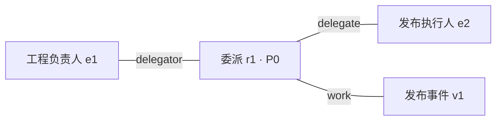
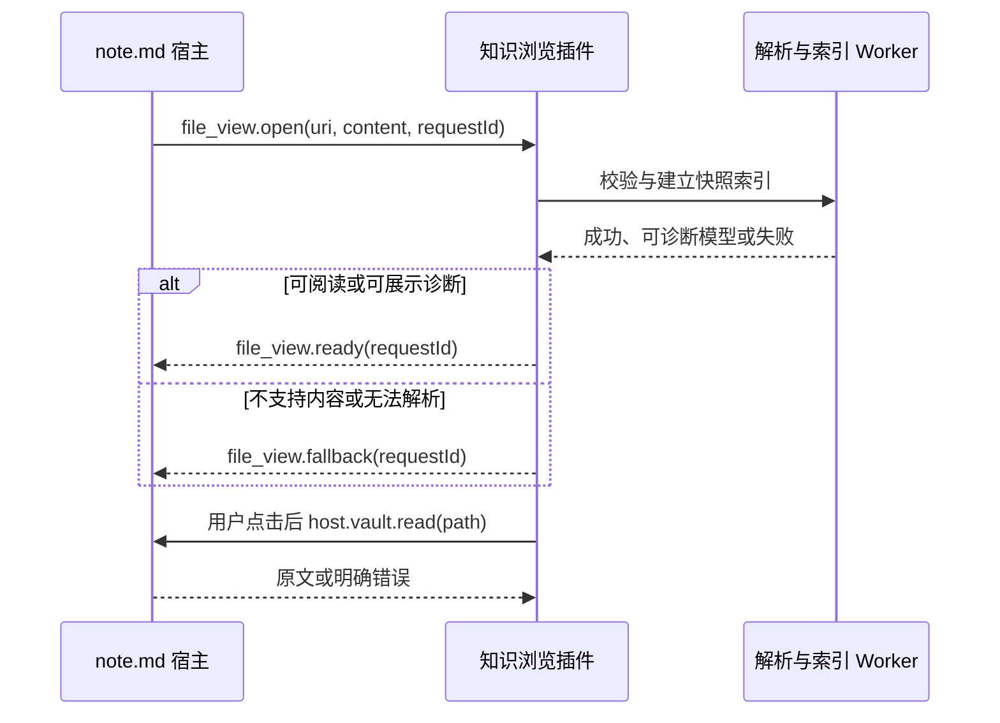
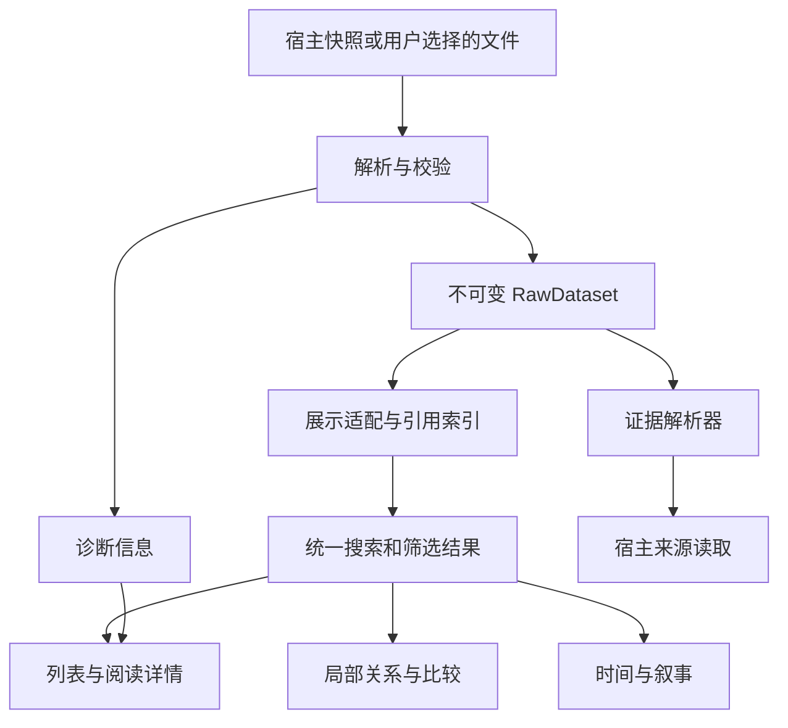

# 知识浏览插件应围绕主张、关系和证据组织阅读

## 0. 文档控制与实施摘要

| 项目 | 约定 |
| --- | --- |
| 规格版本 | 1.0；用户已授权开始实施，最终产品验收尚未完成 |
| 插件中文名 | 提取知识浏览器 |
| 插件英文名 / ID | Knowledge Browser / `notemd.knowledge-browser` |
| 目标工程 | `/Users/bruce/git/mdeditor` |
| 建议目录 | `plugins-src/knowledge-browser/` |
| 输入协议 | `knowledge-representation-dataset/3.0.0` |
| 内置关系注册表 | `1.0.0` |
| 产品形态 | note.md 插件 v2：编辑器只读文件视图 + 数据集浏览窗口，共用一套浏览组件 |
| 本文的“提取知识” | 已由抽取 Skill 生成的实体、概念、主张、事件、叙事及 P0–P3 关系 |
| v1 数据操作 | 读取、检索、浏览、定位、比较、复制引用；用户偏好单独保存 |
| v1 完成标准 | 第 15 节全部 MUST 验收通过；分阶段交付不削减最终范围 |

本文使用 **MUST（必须）**、**SHOULD（应当，偏离须记录原因）**、**MAY（可选）**。没有另行标记的需求按 MUST 执行。标为“未来”的内容不属于 v1。

核心体验：用户打开一个知识 JSON，先读可理解的结论，再沿对象和关系理解上下文，最后查看原文证据。紧凑字段由界面解释，原文件保持紧凑。所有浏览行为确定性执行，正常浏览不消耗模型 Token。[^request]

### 0.1 已核实的宿主基线

核对时工程 `package.json` 为 `6.915.3`，Git HEAD 为 `d5a96f54b7171b184baf236722cd4568b76cbdc7`。宿主已有 `contributes.file_views`、文件快照握手、Vault 读取、打开编辑器文件、插件独立设置及剪贴板能力。[^host-guide][^host-code][^host-view]

实施时以目标分支源码为准；本规格中的 UI、数据和验收要求保持有效。API 签名如有变化，应在适配层对齐，并记录差异。

### 0.2 明确的产品决定

1. 主界面采用**结果列表 + 阅读详情**双栏；筛选为可展开面板，证据占用详情区域，避免长期并列四五个信息区。
2. 五类知识对象与关系均可独立阅读。默认聚焦主张；数据里没有主张时自动转为全部知识。
3. 局部关系图是一种阅读方式；多方关系以有角色的关系节点表达。
4. 研究问题作为阅读上下文展示。v3 没有问题到对象的明确映射，界面不能把字符串匹配结果标成“该问题的答案”。
5. 事件时间、有效时间、来源时间、系统记录时间分别展示、分别筛选。
6. 已有 JSON 是知识内容的来源；界面索引、布局、筛选和偏好不写回知识 JSON。
7. v1 不承担重新抽取、知识审核、事实修改、实体合并、任务创建或长期记忆写入。未来接入抽取 Agent 时，另立执行与写入规格。

### 0.3 实施决策与当前宿主差异

以下决定用于消除实施歧义；如与后文较宽泛的表述冲突，以本节为准：

1. 数据集通过协议允许的 `type_defs` 合法声明自定义关系类型时，该类型可进入正常阅读、筛选和关系图，并按声明的角色展示。没有合法定义的未知类型，或试图用 `type_defs` 覆盖内置类型的记录，必须隔离并进入诊断，不进入正常关系图。
2. 320 px 响应式验收适用于宿主内嵌文件视图。独立窗口保持 manifest 的最小宽度 640 px；两个入口复用同一响应式布局模型，不为窗口另写一套页面。
3. 两个入口共享浏览组件、状态类型和状态转换模型，但不要求跨窗口实时同步瞬时状态。每个窗口维护自己的运行时状态，只通过插件设置恢复已明确允许持久化的偏好。
4. 为发现重复 JSON 属性键，语法层使用能够保留 token 位置的严格解析器，诊断必须给出重复键及其位置；不能先用标准 `JSON.parse` 覆盖重复值后再校验。
5. 固定版本的 Schema 使用构建期生成校验代码，或使用经过显式验证且运行时不依赖 `eval` / `new Function` 的校验器。验收必须在插件 CSP 下证明校验路径无动态代码生成。
6. 关系图 v1 先采用确定性的分层布局，输入顺序与稳定排序相同则布局结果稳定；任何图形交互都必须保留功能等价的关系列表，不能把图作为唯一阅读入口。
7. 当前宿主 `host.vault.read` 的文件读取上限为 200 MB，`read_bytes` 的原始字节读取上限为 10 MB。前者可承载本规格不超过 30 MiB 的知识 JSON 与文本预览；后者只用于能力范围内的 SHA-256 来源版本核对，超过 10 MB 时显示“未核对版本”。
8. 目录扫描取消由插件维护应用级取消令牌：停止调度新读取，并丢弃令牌失效后的完成结果；当前宿主没有目录扫描取消 RPC，不得把 UI 取消描述成已中止宿主内部调用。
9. “复制知识引用”默认包含当前 `snapshot`。恢复时摘要不一致必须提示快照已变化，并在严格核对 dataset/ref 后允许用户查看当前对象。

## 1. 用户目标与范围

### 1.1 必须完成的阅读任务

| ID | 用户任务 | 成功结果 |
| --- | --- | --- |
| JT-01 | 这份材料提取了哪些重要知识？ | 看到研究范围、核心主张及完整对象分类；能切换核心与支撑对象 |
| JT-02 | 某个人、概念或事件与什么有关？ | 找到对象，看到明确关系及每个参与者的角色 |
| JT-03 | 这条主张是谁说的、依据是什么？ | 分清主张者、说话人、提取者；查看引用证据和原文定位 |
| JT-04 | 某项决定在什么范围和时间内有效？ | 读到 P0 关系的作用范围、条件、例外、有效时间及来源声明状态 |
| JT-05 | 两条说法为何冲突，哪个记录修正了哪个？ | 并排比较文本、范围、时间和证据，保留两边记录 |
| JT-06 | 一系列事件如何构成一个解释？ | 按叙事顺序阅读成员、推理、替代解释及限制 |
| JT-07 | 数据不完整或来源变了怎么办？ | 明确区分结构问题、缺失引用、来源缺失、定位失败及来源版本不一致 |
| JT-08 | 下次如何返回同一条知识？ | 复制稳定引用，重新打开数据集并定位到对象或证据 |

### 1.2 v1 交付边界

必须交付：单数据集完整浏览、当前 Vault 的数据集目录、六类知识检索、对象详情、叙事阅读、局部关系探索、时间线、来源与证据浏览、显式关系比较、数据诊断、引用恢复。

未来范围：跨数据集语义合并、全库联合图谱、自然语言问答、重新抽取、模型解释、审核批准、多人协作、版本编辑、完整历史存储、公开链接、独立网站部署。

允许跨文件切换数据集；一次只对当前数据集建立知识连接。同名对象和相同短 ID 不能跨数据集合并。

## 2. 信息架构与页面布局

### 2.1 两个入口，一套阅读状态

**入口 A：编辑器文件视图。** 打开命名匹配的 JSON 时，宿主将文件内容快照交给插件。插件识别协议后显示知识视图；用户通过宿主已有的文件视图切换控件切回源码，插件页眉不重复提供“编辑 JSON 原文”按钮。

**入口 B：插件菜单“提取知识浏览器”。** 打开单例窗口，展示当前 Vault 的数据集目录。选择数据集后在该窗口内进入同一浏览器；提供“在编辑器打开”动作。

目录默认扫描 `research/` 的直接子文件，仅选 `*-knowledge-*.json`、`*.knowledge.json`。用户可配置其他 Vault 相对目录与是否递归。手动选择文件不受文件名限制，但必须验证协议。目录扫描只发现数据集，不读取其引用的来源正文。

### 2.2 桌面布局

```
┌───────────────────────────────────────────────────────────────┐
│ 数据集名称  ▾     研究范围 / 问题            数据说明  ···       │
│ 搜索当前数据集…                  筛选 (2)   阅读 | 关系 | 时间   │
├──────────────────────┬────────────────────────────────────────┤
│ 分类：主张 ▾          │ 当前主张的完整陈述                      │
│ 核心 / 支撑 / 全部    │ 主张类型 · 来源声明状态 · 重要性         │
│ 排序 · 20 个结果      │                                        │
│                      │ 内容与条件                              │
│ 可读的知识结果        │ 参与对象 / 明确关系                      │
│ 类型、必要状态        │                                        │
│ 一句保留理由          │ [详情] [证据 2] [原始记录]               │
│                      │ 当前选项的内容                          │
├──────────────────────┴────────────────────────────────────────┤
│ 路径 / 快照信息                     已载入 · 诊断问题 2          │
└───────────────────────────────────────────────────────────────┘
```

线框只定义层次和行为，视觉实现复用宿主的间距、字体、控件、主题和菜单规范。已有 Index Viewer 使用 `ui-foundation.css`，可参考其构建期样式复用方式。[^reference-plugin]

### 2.3 布局规则

- 内容宽度 ≥ 1100 px：列表初始 360 px，阅读区占剩余空间；列表可调至 280–480 px。
- 760–1099 px：列表初始 300 px，阅读区最小 400 px；不能满足时切换单栏。
- < 760 px：列表与详情分别占满宽度。打开对象后显示返回按钮，返回恢复列表位置。
- 320 px、768 px、1280 px 和 1440 px 均须可用；长句、长路径和短 ID 可换行，不能撑破页面。
- 筛选面板通过工具栏展开，覆盖或推开当前列表区域；关闭后显示已生效条件。
- 证据默认在详情的“证据”页内展开；窄屏保持同一层级，不叠加多个抽屉。
- 比较模式替换阅读区：宽屏双列，窄屏按“左/右对象”切换；退出后恢复原详情。
- 不为数据总量、平均分数、图密度添加占据首屏的仪表盘。

### 2.4 默认状态

第一次打开：阅读模式、主张分类、全部重要性、无筛选；按核心优先，再按原始数组顺序排列。第一条可浏览结果在桌面自动选中，窄屏保持列表；没有主张时使用“全部知识”。

再次打开：恢复当前 Vault 与数据集对应的展示偏好。过期选中对象不存在时回到列表，并提示“上次查看的对象不在当前快照中”；不自动选同名对象。

## 3. 数据契约与解释规则

输入以外部 JSON Schema、输出契约和内置注册表为准。本文规定消费端行为，不增加抽取端必填字段。[^contract][^schema][^types]

### 3.1 依赖与版本固定

实施时将以下文件随插件打包，保存来源路径、协议版本和校验摘要；运行时不联网下载：

| 依赖 | 来源 | 本次核对 SHA-256 |
| --- | --- | --- |
| JSON Schema | `/Users/bruce/git/sotvault/skills/relation-schema-extractor/references/relationship-extraction.schema.json` | `a1700e2eb44049b7f9806c1dc0e35d59ffd16d4914ae606eeaea34a5767d30ed` |
| 内置关系表 | `/Users/bruce/git/sotvault/skills/relation-schema-extractor/references/relation-types.json` | `18aa514da384a8508cd11cd69ba2000808404cc5e6ad2a5d3e6e7ade4691c6d1` |

v1 支持且只按语义解释 `knowledge-representation-dataset/3.0.0` 与关系表 `1.0.0`。2.x、未知版本和未知注册表版本显示“尚不支持此版本”，可查看原始 JSON；不得猜字段、自动迁移或用最新版注册表替代旧版本。

`generated.rule` 是抽取规则版本；`generated.types` 是注册表版本；`schema` 是数据结构版本。三者不可互相代替。

### 3.2 对象身份与快照

- 数据集 ID：`ks_<UUIDv4>`；局部 ID：来源 `s1`、证据 `x1`、实体 `e1`、概念 `c1`、主张 `q1`、事件 `v1`、叙事 `n1`、关系 `r1`。
- 知识定位键：`datasetId#localId`。实现中 Map 必须以数据集作用域隔离，不能全局使用 `e1` 作为键。
- 浏览快照另有 `snapshotHash`：对收到的完整字符串按 UTF-8 编码计算 SHA-256，仅用于识别当前浏览内容。它不等于来源版本，也不必等于未经宿主处理的磁盘字节摘要。
- 同一数据集 ID 出现在两个文件时：显示两个文件位置。内容摘要相同标“相同副本”；不同标“同 ID 的不同快照”。用户明确选择，不能按生成时间自动认定权威最新版。
- 记录 `rev/op/parents` 描述修订信息，不代表插件持有历史。`r1@1` 找不到时显示“父版本未载入”；不得合成历史或把别的数据集的 `r1` 当作父版本。

### 3.3 缺省值必须可解释

| 数据 | 未出现 | 出现 `null` / 明确值 | 页面呈现 |
| --- | --- | --- | --- |
| `status` | `candidate` | 使用协议允许的状态 | “候选”；详情注明来自协议默认 |
| `scope` | 继承数据集 scope | 使用记录自己的 scope | 展示局部范围与数据集研究范围；不做未定义的字段合并 |
| `event` / `valid` | 不适用 | `null` = 适用但未知 | 分别显示“不适用”与“未知” |
| `evidence.at` | 来源时间未知 | 时间点或区间 | 不继承生成时间 |
| `rev/op/parents` | 1 / create / 无父版 | 三者须按契约同时出现 | 默认在元数据展开后可见 |
| `authority` | 未审核、无行动授权 | 数据里的审核声明 | “来源记录的审核信息”；不显示为本插件核实 |
| `source.origin` | 原始来源 | derived / unknown | 标签来自数据约定，不能声称已检查来源真实性 |
| `source.group` | 分组为来源自身 | 使用显式 group | “证据链分组”；不声称已证明独立性 |
| `source.v` | 非法，字段必填 | `null` = 版本未知 | “版本未知”；字符串原样保留 |
| `entity.identity` | 候选身份 | resolved / ambiguous | “来源标记已消歧”或“身份待消歧” |
| `score` / `score_type` | 没有分数 | 成对展示 | “抽取分数 / 分类分数”，不可称“事实可信度” |
| `limits` | 没有单列已知限制 | 展示内容 | 不能推导“没有任何限制” |

`generated.at` 作为数据集系统记录时间，仅在明确选择该时间维度时用于排序或筛选。界面展开默认值只发生在展示模型，不写回原对象。[^contract]

### 3.4 可读标题与关系文本

标题解析必须确定性完成：

| 类型 | 主显示内容 | 次级内容 |
| --- | --- | --- |
| 实体 | `name` | 实体类型；别名按需展开 |
| 概念 | `term` | `definition` |
| 主张 | 完整 `text` | `kind`、`by` |
| 事件 | `title` | `state`、`event` |
| 叙事 | `title` | `thesis`、`mode` |
| 关系 | 优先自身 `text`；否则按顺序解析 `claim[].text` | `type`、`p`、角色 |
| 来源 | `title`，缺失时使用路径文件名或 URI | 版本与来源性质 |
| 证据 | 来源名 + `loc` | 短引文及说话人 |

关系只含 `claim` 时，显示明确的“引用主张”标记。多条主张逐条呈现，不拼成一个新命题。`text` 与 `claim` 同时出现时保留两层内容，不自行判定相同或冲突。`claim` 缺失或断开时不能从角色名自动编造关系陈述。

`why` 在列表最多两行、详情完整显示。原始短 ID 作为次级信息和复制目标，界面主标签用中文名称或可读文本。

### 3.5 Priority、重要性、状态分开

| 维度 | 值 | 含义 |
| --- | --- | --- |
| 关系 Priority | P0 / P1 / P2 / P3 | 行动责任 / 证据修订 / 身份时间 / 机制发现 |
| 对象重要性 | `i=0` / `i=1` | 核心 / 支撑 |
| 来源声明状态 | candidate / contested 等 | 记录声明的状态，不是本插件事实裁决 |

对象没有 `p`，不能从邻接关系给实体或主张补一个 P 级别。来源标记 `confirmed` 但仅附自由文本 `authority` 时，可展示该声明，不能显示“本系统已认证”的绿色勾选。结构校验通过也不能升级事实状态。

不显示 P4、不展示被排除候选、不为缺少某个 Priority 提醒“补齐”。

## 4. 检索、筛选与导航

### 4.1 检索对象和匹配方式

**KB-SEARCH-01**：搜索默认限定当前数据集，覆盖可读标题、完整文本、定义、别名、`why`、条件、例外、推理、限制和角色名称。关系无 `text` 时，索引所引用主张的文本，并标明命中来自主张引用。`args`、`about`、`by` 的直接引用可索引被引对象的名称/标题，并显示“命中参与对象”；最多展开一层名称，不把邻接对象全文递归混入每条记录。

**KB-SEARCH-02**：原文全文搜索是单独动作。默认搜索不读取来源全文；选中“包含已保存引文”后仅搜索 `evidence.quote` 并返回证据及明确引用它的记录。

**KB-SEARCH-03**：文本做 Unicode NFKC 及大小写归一化，保存原文用于显示。连续中文按字面子串匹配，空白分隔的词按 AND 组合，双引号内作为一个短语。不启用正则、不自动同义词扩展。输入法组合过程中不刷新结果，完成输入后 150 ms 防抖。

**KB-SEARCH-04**：支持局部 ID 精确检索和 `datasetId#localId` 定位。当前数据集不匹配时说明所在数据集，不把同名 ID 当成命中。

排序可选：相关性、核心优先、原始顺序、所选时间升序/降序。默认无搜索时核心优先；有搜索时按“ID 精确 > 主标签精确 > 主标签包含 > 其他字段包含”，再按核心、原始顺序稳定排序。

### 4.2 分面筛选

每个维度内部 OR，维度之间 AND。提供一键清除及逐条件删除；数量基于当前快照计算，不用模型估计。

| 筛选项 | 适用对象 | 规则 |
| --- | --- | --- |
| 对象分类 | 六类知识，另有来源/证据入口 | “全部知识”包含五类对象和关系，不混入来源/证据 |
| 核心 / 支撑 | 六类知识 | 使用 `i` |
| P0–P3 | 仅关系 | 选择 P 级别时切换关系分类，并明确显示该切换 |
| 来源声明状态 | 六类知识 | 包括协议默认 candidate |
| 来源 / 证据链组 | 六类知识 | 依据自身 `ev` 直接引用；不会递归沿所有关系扩散 |
| 时间 | 有该时间维度的记录 | 用户先选事件 / 有效 / 来源 / 系统，再选范围 |
| 数据问题 | 六类知识 | 有诊断、身份歧义、来源定位问题等具体项目；未读取来源时为“尚未检查”，不能归为“来源正常” |

不能把研究问题下拉项当作精确筛选：用户选择问题后只固定显示其文本；可点击“用问题文本搜索”，此时生成可见搜索词。

### 4.3 上下文导航

- 单击结果：在详情显示；键盘 Enter 等价。短 ID 和对象名称都能作为明确导航目标。
- 单击详情中的关联对象：进入该对象；显示面包屑和“返回上一对象”。
- 面包屑最多显示最近三层，其余收进历史菜单；循环引用不得创建无限嵌套页面。
- 关联对象不符合当前筛选时仍可查看，显示“此对象不在当前筛选结果中”；不暗改筛选。提供“定位到列表”显式解除冲突条件。
- 切换阅读/关系/时间模式时保留数据集、选中对象、查询及有效筛选。时间轴没有该对象时说明原因，不能自动以生成时间定位。
- 叙事成员和图中的上下文节点可超出结果集合，但必须以“关联上下文”区别；结果数量只计算真实命中。

## 5. 阅读详情与知识对象

### 5.1 公共详情框架

顺序固定为：可读标题 → 类型与必要状态 → 主内容 → 条件/例外/限制 → 关联对象与关系 → 证据入口 → 展开的元数据。

详情提供“详情 / 证据 / 原始记录”三个页签。缺失值解释在详情或元数据中可查；列表不重复展示大段默认 Meta。

“原始记录”显示原文件对应的 JSON 结构和 JSON Pointer，允许复制原对象。只在显示时格式化；不得将继承字段、中文标签、索引计数或图坐标混入复制的原对象。

### 5.2 类型专属内容

| 对象 | 必须显示 |
| --- | --- |
| 实体 | 名称、类型、别名、描述、身份声明；按关系类型分组的相关关系；被哪些主张/事件/叙事引用 |
| 概念 | 定义、成立标准 `criteria`、排除边界 `excludes`；缺一项时如实省略，不补写；实际引用对象 |
| 主张 | 全文、主张类别、主张者 `by`、对象 `about`、条件与例外；表达此主张的形式化关系；显式支持/冲突/修订关系 |
| 事件 | 标题、类型、计划/进行/完成/取消/未知状态、事件时间、参与角色、地点；计划事件和已发生事件用文字区分 |
| 叙事 | 中心命题、来源/Agent/混合模式、成员及原有顺序、角色、推理、替代解释、限制 |
| 关系 | Priority、类型、陈述或主张引用、完整角色表、范围、条件、例外、时间、修订、证据 |

`claims.by` 是对象/来源引用时导航到对应对象；是明确 actor 文本时按文本显示，不能自动创建实体。`evidence.speaker`、`claims.by`、`generated.by` 分别使用“证据说话人”“主张者”“提取者”标签。

### 5.3 P0 与 P3 的呈现要求

**P0**：范围、条件、例外、有效时间与审核声明必须在详情首屏可发现，不能全部藏进 JSON。未知有效时间明确写“有效时间未知”。拥有执行责任、接受承诺和拥有批准权必须通过真实角色名称分别显示。

**P3**：显示“机制解释 / 假设”，默认展开 `reason`、`limits`；单一证据链时显示 `single_source_reason`。证据数量与证据链分组数量分别统计，不显示由数量推算的可信度分数。

### 5.4 叙事阅读

叙事分类将列表切换为叙事目录，详情按 `members` 数组顺序生成阅读链：序号、角色、对象内容、查看详情、查看证据。顺序来自数据，不从事件时间重排；需要按时间看时用户切换时间模式。

成员即使被筛选排除也保留并标“上下文”；缺失成员显示占位及 ID，不把叙事收拢成一条看似完整的解释。Agent / mixed 叙事的推理和替代解释必须可见。嵌套叙事通过跳转展开，不递归渲染到无限深度。

## 6. 关系探索与比较

### 6.1 首先支持可读的关系清单

当前对象的关系按“参与关系 / 被主张谈及 / 事件参与 / 叙事成员 / 证据引用”分组。结构引用与真实关系分开：`about`、`members`、`ev` 不能在 UI 中伪装成新提取的关系记录。

关系清单至少提供：Priority、可读陈述、类型、当前对象所扮演的角色、其他参与者和证据入口。关系类型 `args` 可以引用来源或关系本身，实现不能假定端点只有实体。

### 6.2 局部关系图

**KB-GRAPH-01**：默认中心为当前选中对象，展示一跳。这里一跳定义为“当前对象 → 一条关系实例 → 该关系全部参与对象”，不是布局图上的单条线。用户可显式扩展至两跳。

**KB-GRAPH-02**：每条关系都保留独立身份。统一用关系节点连接参与对象；连接线上标出 `args` 角色。`delegates_to` 的三方角色不能变成三条没有角色的两两边。



角色线只表示参与关系，默认不画因果箭头。内置注册表当前只声明 Priority 与必需角色，未给出完整方向定义；不得把角色数组顺序当作因果或时间方向。[^types]

**KB-GRAPH-03**：节点文字来自确定性标题解析。关系类型和 P 级别在关系节点显示；来源是来源节点，不能伪装成已消歧实体。结构引用默认关闭，开启时用虚线并注明“引用”。

**KB-GRAPH-04**：单次渲染最多 80 个对象节点与 120 条角色连接线；关系节点计入节点上限。按 Priority、核心重要性、原始顺序稳定选择完整关系组；若一条关系本身超限，则以可展开角色列表替代该关系图，不能截掉参与者。显示已展示/可用数量及“展开更多”；达到上限后的“更多”切换当前局部子图或打开完整列表，不能突破上限持续追加。

**KB-GRAPH-05**：点击节点与阅读详情同步；点击关系节点查看角色表；缩放、平移、居中、返回上一中心均可用。键盘用户可以通过等价关系列表完成全部阅读任务。

布局坐标、展开状态、节点中心性均为派生视图，不回写 JSON，也不成为重要性或真实性证据。

### 6.3 冲突、替代与修正比较

只对显式的 `contradicts`、`supersedes`、`corrects`、`version_of` 提供语义化比较入口。其他两对象可手动比较，但标题为“内容比较”，不自动认定冲突。

比较字段：全文、主体/角色、作用范围、条件、例外、事件时间、有效时间、来源声明状态、证据、来源版本、修订。区分字段缺失、null、空值和具体值，不把这些变化折叠掉。

- `contradicts`：左右平等，不能自动给某边“正确”标记。
- `supersedes`：按 `newer/older` 角色标明后来取代旧规则或状态。
- `corrects`：按 `correction/incorrect` 角色标明修正关系的来源声明。
- `version_of`：只展示版本连接，不推导哪版有效。

文本差异和字段差异可以高亮，但不能把差异结果写成新知识。缺失端点保留占位和诊断，不使用相似对象替补。

## 7. 时间浏览

### 7.1 四个独立时间维度

| 维度 | 来源 | 对象集合 |
| --- | --- | --- |
| 事件时间 | 记录 `event` | 事件及其他显式具有 event 的知识对象 |
| 有效时间 | 记录 `valid` | 有效期适用的知识对象和关系 |
| 来源时间 | `evidence.at` | 证据；并提供反向引用它的知识对象 |
| 系统记录时间 | `generated.at` | 数据集快照；不会复制成所有对象同时发生的事件 |

### 7.2 时间解析与显示

- 支持严格有效的 `YYYY-MM-DD`、带时区的 RFC 3339 时间点和二元区间；保留原字符串与原精度。
- 日期仅作为该日显示，不能因为时区转换变成前一天。时间戳可按当前显示时区转换，同时可展开查看原值。
- `null`、字段缺失、无法解析的字符串分别进入“未知”“不适用”“未标准化时间”分组。
- Schema 允许非空时间字符串，不等于字符串一定是可绘制日期。相对时间如“下季度”保持原文，不能以生成时间补足。
- 只有一端为 null 的区间显示开放端标记；不把 null 端解释为已知的无限过去/未来。
- 范围结束早于开始时显示诊断，不静默调换；`[null,null]` 是非法结构。
- 时间范围筛选：完整已知区间按相交判断；开放区间以未封闭端计算“可能相交”，单独标注；未知/不适用/未标准化默认不进入日期结果，用户可主动勾选附带显示。

时间线按所选维度升序，日期精度的事件归为日组，具体时刻按时序显示；同一时间按原数组顺序。持续有效期用区间，点事件用时间点，计划/取消状态以文字明确标识。

## 8. 来源与证据回溯

### 8.1 证据详情

点击 `ev` 必须能完成 `record → evidence → source` 的定位。详情显示来源名称、位置 `loc`、短引文、来源时间、说话人、作用、来源版本、分组及引用该证据的记录。

对象的“直接证据”只计自身 `ev`。关系引用主张时可展示“关联主张的证据”，但单独分组，不静默并入直接证据数量。

默认展示 JSON 内保存的内容；用户点击“读取原文片段”后才通过宿主读取源文件。原文读取失败不影响已保存的引文阅读。

### 8.2 URI 解析与来源边界

| URI 形态 | v1 处理 |
| --- | --- |
| `/ssot/…` 等以 `/` 开头的 bundle 路径 | 去除 bundle 开头 `/`，在当前 Vault 内解析；绝不直接作为 OS 绝对路径 |
| `./…` 或不带前导 `/` 的相对路径 | 相对知识 JSON 所在目录解析，再验证仍位于当前 Vault |
| `https://…` / `http://…` | 显示外部来源并允许复制 URL；v1 不抓取网页正文 |
| `hemory://…` 等其他 scheme | 显示原始 URI 和“不支持自动定位”，允许复制 |
| 自然语言范围描述 | 作为来源说明显示，不能解释成文件路径 |
| 明确的 OS 路径或外部文件 | 只有用户通过文件选择器单独授权后才能读取，不因 JSON 内引用而读取 |

当前 Vault 根目录来自 `host.vault.info`。所有 `host.vault.*` 参数最终必须是安全的 Vault 相对路径；复用宿主的符号链接和路径围栏。不能使用词条页面导航代替文件读取：`file_view.open_page` 的目标是页面名，并可能创建缺失页面，不适合本插件的回源动作。[^host-code][^host-guide]

知识 JSON 在 Vault 外被手动打开时，可以浏览内嵌知识与引文；在没有明确来源根目录的情况下，不自动将 `/…` 映射到当前 Vault。

受管理来源遵守宿主各自的访问路径；例如原始邮件正文需要专用可信预览，不能借 `sources.uri` 绕过并读取原始邮件档案。控制目录、凭证目录和隐藏配置不属于本插件来源预览范围。

### 8.3 定位算法

`loc` 是原样保存的定位描述，v1 按以下顺序尝试，所有成功/失败都反馈具体原因：

1. 行号：识别 `L12`、`L12-L18`、`line-12`、`lines 12-18`；行号从 1 开始，对解码后的原文按 LF/CRLF 计行。
2. 时间码：识别 `HH:MM:SS[.mmm]`、时间码区间及 SRT 的逗号毫秒；在 SRT 或逐行有时间戳的转录中找相交片段。不得把 `loc` 时间码当作真实日期。
3. 短引文：在位置无法解释或超界时，用 `quote` 在原文精确查找，仅允许换行规范化；多个命中让用户选，不默认选第一处。
4. 均失败：仍可显示整份来源文本的受限预览和原始 loc，标“未能自动定位”。不得用语义相似度制造精确命中。

命中后默认显示前后各 5 行上下文，可逐步展开。文本预览最多一次显示 200 行，保留真实行号；转录显示真实说话人与时间码。

### 8.4 来源版本与定位可信度

- `source.v` 为 `sha256:` 摘要时，仅在能够拿到原始字节的情况下比较。宿主 `read_bytes` 当前有 10 MB 上限；超限或只拿到可能经处理的文本时显示“未核对版本”，不伪造字节一致性。[^host-guide]
- 版本为其他字符串时原样显示，除非存在已实现的版本解析器，否则标“版本未核对”。
- 字节摘要一致：允许显示“来源内容版本一致”，它只表示字节比较结果。
- 摘要不同：保留 JSON 引文并标“当前来源与抽取版本不同”；即使行号存在，也不能标为“抽取时原位置已验证”。当前文件命中可显示为“当前版本的候选位置”。
- 文件缺失、无权限、超出大小上限和定位失败是四种不同错误，提供各自恢复动作。

### 8.5 在编辑器打开来源

当前 `host.editor.open` 接收文件路径及可选视图参数，未提供行号或时间码参数。v1 必须在插件内部实现精确片段预览；“在编辑器打开”只承诺打开整份文件，并提供“复制定位”辅助。不得传入不存在的 `line`、`timestamp` 参数并宣称成功跳转。[^host-code]

## 9. 数据集目录、刷新与引用恢复

### 9.1 目录发现

目录显示文件名、可读研究目的、生成时间、六类知识数量、协议版本及加载状态。数据集没有 `title` 字段，名称优先从文件名得出；`scope.purpose` 作为说明，不能写回一个新 title。

读取顺序：列目录 → 按模式筛文件 → 每次最多 2 个并发读取 → 解析并显示条目。目录扫描只保留每份数据集的摘要，读取后释放其全文；仅当前打开的数据集保留完整索引。一次扫描最多 500 个匹配文件、目录递归最多 10 层；达到上限显示“结果有截断”，允许用户缩小目录。用户可取消扫描；取消不能清空已成功发现的条目。

v1 不自动全库扫描，不访问 `.git`、`.notemd`、依赖目录或其他控制目录。没有数据集时显示抽取 Skill 名称、预期格式与文件命名示例；不放置不可用的“开始 AI 提取”按钮。

### 9.2 快照刷新

文件视图以宿主 `file_view.open` 的内容为本次权威浏览快照。收到新 requestId 时取消旧解析与原文读取回调，原子替换整个数据模型，不混合新旧数组。

独立窗口提供“重新读取”。窗口重新获得焦点时只检查当前数据集（若宿主没有变更事件，允许一次节流读取），不轮询整个 Vault。读取到不完整写入时保留上一成功快照，显示“新文件暂时无法解析”；重试或切回源码，不丢弃旧视图冒充空数据集。

数据集 ID 相同且目标对象仍存在时保留选中；ID 改变时重置选择。Vault 切换必须取消在途请求并清理来源正文缓存，避免同路径跨库读取。

### 9.3 复制与恢复引用

“复制知识引用”使用以下**导航封装**，与知识 JSON 协议分开，复制为紧凑 JSON：

```json
{"format":"knowledge-ref/1","path":"research/example.knowledge.json","dataset":"ks_85cb6e32-b304-4e00-9331-b919b7c40b41","ref":"q1"}
```

可选 `snapshot` 为浏览快照摘要，可选 `evidence` 为 `x1`。path 是 Vault 相对位置，不能携带文件正文、绝对用户目录或权限声明。

独立窗口提供“定位引用”：解析封装 → 在当前 Vault 读取 path → 核对 dataset → 核对 ref / evidence → 定位。dataset 不符时停止自动定位；snapshot 不符时提示已变化并允许查看当前对象；短 ID 不存在时显示缺失，不能按名称替补。

文件视图支持当前数据集内定位；跨文件引用在独立窗口恢复。v1 不承诺操作系统 URL scheme 或可公开访问的网页链接，不能把普通 `plugin://` URL 当作跨窗口深链协议。

支持“复制原始对象”和“复制带来源的可读摘录”。后者包括原陈述、对象定位、来源 URI / loc 和来源声明状态。复制成功后才反馈成功；复制失败可选中文本手动复制。

## 10. 校验、降级与错误状态

### 10.1 校验层次

1. **语法层**：JSON 可解析、根对象、文件上限、嵌套深度、重复 JSON 属性键。
2. **结构层**：Draft 2020-12 Schema、必填字段、枚举、ID 格式、数组类型。
3. **引用层**：ID 唯一、引用存在、引用对象类型正确、禁止直接自引用。
4. **业务层**：注册表版本、关系类型与角色、p 一致、P3 推理与证据组要求、身份歧义说明等。
5. **来源层**：仅在读取来源时检查可用性、版本和定位。

复用现有 Python 校验器的业务规则作为对照，不要求用户在插件里安装 Python。Python 当前只是实现参考；前端还须正确处理非法字段类型、未知时间文本和来源读取问题。[^validator]

### 10.2 故障处理矩阵

| 情况 | 视图行为 | 可用动作 |
| --- | --- | --- |
| JSON 语法失败 / 非目标 schema | 文件视图回退宿主源码；独立窗口显示具体错误 | 查看源码、重试、选择文件 |
| 已知 schema 但必需顶层结构不成立 | 诊断页，不生成知识索引 | 查看错误与原始 JSON |
| 重复属性键 / 重复局部 ID | 整个数据集进入诊断页，避免二义引用 | 定位冲突位置；不选后一个覆盖 |
| 单条对象字段错误 | 隔离该对象，其他合法对象可浏览 | 显示原记录和 JSON Pointer |
| 引用对象被隔离或不存在 | 保留有问题的关系/叙事占位，停用对应跳转 | 查看缺失 ID 与诊断 |
| 未知关系类型 / 自定义类型覆盖内置类型 | 该关系不进入正常关系图；诊断页保留原记录 | 查看原始 type 与定义 |
| p 与注册表不一致 | 保留原记录并标错误；不自动改 p 或错误归组 | 查看两者差异 |
| 事件时间无法标准化 | 正常阅读原文本，单列时间分组 | 查看原值 |
| 来源缺失 / 版本不符 | 知识阅读继续，证据页展示具体状态 | 读取当前文件、复制 URI、重试 |
| 无结果 / 数组为空 | 明确空状态，不虚构示例数据 | 清除筛选或浏览其他分类 |

“诊断通过”表示数据结构和引用满足规则，不表示知识已核实。局部可浏览时，在底部持续显示“可浏览 X 条，隔离 Y 条，引用问题 Z 项”，不能把隔离记录计为不存在。

结构诊断保存于内存，每项至少含 `code`、`severity`、`pointer`、相关对象 ID、可读消息和恢复建议；不写回输入文件。

### 10.3 异步状态

必须覆盖 `idle → loading → ready | partial | diagnostic | unsupported | failed`。新请求可取消旧请求；取消是独立状态，不显示为来源错误。错误消息在对应区域呈现，不用连发 Toast 打断阅读。

## 11. 宿主集成规格

### 11.1 Manifest 建议基线

以下是完整可实施的初始声明。最低版本以本次核实的宿主基线保守设置；若团队降低门槛，必须在相应宿主版本验证所有使用的能力。

```json
{
  "manifest_version": 2,
  "id": "notemd.knowledge-browser",
  "name": "Knowledge Browser",
  "version": "1.0.0",
  "kind": "native",
  "engines": {"notemd": ">=6.915.3"},
  "description": "Browse extracted knowledge, relations and source evidence.",
  "ui": "ui/",
  "activation": {"events": []},
  "contributes": {
    "menus": [
      {"location":"plugins","submenu":"reading","label":"Knowledge Browser","command":"open-browser"},
      {"location":"plugins","submenu":"reading","label":"View Extracted Knowledge","command":"view-knowledge"}
    ],
    "windows": [
      {"id":"main","entry":"browser.html","title":"Knowledge Browser","width":1180,"height":800,"min_width":640,"min_height":480,"singleton":true,"open_command":"open-browser"}
    ],
    "file_views": [
      {"id":"knowledge","entry":"viewer.html","icon":"generic","open_command":"view-knowledge","priority":100,"selectors":[
        {"file_extensions":["json"],"file_name_patterns":["*-knowledge-*.json","*.knowledge.json"]}
      ]}
    ]
  },
  "capabilities": ["vault.read","editor.open","dialog","fs.read:dialog","clipboard.write","settings"],
  "i18n": {
    "zh": {
      "name":"提取知识浏览器",
      "description":"浏览提取的知识对象、多维关系与原文证据。",
      "menus":{"open-browser":"提取知识浏览器","view-knowledge":"查看提取知识"}
    }
  }
}
```

命名选择器只决定尝试加载；协议验证决定是否接受。不得声明接管全部 JSON。菜单打开窗口/文件视图走 `open_command`，不需要为纯前端插件虚设后端进程。[^host-guide]

### 11.2 文件视图握手

收到 `file_view.open` 后验证 `event.source === window.parent`、可信宿主 origin、viewId、requestId 及 content 类型；禁止使用 `'*'` 作为回复 targetOrigin。



宿主当前在 8 秒内未收到就绪时回退；插件不能先假报 ready 再长期无内容。可先完成版本/顶层检查并渲染可操作的加载或诊断页面，但“知识索引就绪”必须在完整校验结束后单独标示。旧 requestId 的完成结果、错误、原文响应全部丢弃。[^host-view][^host-guide]

用户点击“编辑原文”发送 `file_view.fallback` 且 `reason: "edit"`。回退保留同一份宿主内容，不由插件另读磁盘覆盖未保存编辑。

### 11.3 能力映射

| 能力 | 用途 | 关键约束 |
| --- | --- | --- |
| `vault.read` | 当前 Vault 信息、目录、数据集与原文 | 所有文件路径相对 Vault；来源正文按用户操作读取 |
| `editor.open` | 在编辑器打开 JSON 或来源 | `fileView: "knowledge"` 只用于符合自身选择器的文件 |
| `dialog` + `fs.read:dialog` | 用户手动选择任意命名 JSON / 外部来源 | 只读取当次选择器授权路径，不递归授权引用文件 |
| `clipboard.write` | 对象、引用、摘录 | 由用户点击触发 |
| `settings` | 插件自己的展示偏好与扫描目录 | 使用 host.settings.get / set；不能传其他插件 ID |

v1 不需要 `vault.write`、Agent 执行能力、Memory 控制能力或后台程序。构建脚本可以复用工程的共享类型、样式和纯函数，但产物必须自包含，运行时通过宿主桥访问文件；不能在隔离 UI 里直接调用 Tauri IPC。[^host-guide][^reference-plugin]

### 11.4 展示偏好与缓存

`host.settings.get` 返回当前插件的 `{settings: ...}`，`host.settings.set` 使用 `{key,value}`。[^host-code]

设置只保存 schemaVersion、目录选择、递归设置、视图/列表宽度、排序、每数据集最后的 view/ref。采用按 Vault 根标识摘要分区，最近最多 50 个数据集；不保存证据正文、主张全文或搜索历史。设置写入按操作结束后防抖，失败只提示“偏好未保存”，阅读继续。

解析索引及原文片段仅保存在内存。原文缓存总量最多 10 MiB，按最近使用淘汰；切换 Vault、关闭数据集或插件卸载时释放相应资源。文件视图与独立窗口不依赖 localStorage 自动互通来传递选中对象。

## 12. 内部架构与数据流



### 12.1 模块职责

| 模块 | 职责 |
| --- | --- |
| `host-adapter` | 类型化桥调用、入口上下文、origin/requestId 校验、Vault 切换 |
| `parser` / `validator` | JSON 安全解析、Schema 与业务规则、诊断分类 |
| `normalizer` | 缺省语义、可读标题、时间分类；不修改 raw 数据 |
| `indexes` | ID、反向引用、角色、证据引用、词条与时间索引 |
| `query` | 明确的搜索、筛选、稳定排序 |
| `navigation` | 选中对象、面包屑、返回栈、引用恢复 |
| `source-resolver` | URI 围栏、loc 解析、来源读取、版本核对 |
| `views` | 列表、详情、叙事、图、时间线、比较、诊断 |

至少构建 `nodesById`、`sourcesById`、`evidenceById`、`relationsByParticipant`、`recordsByEvidence`、`incomingReferences`。通过反向索引查关联，不能每次选中对象都扫描并递归展开整个 JSON。

内部视图模型允许有 `label`、`effectiveStatus`、`timeKind`、`diagnostics`、`inheritedFrom` 等派生字段；这些字段不是 v3 输出协议，不得复制回原始 JSON。

所有关系和来源字典使用 Map 或无原型字典，防止自定义角色、标签等文本改变对象原型。所有原文、标题、quote、definition 按文本渲染；如支持 Markdown，只允许经过宿主既有安全渲染器处理的子集。

### 12.2 校验器执行环境

前端校验器需要支持 Draft 2020-12 中的 `unevaluatedProperties`、`dependentRequired`、`prefixItems` 等当前 Schema 用法；只做字段存在检查不算兼容。

插件 CSP 下不得依赖运行时 `eval` / `new Function`。如选择编译式 JSON Schema 库，应在构建时生成校验代码并随插件打包；运行时不联网解析 `$id` 或下载 `$ref`。这属于实施要求，不预先指定新增依赖版本。

## 13. 性能、可访问性与运行边界

以下是验收目标，不是已经测得的性能。计时方法和基准数据应进入验收报告。

### 13.1 基准与目标

测试环境：Apple Silicon、16 GB RAM、发布模式、1280×800，关闭开发热更新；每项预热一次，重复 20 次，报告 p95。

| 数据规模 | 目标 |
| --- | --- |
| 小型：100 条知识、50 条证据 | 收到内容至首屏可用 ≤ 500 ms |
| 常用：10,000 条知识、20,000 条证据、UTF-8 ≤ 10 MiB | 完整解析校验索引 ≤ 3 s；搜索筛选 ≤ 150 ms；对象跳转 ≤ 100 ms |
| 大型：50,000 条知识、100,000 条证据、UTF-8 ≤ 30 MiB | 首个可操作页面 ≤ 2 s；后台索引 ≤ 10 s，显示进度并可取消 |
| 局部关系图 | 规定上限内布局及首帧 ≤ 800 ms；展开不冻结正文阅读 |

超过 30 MiB、50,000 条知识、100,000 条证据、JSON 嵌套深度 64 任一上限时，显示具体上限并提供源码查看；不无限增大内存，不把未处理部分当空数据。字节上限以 UTF-8 计算，字符串字符数只可用于提前拒绝，不可冒充字节精确值。

大型文件不得在主线程同步完成全部解析与索引；使用同源打包 Worker，并验证宿主 CSP 允许该 Worker。列表使用虚拟化，原始 JSON 按当前对象显示；全文格式化由用户显式触发并限制规模。

### 13.2 视觉与可访问性

- 复用宿主 Svelte 5、TypeScript、主题基础及插件构建方式，不创建第二套应用导航。
- UI 必须提供简体中文与英文；知识原文保留其原语言，不自动翻译。
- 正文建议 14–16 px，次级信息不小于 12 px；完整陈述可展开读取，不能仅靠 tooltip。
- 重要性、Priority、冲突及未知时间同时使用文字标签；颜色不能作为唯一含义。
- 搜索框、过滤控件、页签、列表选中、图的等价关系列表、复制和返回均可键盘操作；焦点清晰可见。
- Esc 先关闭当前临时面板，再退出比较；不丢失当前选中。Tab 顺序跟随视觉顺序，关闭面板后焦点返回触发控件。
- 遵循系统减少动态效果设置；图布局不持续摆动。
- 正常浏览不发模型请求、不加载远程脚本、不自动访问源 URL，不把数据正文写入日志。诊断日志只包含错误码、数量和必要的匿名化定位。

## 14. 实施顺序与交付物

### 阶段 A：建立可靠数据入口

交付 manifest、两个入口、Schema 兼容解析、数据诊断、目录发现、搜索列表、六类详情、缺省语义和只读验证。用附录样例走通文件视图与窗口两种入口。

### 阶段 B：完成证据与阅读闭环

交付来源定位、版本状态、叙事阅读、比较、时间线和复制引用恢复。证明来源路径、原文位置和状态标签均不发生语义替换。

### 阶段 C：完成探索与发布质量

交付局部多方关系图、大数据虚拟化/Worker、主题与窄屏、错误恢复、安装产物及全部验收记录。

三个阶段都属于 v1，不能只完成 A 后将图、时间线、叙事和回源列为“可选后续”。

### 阶段验收状态

| 阶段 | 当前状态（2026-09-15） | 完成条件 |
| --- | --- | --- |
| A：建立可靠数据入口 | 已实现并通过自动化与 Chromium 宿主模拟检查；待真实 note.md 人工验收 | 阶段 A 交付物完成，相关自动化与真实宿主检查通过并记录 |
| B：完成证据与阅读闭环 | 主要闭环已实现；SRT 精确片段、多候选选择及外部授权来源仍待补齐和验收 | 阶段 B 交付物完成，相关自动化与真实宿主检查通过并记录 |
| C：完成探索与发布质量 | 部分实现；Worker、窄屏、错误恢复和安装包已验证，虚拟化、图缩放/两跳、p95 基准与真实 WKWebView 验收待完成 | 阶段 C 交付物完成，第 15 节全部 MUST 验收完成并记录 |

状态只能依据验收证据更新；“未测试”不得改记为“已实现”或“通过”。

最终交付：

1. `plugins-src/knowledge-browser/` 的源代码、manifest、构建与安装说明。
2. 固定版本的 Schema、关系注册表及 provenance 记录。
3. 合成测试 fixtures；不把个人会话原文复制进公共测试数据或示例。
4. 自动化测试和用户验收记录，包含失败恢复及性能结果。
5. 可安装的本地插件产物；公开市场发布按项目既有发布流程另行执行。

## 15. 验收矩阵

下列均为 MUST，采用 Given / When / Then 的方式实现为适当的单元、组件或真实宿主集成检查。纯展示和可访问性项目可使用人工验收，但必须记录结果。

| ID | 场景与操作 | 必须观察到的结果 |
| --- | --- | --- |
| AC-01 | 在编辑器打开合法 `*.knowledge.json` | 进入知识视图；可切回同一份源码；重新打开内容不变 |
| AC-02 | 打开命名匹配但 schema 不支持的 JSON | 明确回退或版本说明，不误解为 v3 |
| AC-03 | 从插件窗口打开任意命名的合法 JSON | 正常浏览；不要求为读取而重命名 |
| AC-04 | 六类对象齐全或部分数组为空 | 计数正确，全部非空对象可达，空类有明确空状态 |
| AC-05 | 关系只有 claim，没有 text | 显示引用主张的完整陈述，不能为空或自行编句 |
| AC-06 | 关系同时含 text 与多个 claim | 主陈述和引用分开可读，保持原顺序 |
| AC-07 | status、scope、rev 缺失 | 按契约显示默认/继承；复制原对象不增加字段 |
| AC-08 | event 缺失、null、日期、区间、自由文本 | 五种状态分别正确显示；没有假日期 |
| AC-09 | evidence.at 与 generated.at 不同 | 时间切换分别显示，不用系统时间替代来源时间 |
| AC-10 | 两数据集均含 e1/q1 | 切换及引用恢复不串对象；同 ID 不自动合并 |
| AC-11 | 同 dataset ID 的两个不同文件快照 | 显示文件及差异提示，让用户选，不静默覆盖 |
| AC-12 | 中文连续词、英文大小写、短语、局部 ID 搜索 | 按第 4 节命中与稳定排序；组合输入不会中途打断 |
| AC-13 | 同时按来源、状态、P 级别筛选 | OR/AND 规则正确，明确仅关系拥有 Priority |
| AC-14 | 跳到筛选外的关联对象后返回 | 保留原筛选、选中和滚动位置；显示上下文标记 |
| AC-15 | 三方或同角色多人的关系 | 图及角色表保留全部参与者；没有错误的两两事实边 |
| AC-16 | 图有循环、超过节点上限或单条关系超大 | 可停止、有上限与数量说明，不递归卡死、不丢角色 |
| AC-17 | 点击一条直接证据和主张关联证据 | 引用链及计数分开，speaker/by/generated.by 标签准确 |
| AC-18 | loc 为行区间、SRT 时间码和唯一 quote | 插件预览准确定位，显示真实上下文及行号/时间码 |
| AC-19 | quote 多处命中或 loc 超界 | 显示多候选或定位失败，不默认冒充精确命中 |
| AC-20 | 来源字节版本一致、不同、未知、读取超限 | 四种状态明确；不同版本的行命中不能冒充历史命中 |
| AC-21 | 点击“在编辑器打开”来源 | 打开正确 Vault 文件，不传入虚构的跳行参数 |
| AC-22 | bundle / 相对 / 外部 URI、路径逃逸、控制目录 | 路径按约定解析，越界与受管理来源不被通用读取 |
| AC-23 | 叙事成员与事件时间顺序不同、成员缺失 | 叙事保持数组顺序，缺失成员有占位，Agent 解释有标记 |
| AC-24 | contradicts / supersedes / corrects 比较 | 角色和语义区别正确；不自动裁决事实或改状态 |
| AC-25 | confirmed 声明、score、证据组数量存在 | 不显示为插件验证通过的真相或推算的可信度 |
| AC-26 | JSON 非法、重复 ID、断开引用、未知字段、p 冲突 | 按诊断矩阵隔离/回退；没有静默修复或隐藏损坏 |
| AC-27 | 新快照到达时旧 Worker/来源读取刚完成 | 旧结果不污染当前视图，旧错误不覆盖新页面 |
| AC-28 | 外部写入中途失败、Vault 切换、插件关闭 | 保留明确的旧快照状态或取消请求，释放缓存 |
| AC-29 | 复制并恢复知识引用，路径内容或摘要已变化 | 严格核对 dataset/ref；变化有提示，缺失不替补 |
| AC-30 | 完成浏览、筛选、图展开、比较、复制与刷新 | 所有输入 JSON 和原始来源文件的字节摘要不变；仅插件偏好可以变化 |
| AC-31 | 伪造 origin/requestId、恶意 HTML、远程 URL | 无脚本执行、无越权桥调用、无自动外部请求 |
| AC-32 | 小型、常用、大型基准与超限输入 | 达到第 13 节目标或明确超限；记录 p95，不用开发模式结果替代 |
| AC-33 | 320/768/1280/1440 px、深浅主题、纯键盘 | 核心任务都能完成，无横向撑破、焦点丢失或颜色独占语义 |
| AC-34 | 偏好写入失败、剪贴板失败、读取权限被拒 | 阅读继续；动作反馈真实且具有恢复方式 |
| AC-35 | 目录超过扫描限制或用户取消 | 显示截断/取消并保留已发现结果，不宣称全库完整 |
| AC-36 | 内置关系表缺少方向定义、自定义 relation type | 角色关联不生成因果箭头；自定义定义按数据展示 |

### 15.1 验证方法要求

- 建立合成 fixture 覆盖正常、边界与损坏输入；读取用户真实 JSON 只做本机兼容性检查，不进入公开仓库。
- 对有效合成 fixture，同时通过现有 Python validator 和插件校验器；非法用例比较预期诊断类别，不要求中文消息逐字相同。
- 真实宿主检查必须覆盖插件 CSP、Worker、文件视图握手、外部刷新、Vault 路径围栏、菜单、主题和打开源码。
- 自动化浏览前后比较所有输入数据集/来源文件摘要，确认只读边界。
- 验收报告区分“自动化通过”“人工通过”“未测试”“未实现”；未测试不能记为通过。

## 16. 已知协议局限与处理决定

| 局限 | v1 决定 |
| --- | --- |
| 研究问题没有对象映射 | 展示上下文，用户明确触发文本搜索，不标自动答案 |
| 关系表仅有 p 与角色，没有完整语义方向 | 图按角色连接，使用已知类型名称翻译；不根据数组位置推方向 |
| entity.identity 为 resolved 时没有独立稳定 ID 字段 | 展示“来源标记已消歧”，不把它用作跨数据集合并依据 |
| source.group 默认自身，但未证明独立性 | 显示证据链分组数，注明来自抽取数据，不当作核实后的独立来源数 |
| loc 是自由字符串 | 实现有限可核对解析；不支持的格式保留并显示未定位 |
| time 字段允许自由字符串 | 可读展示与可绘制时间分离 |
| parents 无历史快照存储 | 展示已提供 lineage，缺失父版明确标未载入 |
| authority 缺少本插件可验证的完整决策链 | 展示来源声明，不代替宿主的 Memory 或 Task 权威机制 |
| file view 没有对象级 OS 深链或精确跳行 API | 插件内部定位与复制引用恢复；来源整文件由宿主打开 |

这些决定使当前紧凑协议可以直接使用。若后续需要更强能力，应先修订对应数据/宿主协议，再增加 UI；不得由界面静默补出额外事实。

## 附录 A：最小完整合成数据集

以下仅用于开发和验收，人物、事件和来源均为虚构。格式为便于阅读而缩进；生产输入允许单行紧凑 JSON。

```json
{
  "schema": "knowledge-representation-dataset/3.0.0",
  "id": "ks_85cb6e32-b304-4e00-9331-b919b7c40b41",
  "generated": {
    "by": "fixture/1.0.0",
    "at": "2026-09-15T10:00:00Z",
    "rule": "relation-schema-extractor/3.0.0",
    "types": "1.0.0"
  },
  "scope": {"purpose":"合成发布流程阅读测试","questions":["谁执行发布，谁批准？"]},
  "sources": [{"id":"s1","uri":"/fixtures/release-transcript.md","title":"合成发布会议","v":null}],
  "evidence": [
    {"id":"x1","s":"s1","loc":"L1-L2","quote":"工程负责人委派发布执行人完成发布。\n发布前须经工程负责人批准。","at":"2026-09-15T09:00:00+08:00","speaker":"e1"},
    {"id":"x2","s":"s1","loc":"L3","quote":"批准权是允许或阻止正式发布的权力。","speaker":"e1"}
  ],
  "entities": [
    {"id":"e1","type":"person","name":"工程负责人","i":0,"why":"发布委派者与批准者","ev":["x1"]},
    {"id":"e2","type":"person","name":"发布执行人","i":0,"why":"执行工作的人","ev":["x1"]}
  ],
  "concepts": [
    {"id":"c1","term":"发布批准权","definition":"允许或阻止正式发布的权力","criteria":["能够决定发布是否继续"],"i":1,"why":"区分执行与批准","ev":["x2"]}
  ],
  "claims": [
    {"id":"q1","text":"发布执行人须在获得工程负责人批准后执行发布。","kind":"rule","about":["e1","e2","v1","c1"],"by":["e1"],"i":0,"why":"决定发布前置条件","ev":["x1"],"valid":null,"limits":["规则有效期未说明"]}
  ],
  "events": [
    {"id":"v1","type":"release","title":"执行正式发布","state":"planned","args":{"executor":"e2","approver":"e1"},"event":null,"i":0,"why":"责任关系作用的具体工作","ev":["x1"]}
  ],
  "narratives": [
    {"id":"n1","type":"decision_rationale","title":"执行与批准分别归属两个角色","thesis":"委派执行工作后，发布仍需批准。","mode":"agent","members":[{"ref":"r1","role":"premise"},{"ref":"q1","role":"constraint"},{"ref":"v1","role":"outcome"}],"reason":"委派说明执行者，规则主张说明批准前提。","alternatives":["后续规则可能改变批准要求"],"limits":["尚未看到后续规则"],"i":0,"why":"把角色与行动前提连成可读解释","ev":["x1"]}
  ],
  "relations": [
    {"id":"r1","p":0,"type":"delegates_to","text":"工程负责人委派发布执行人完成正式发布。","args":{"delegator":"e1","delegate":"e2","work":"v1"},"i":0,"why":"明确工作委派与承接角色","ev":["x1"],"valid":null,"limits":["委派的有效期未说明"]},
    {"id":"r2","p":0,"type":"requires_approval","args":{"approver":"e1","action":"v1"},"claim":["q1"],"i":0,"why":"保留行动前提","ev":["x1"],"valid":null,"limits":["规则的有效期未说明"]}
  ]
}
```

附录来源 fixture 的正文应为以下三行；只有测试资源使用该路径：

```
工程负责人委派发布执行人完成发布。
发布前须经工程负责人批准。
批准权是允许或阻止正式发布的权力。
```

期望：8 条知识记录（2 实体、1 概念、1 主张、1 事件、1 叙事、2 关系）；2 条证据；1 个来源；r1 为三方关系；r2 的可读陈述来自 q1；v1 事件时间未知。

## 参考定位

[^request]: 本任务用户要求：一次提取重要实体、概念、主张、事件、叙事与 P0–P3 关系，以紧凑 JSON 表达，并制作可交给 mdeditor 工程实施的知识浏览插件规格。
[^contract]: [紧凑 JSON 输出契约](/Users/bruce/git/sotvault/skills/relation-schema-extractor/references/output-contract.md)。
[^schema]: [JSON Schema 3.0.0](/Users/bruce/git/sotvault/skills/relation-schema-extractor/references/relationship-extraction.schema.json)。
[^types]: [关系类型注册表 1.0.0](/Users/bruce/git/sotvault/skills/relation-schema-extractor/references/relation-types.json)。
[^validator]: [现有业务校验器](/Users/bruce/git/sotvault/skills/relation-schema-extractor/scripts/validate_output.py)。
[^host-guide]: [mdeditor 插件 v2 开发规范](/Users/bruce/git/mdeditor/docs/plugin-v2-development.md)，含 `contributes.file_views`、8 秒回退及 Host API。
[^host-code]: [宿主 UI 桥实现](/Users/bruce/git/mdeditor/src-tauri/src/plugin_runtime/ui_rpc.rs)，重点为 `editor_open`、`plugin_settings_get`、`plugin_settings_set`；能力声明见 [host_api.rs](/Users/bruce/git/mdeditor/src-tauri/src/plugin_runtime/host_api.rs)。
[^host-view]: [文件视图消息协议](/Users/bruce/git/mdeditor/src/lib/plugins/v2/file-view-msg.ts) 与 [FilePluginView.svelte](/Users/bruce/git/mdeditor/src/components/FilePluginView.svelte)。
[^reference-plugin]: [Index Viewer 插件](/Users/bruce/git/mdeditor/plugins-src/index-viewer/manifest.v2.json)、[桥接实现](/Users/bruce/git/mdeditor/plugins-src/index-viewer/src/lib/bridge.ts) 和 [页面实现](/Users/bruce/git/mdeditor/plugins-src/index-viewer/src/App.svelte)。
